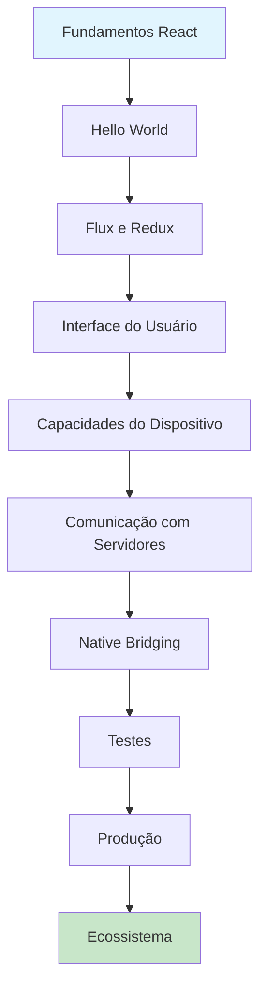

# 📱 Curso Completo de React Native

**Professor:** Jackson Sá  
**Instituição:** ETEC Bento Quirino - Campinas/SP

---

## 🎯 **Objetivo do Curso**

Este curso abrangente ensina desenvolvimento de aplicações mobile usando React Native. Os estudantes aprenderão a criar aplicações nativas para iOS e Android usando uma única base de código, explorando desde os fundamentos até recursos avançados.

## 🚀 **Por que React Native?**

### **Desenvolvimento Cross-Platform**

- ✅ **Uma Base de Código**: Desenvolva para iOS e Android simultaneamente
- ✅ **Performance Nativa**: Compilação para código nativo
- ✅ **Reutilização de Conhecimento**: JavaScript e React
- ✅ **Ecosystem Maduro**: Bibliotecas e ferramentas consolidadas
- ✅ **Suporte da Meta**: Desenvolvimento ativo e suporte oficial

### **Aplicações Práticas**

- ✅ **Apps Corporativos**: Aplicações empresariais e B2B
- ✅ **E-commerce**: Apps de compras e marketplaces
- ✅ **Social Media**: Apps de redes sociais e comunicação
- ✅ **Fintech**: Aplicações financeiras e de pagamento
- ✅ **Gaming**: Jogos mobile e entretenimento

## 📚 **Estrutura do Curso Completo**

### **Módulo 1: 🏗️ [Fundamentos do React](./modulo-01-fundamentos/README.md)**

- ✅ Virtual DOM e conceitos fundamentais
- ✅ Componentes, props e state
- ✅ Ciclo de vida dos componentes
- ✅ Eventos e formulários
- ✅ **Projeto:** Aplicativo de contador interativo

### **Módulo 2: 🌍 [Hello World - Primeira App](./modulo-02-hello-world/README.md)**

- ✅ Configuração do ambiente de desenvolvimento
- ✅ Estrutura de projeto React Native
- ✅ Componentes básicos (View, Text, StyleSheet)
- ✅ Navegação simples
- ✅ **Projeto:** App de boas-vindas personalizada

### **Módulo 3: 🔄 [Flux e Redux](./modulo-03-flux-redux/README.md)**

- ✅ Gerenciamento de estado global
- ✅ Arquitetura Flux
- ✅ Implementação Redux
- ✅ Middlewares (Redux Thunk, Redux Saga)
- ✅ **Projeto:** Sistema de gerenciamento de estado

### **Módulo 4: 🎨 [Interface do Usuário](./modulo-04-interface-usuario/README.md)**

- ✅ Layout e flexbox
- ✅ Componentes de UI (Button, Input, Image)
- ✅ Animações básicas
- ✅ Temas e estilização
- ✅ **Projeto:** Interface completa de app

### **Módulo 5: 📱 [Capacidades do Dispositivo](./modulo-05-capacidades-dispositivo/README.md)**

- ✅ Câmera e galeria
- ✅ Localização e mapas
- ✅ Notificações push
- ✅ Sensores do dispositivo
- ✅ **Projeto:** App com recursos nativos

### **Módulo 6: 🌐 [Comunicação com Servidores](./modulo-06-comunicacao-servidores/README.md)**

- ✅ HTTP requests (Fetch, Axios)
- ✅ Autenticação e autorização
- ✅ WebSockets em tempo real
- ✅ Cache e sincronização offline
- ✅ **Projeto:** App com backend integrado

### **Módulo 7: 🔗 [Native Bridging](./modulo-07-native-bridging/README.md)**

- ✅ Módulos nativos customizados
- ✅ Bridge entre JavaScript e nativo
- ✅ Bibliotecas de terceiros
- ✅ Performance e otimização
- ✅ **Projeto:** Funcionalidade nativa customizada

### **Módulo 8: 🧪 [Testes](./modulo-08-testes/README.md)**

- ✅ Testes unitários com Jest
- ✅ Testes de integração
- ✅ Testes E2E com Detox
- ✅ Mocking e stubbing
- ✅ **Projeto:** App com cobertura de testes

### **Módulo 9: 🚀 [Produção](./modulo-09-producao/README.md)**

- ✅ Build e deploy
- ✅ App Store e Google Play
- ✅ CI/CD para mobile
- ✅ Monitoramento e analytics
- ✅ **Projeto:** App publicado nas stores

### **Módulo 10: 🌟 [Ecossistema](./modulo-10-ecossistema/README.md)**

- ✅ Bibliotecas essenciais
- ✅ Ferramentas de desenvolvimento
- ✅ Debugging e profiling
- ✅ Boas práticas e padrões
- ✅ **Projeto:** App com stack completo

## 🛠️ **Tecnologias e Ferramentas**

### **Core Technologies**

- **React Native**: Framework principal
- **JavaScript ES6+**: Linguagem de programação
- **React**: Biblioteca de componentes
- **Redux**: Gerenciamento de estado
- **Expo**: Plataforma de desenvolvimento

### **Ferramentas de Desenvolvimento**

- **Metro**: Bundler JavaScript
- **React Native CLI**: Linha de comando
- **VSCode**: Editor de código
- **Git**: Controle de versão

### **Testes e Qualidade**

- **Jest**: Framework de testes
- **ESLint**: Linting de código
- **Prettier**: Formatação de código

## 📊 **Métricas de Aprendizagem**

### **Conceituais**

- ✅ Compreender fundamentos do React Native
- ✅ Dominar desenvolvimento cross-platform
- ✅ Entender gerenciamento de estado
- ✅ Conhecer recursos nativos

### **Práticas**

- ✅ Criar aplicações mobile funcionais
- ✅ Implementar interfaces responsivas
- ✅ Integrar APIs e serviços
- ✅ Escrever testes unitários

### **Avançadas**

- ✅ Otimizar performance de apps
- ✅ Implementar recursos nativos
- ✅ Publicar aplicações
- ✅ Dominar ecossistema completo

## 🎯 **Pré-requisitos**

### **Conhecimentos Básicos**

- ✅ Programação em JavaScript
- ✅ Conceitos básicos de React
- ✅ HTML/CSS básico
- ✅ Lógica de programação

### **Ferramentas**

- ✅ Node.js 16+ instalado
- ✅ Editor de código (VSCode recomendado)
- ✅ Git instalado
- ✅ Terminal/Command Prompt

## 🚀 **Como Começar**

### **1. Configuração do Ambiente**

```bash
# Clone o repositório
git clone [url-do-repositorio]
cd react-native

# Instale as dependências
npm install

# Execute os testes
npm test
```

> 📖 **Documentação:** Consulte o [Guia de Início](./INICIO.md) para configuração detalhada

### **2. Estrutura de Estudos**

```bash
# Navegue pelos módulos
cd modulo-01-fundamentos
# Estude os exemplos e exercícios
# Execute os testes para validar
```

> 📚 **Tutoriais:** Siga o [Guia de Tutoriais](./TUTORIAIS.md) para estudos estruturados

### **3. Prática**

```bash
# Implemente suas próprias soluções
# Compare com as soluções de referência
# Execute testes para validar
```

## 📈 **Projeto de Aprendizagem**

### **App Final: Plataforma Mobile Completa**

Desenvolva uma aplicação mobile completa que demonstre todos os conceitos aprendidos.

#### **Funcionalidades**

- ✅ Autenticação de usuários
- ✅ Interface responsiva
- ✅ Integração com APIs
- ✅ Recursos nativos (câmera, GPS)
- ✅ Notificações push
- ✅ Funcionamento offline

#### **Tecnologias**

- ✅ React Native + Expo
- ✅ Redux para estado global
- ✅ React Navigation
- ✅ Firebase para backend
- ✅ AsyncStorage para cache

## 🎓 **Certificação**

### **Critérios de Aprovação**

- ✅ 80% dos exercícios práticos completados
- ✅ Projeto final funcional
- ✅ Testes unitários implementados
- ✅ App publicado nas stores
- ✅ Documentação completa

### **Entregáveis**

- ✅ Código fonte de todos os módulos
- ✅ Projeto final com apresentação
- ✅ App funcional nas stores
- ✅ Portfolio de projetos

## 📚 **Recursos Adicionais**

### **Documentação Oficial**

- [React Native Docs](https://reactnative.dev/)
- [Expo Documentation](https://docs.expo.dev/)
- [React Documentation](https://react.dev/)
- [Redux Documentation](https://redux.js.org/)

### **Comunidade**

- [React Native Community](https://github.com/react-native-community)
- [Expo Discord](https://discord.gg/expo)
- [Stack Overflow](https://stackoverflow.com/questions/tagged/react-native)

## 🎯 **Roadmap de Carreira**

### **Desenvolvedor Mobile Junior**

- ✅ React Native básico
- ✅ Componentes e navegação
- ✅ APIs e HTTP requests
- ✅ Testes unitários

### **Desenvolvedor Mobile Pleno**

- ✅ Redux e gerenciamento de estado
- ✅ Recursos nativos
- ✅ Performance e otimização
- ✅ Deploy e CI/CD

### **Arquiteto Mobile**

- ✅ Arquitetura de aplicações
- ✅ Native modules customizados
- ✅ DevOps mobile
- ✅ Liderança técnica

---

**Desenvolvido com ❤️ para a comunidade de desenvolvimento mobile brasileira**

_ETEC Bento Quirino - Curso Completo de React Native_

## 📊 **Progressão do Curso**

