# Módulo 1: Fundamentos do React

## 🎯 Objetivos de Aprendizagem

Ao final deste módulo, você será capaz de:

- Compreender o conceito de Virtual DOM
- Entender o fluxo unidirecional de dados
- Criar e usar componentes React
- Trabalhar com props e state
- Aplicar o ciclo de vida dos componentes

## 📚 Conteúdo Teórico

### 1.1 Por que React?

React foi criado pelo Facebook para resolver problemas comuns no desenvolvimento de interfaces:

- **Complexidade de gerenciamento de estado**
- **Reutilização de código**
- **Performance em aplicações grandes**
- **Manutenibilidade do código**

### 1.2 Virtual DOM

O Virtual DOM é uma representação em memória da estrutura do DOM real. Veja como funciona:

```mermaid
graph TD
    A[Estado da Aplicação] --> B[Virtual DOM]
    B --> C[Diff Algorithm]
    C --> D[DOM Real]
    D --> E[Interface Atualizada]

    F[Mudança de Estado] --> A

    style A fill:#e1f5fe
    style B fill:#f3e5f5
    style C fill:#fff3e0
    style D fill:#e8f5e8
    style E fill:#fce4ec
```



**Vantagens do Virtual DOM:**

- Performance otimizada
- Atualizações seletivas
- Menos manipulação direta do DOM
- Melhor experiência do usuário

### 1.3 Fluxo Unidirecional de Dados


**Características:**

- Dados fluem em uma única direção
- Previsibilidade no comportamento
- Facilita debugging
- Separação clara de responsabilidades

### 1.4 Componentes

Componentes são blocos reutilizáveis de código que retornam elementos React.


## 💻 Exemplos Práticos

### Exemplo 1: Componente Básico

```jsx
// exemplos/ComponenteBasico.jsx
import React from 'react';

const Saudacao = ({ nome, idade }) => {
  return (
    <div>
      <h1>Olá, {nome}!</h1>
      <p>Você tem {idade} anos.</p>
    </div>
  );
};

export default Saudacao;
```

### Exemplo 2: Componente com Estado

```jsx
// exemplos/Contador.jsx
import React, { useState } from 'react';

const Contador = () => {
  const [contador, setContador] = useState(0);

  const incrementar = () => {
    setContador(contador + 1);
  };

  const decrementar = () => {
    setContador(contador - 1);
  };

  return (
    <div>
      <h2>Contador: {contador}</h2>
      <button onClick={incrementar}>+</button>
      <button onClick={decrementar}>-</button>
    </div>
  );
};

export default Contador;
```

### Exemplo 3: Ciclo de Vida dos Componentes

```jsx
// exemplos/CicloVida.jsx
import React, { Component } from 'react';

class ExemploCicloVida extends Component {
  constructor(props) {
    super(props);
    this.state = {
      dados: [],
      carregando: true
    };
  }

  componentDidMount() {
    console.log('Componente montado');
    this.carregarDados();
  }

  componentDidUpdate(prevProps, prevState) {
    console.log('Componente atualizado');
  }

  componentWillUnmount() {
    console.log('Componente será desmontado');
  }

  carregarDados = () => {
    setTimeout(() => {
      this.setState({
        dados: ['Item 1', 'Item 2', 'Item 3'],
        carregando: false
      });
    }, 2000);
  };

  render() {
    if (this.state.carregando) {
      return <div>Carregando...</div>;
    }

    return (
      <div>
        <h2>Dados Carregados:</h2>
        <ul>
          {this.state.dados.map((item, index) => (
            <li key={index}>{item}</li>
          ))}
        </ul>
      </div>
    );
  }
}

export default ExemploCicloVida;
```

## 🎯 Tutorial Prático: App de Perfil de Usuário

### Passo 1: Configuração do Projeto

1. **Crie um novo projeto React:**

   ```bash
   npx create-react-app app-perfil-usuario
   cd app-perfil-usuario
   ```

2. **Instale dependências adicionais:**

   ```bash
   npm install styled-components
   ```

3. **Estrutura de pastas:**
   ```
   src/
   ├── components/
   │   ├── PerfilUsuario.jsx
   │   ├── EditarPerfil.jsx
   │   └── ListaTarefas.jsx
   ├── styles/
   │   └── globalStyles.js
   └── App.js
   ```

### Passo 2: Criando o Componente PerfilUsuario

```jsx
// src/components/PerfilUsuario.jsx
import React, { useState } from 'react';
import styled from 'styled-components';

const PerfilUsuario = () => {
  const [usuario, setUsuario] = useState({
    nome: 'João Silva',
    idade: 25,
    email: 'joao@email.com',
    foto: 'https://via.placeholder.com/150',
    editando: false
  });

  const [tarefas, setTarefas] = useState([
    { id: 1, texto: 'Aprender React', concluida: false },
    { id: 2, texto: 'Fazer exercícios', concluida: true },
    { id: 3, texto: 'Criar projeto', concluida: false }
  ]);

  const toggleEdicao = () => {
    setUsuario({ ...usuario, editando: !usuario.editando });
  };

  const salvarPerfil = novosDados => {
    setUsuario({ ...usuario, ...novosDados, editando: false });
  };

  const adicionarTarefa = texto => {
    const novaTarefa = {
      id: Date.now(),
      texto,
      concluida: false
    };
    setTarefas([...tarefas, novaTarefa]);
  };

  const toggleTarefa = id => {
    setTarefas(
      tarefas.map(tarefa =>
        tarefa.id === id ? { ...tarefa, concluida: !tarefa.concluida } : tarefa
      )
    );
  };

  const removerTarefa = id => {
    setTarefas(tarefas.filter(tarefa => tarefa.id !== id));
  };

  return (
    <Container>
      <Header>
        <Titulo>Meu Perfil</Titulo>
        <BotaoEditar onClick={toggleEdicao}>
          {usuario.editando ? 'Cancelar' : 'Editar'}
        </BotaoEditar>
      </Header>

      <CardPerfil>
        <FotoPerfil src={usuario.foto} alt='Foto do usuário' />
        <InfoPerfil>
          <Nome>{usuario.nome}</Nome>
          <Idade>{usuario.idade} anos</Idade>
          <Email>{usuario.email}</Email>
        </InfoPerfil>
      </CardPerfil>

      <ListaTarefas
        tarefas={tarefas}
        onToggle={toggleTarefa}
        onRemover={removerTarefa}
        onAdicionar={adicionarTarefa}
      />
    </Container>
  );
};

// Estilos com styled-components
const Container = styled.div`
  max-width: 600px;
  margin: 0 auto;
  padding: 20px;
  font-family: Arial, sans-serif;
`;

const Header = styled.div`
  display: flex;
  justify-content: space-between;
  align-items: center;
  margin-bottom: 30px;
`;

const Titulo = styled.h1`
  color: #333;
  margin: 0;
`;

const BotaoEditar = styled.button`
  background-color: #007bff;
  color: white;
  border: none;
  padding: 10px 20px;
  border-radius: 5px;
  cursor: pointer;

  &:hover {
    background-color: #0056b3;
  }
`;

const CardPerfil = styled.div`
  background: white;
  border-radius: 10px;
  padding: 30px;
  box-shadow: 0 2px 10px rgba(0, 0, 0, 0.1);
  display: flex;
  align-items: center;
  margin-bottom: 30px;
`;

const FotoPerfil = styled.img`
  width: 100px;
  height: 100px;
  border-radius: 50%;
  margin-right: 20px;
`;

const InfoPerfil = styled.div`
  flex: 1;
`;

const Nome = styled.h2`
  margin: 0 0 10px 0;
  color: #333;
`;

const Idade = styled.p`
  margin: 0 0 5px 0;
  color: #666;
  font-size: 16px;
`;

const Email = styled.p`
  margin: 0;
  color: #666;
  font-size: 16px;
`;

export default PerfilUsuario;
```

### Passo 3: Criando o Componente ListaTarefas

```jsx
// src/components/ListaTarefas.jsx
import React, { useState } from 'react';
import styled from 'styled-components';

const ListaTarefas = ({ tarefas, onToggle, onRemover, onAdicionar }) => {
  const [novaTarefa, setNovaTarefa] = useState('');

  const handleSubmit = e => {
    e.preventDefault();
    if (novaTarefa.trim()) {
      onAdicionar(novaTarefa);
      setNovaTarefa('');
    }
  };

  const tarefasPendentes = tarefas.filter(t => !t.concluida).length;

  return (
    <Container>
      <Titulo>Minhas Tarefas ({tarefasPendentes} pendentes)</Titulo>

      <Formulario onSubmit={handleSubmit}>
        <Input
          type='text'
          value={novaTarefa}
          onChange={e => setNovaTarefa(e.target.value)}
          placeholder='Nova tarefa...'
        />
        <BotaoAdicionar type='submit'>Adicionar</BotaoAdicionar>
      </Formulario>

      <Lista>
        {tarefas.map(tarefa => (
          <ItemTarefa key={tarefa.id} concluida={tarefa.concluida}>
            <Checkbox
              type='checkbox'
              checked={tarefa.concluida}
              onChange={() => onToggle(tarefa.id)}
            />
            <TextoConcluida>{tarefa.texto}</TextoConcluida>
            <BotaoRemover onClick={() => onRemover(tarefa.id)}>×</BotaoRemover>
          </ItemTarefa>
        ))}
      </Lista>
    </Container>
  );
};

const Container = styled.div`
  background: white;
  border-radius: 10px;
  padding: 20px;
  box-shadow: 0 2px 10px rgba(0, 0, 0, 0.1);
`;

const Titulo = styled.h3`
  margin: 0 0 20px 0;
  color: #333;
`;

const Formulario = styled.form`
  display: flex;
  margin-bottom: 20px;
  gap: 10px;
`;

const Input = styled.input`
  flex: 1;
  padding: 10px;
  border: 1px solid #ddd;
  border-radius: 5px;
  font-size: 16px;
`;

const BotaoAdicionar = styled.button`
  background-color: #28a745;
  color: white;
  border: none;
  padding: 10px 20px;
  border-radius: 5px;
  cursor: pointer;

  &:hover {
    background-color: #218838;
  }
`;

const Lista = styled.ul`
  list-style: none;
  padding: 0;
  margin: 0;
`;

const ItemTarefa = styled.li`
  display: flex;
  align-items: center;
  padding: 10px;
  border-bottom: 1px solid #eee;
  opacity: ${props => (props.concluida ? 0.6 : 1)};
`;

const Checkbox = styled.input`
  margin-right: 10px;
`;

const TextoConcluida = styled.span`
  flex: 1;
  text-decoration: ${props => (props.concluida ? 'line-through' : 'none')};
  color: ${props => (props.concluida ? '#999' : '#333')};
`;

const BotaoRemover = styled.button`
  background-color: #dc3545;
  color: white;
  border: none;
  width: 30px;
  height: 30px;
  border-radius: 50%;
  cursor: pointer;
  font-size: 18px;

  &:hover {
    background-color: #c82333;
  }
`;

export default ListaTarefas;
```

### Passo 4: Atualizando o App.js

```jsx
// src/App.js
import React from 'react';
import PerfilUsuario from './components/PerfilUsuario';
import './App.css';

function App() {
  return (
    <div className='App'>
      <PerfilUsuario />
    </div>
  );
}

export default App;
```

### Passo 5: Executando o Projeto

```bash
npm start
```

### Passo 6: Exercícios de Extensão

1. **Adicione validação de email**
2. **Implemente upload de foto**
3. **Adicione filtros para as tarefas**
4. **Crie um sistema de categorias**

## 🎯 Atividades Práticas

### Atividade 1: Calculadora Avançada

Crie uma calculadora com as seguintes funcionalidades:

**Requisitos:**

- Operações básicas (+, -, \*, /)
- Operações avançadas (√, x², %)
- Histórico de cálculos
- Memória (M+, M-, MR, MC)
- Interface responsiva

### Atividade 2: App de Notas

Implemente um app de notas com:

**Funcionalidades:**

- Criar, editar e deletar notas
- Categorias de notas
- Busca por texto
- Favoritos
- Exportar notas

### Atividade 3: Jogo da Memória

Desenvolva um jogo da memória:

**Características:**

- Tabuleiro configurável
- Contador de movimentos
- Timer
- Sistema de pontuação
- Animações

## 📝 Exercícios de Fixação

1. **Pergunta:** Qual é a principal vantagem do Virtual DOM?
   - Resposta: Performance otimizada através de atualizações seletivas

2. **Pergunta:** Como o fluxo unidirecional de dados facilita o desenvolvimento?
   - Resposta: Torna o comportamento da aplicação mais previsível e facilita o debugging

3. **Pergunta:** Qual a diferença entre props e state?
   - Resposta: Props são dados passados de componente pai para filho (imutáveis), state é gerenciado internamente pelo componente (mutável)

## 🔗 Próximos Passos

No próximo módulo, você aprenderá a:

- Configurar o ambiente React Native
- Criar sua primeira aplicação mobile
- Entender as diferenças entre React e React Native

## 📚 Recursos Adicionais

- [Documentação Oficial do React](https://pt-br.reactjs.org/)
- [React Hooks](https://pt-br.reactjs.org/docs/hooks-intro.html)
- [Virtual DOM Explained](https://reactjs.org/docs/reconciliation.html)

---

**Professor:** Jackson Sá  
**ETEC Bento Quirino - Campinas/SP**
