# Módulo 2: Hello World com React Native

## 🎯 Objetivos de Aprendizagem

Ao final deste módulo, você será capaz de:

- Configurar o ambiente de desenvolvimento React Native
- Criar sua primeira aplicação mobile
- Entender as diferenças entre React e React Native
- Usar o Expo para desenvolvimento rápido
- Executar aplicações em simuladores e dispositivos

## 📚 Conteúdo Teórico

### 2.1 O que é React Native?

React Native é um framework que permite criar aplicações mobile nativas usando JavaScript e React. Ele compila o código JavaScript para componentes nativos.


**Vantagens do React Native:**

- Código compartilhado entre plataformas
- Performance próxima ao nativo
- Hot reload para desenvolvimento rápido
- Grande comunidade e ecossistema

### 2.2 Expo vs React Native CLI

```mermaid
graph LR
    A[Desenvolvimento React Native] --> B[Expo]
    A --> C[React Native CLI]

    B --> D[Desenvolvimento Rápido]
    B --> E[Fácil Configuração]
    B --> F[Limitações de Funcionalidades]

    C --> G[Controle Total]
    C --> H[Configuração Complexa]
    C --> I[Acesso Completo às APIs]

    style A fill:#e1f5fe
    style B fill:#e8f5e8
    style C fill:#fff3e0
    style D fill:#f1f8e9
    style E fill:#f1f8e9
    style F fill:#ffebee
    style G fill:#e3f2fd
    style H fill:#ffebee
    style I fill:#e3f2fd
```



### 2.3 Arquitetura do React Native


## 🛠️ Configuração do Ambiente

### Pré-requisitos

1. **Node.js** (versão 16 ou superior)
2. **npm** ou **yarn**
3. **Expo CLI**
4. **Android Studio** (para Android)
5. **Xcode** (para iOS - apenas macOS)

### Instalação do Expo CLI

```bash
npm install -g @expo/cli
```

### Verificação da Instalação

```bash
expo --version
```

## 💻 Exemplos Práticos

### Exemplo 1: Primeira Aplicação

```jsx
// exemplos/PrimeiraApp.jsx
import React from 'react';
import { View, Text, StyleSheet, TouchableOpacity } from 'react-native';

const PrimeiraApp = () => {
  const [contador, setContador] = React.useState(0);

  return (
    <View style={styles.container}>
      <Text style={styles.titulo}>Minha Primeira App React Native!</Text>
      <Text style={styles.contador}>Contador: {contador}</Text>

      <TouchableOpacity
        style={styles.botao}
        onPress={() => setContador(contador + 1)}
      >
        <Text style={styles.textoBotao}>Incrementar</Text>
      </TouchableOpacity>
    </View>
  );
};

const styles = StyleSheet.create({
  container: {
    flex: 1,
    justifyContent: 'center',
    alignItems: 'center',
    backgroundColor: '#f0f0f0'
  },
  titulo: {
    fontSize: 24,
    fontWeight: 'bold',
    marginBottom: 20,
    textAlign: 'center',
    color: '#333'
  },
  contador: {
    fontSize: 18,
    marginBottom: 20,
    color: '#666'
  },
  botao: {
    backgroundColor: '#007bff',
    paddingHorizontal: 20,
    paddingVertical: 10,
    borderRadius: 5
  },
  textoBotao: {
    color: 'white',
    fontSize: 16,
    fontWeight: 'bold'
  }
});

export default PrimeiraApp;
```

### Exemplo 2: Navegação Básica

```jsx
// exemplos/NavegacaoBasica.jsx
import React from 'react';
import { View, Text, StyleSheet, TouchableOpacity } from 'react-native';

const TelaInicial = ({ navigation }) => {
  return (
    <View style={styles.container}>
      <Text style={styles.titulo}>Tela Inicial</Text>
      <TouchableOpacity
        style={styles.botao}
        onPress={() => navigation.navigate('Detalhes')}
      >
        <Text style={styles.textoBotao}>Ir para Detalhes</Text>
      </TouchableOpacity>
    </View>
  );
};

const TelaDetalhes = ({ navigation }) => {
  return (
    <View style={styles.container}>
      <Text style={styles.titulo}>Tela de Detalhes</Text>
      <TouchableOpacity
        style={styles.botao}
        onPress={() => navigation.goBack()}
      >
        <Text style={styles.textoBotao}>Voltar</Text>
      </TouchableOpacity>
    </View>
  );
};

const styles = StyleSheet.create({
  container: {
    flex: 1,
    justifyContent: 'center',
    alignItems: 'center',
    backgroundColor: '#f0f0f0'
  },
  titulo: {
    fontSize: 24,
    fontWeight: 'bold',
    marginBottom: 20,
    textAlign: 'center',
    color: '#333'
  },
  botao: {
    backgroundColor: '#007bff',
    paddingHorizontal: 20,
    paddingVertical: 10,
    borderRadius: 5
  },
  textoBotao: {
    color: 'white',
    fontSize: 16,
    fontWeight: 'bold'
  }
});

export { TelaInicial, TelaDetalhes };
```

### Exemplo 3: Lista de Itens

```jsx
// exemplos/ListaItens.jsx
import React, { useState } from 'react';
import {
  View,
  Text,
  StyleSheet,
  FlatList,
  TouchableOpacity,
  TextInput
} from 'react-native';

const ListaItens = () => {
  const [itens, setItens] = useState([
    { id: '1', texto: 'Item 1' },
    { id: '2', texto: 'Item 2' },
    { id: '3', texto: 'Item 3' }
  ]);
  const [novoItem, setNovoItem] = useState('');

  const adicionarItem = () => {
    if (novoItem.trim()) {
      setItens([
        ...itens,
        {
          id: Date.now().toString(),
          texto: novoItem
        }
      ]);
      setNovoItem('');
    }
  };

  const removerItem = id => {
    setItens(itens.filter(item => item.id !== id));
  };

  const renderizarItem = ({ item }) => (
    <View style={styles.item}>
      <Text style={styles.textoItem}>{item.texto}</Text>
      <TouchableOpacity
        style={styles.botaoRemover}
        onPress={() => removerItem(item.id)}
      >
        <Text style={styles.textoBotaoRemover}>Remover</Text>
      </TouchableOpacity>
    </View>
  );

  return (
    <View style={styles.container}>
      <Text style={styles.titulo}>Lista de Itens</Text>

      <View style={styles.inputContainer}>
        <TextInput
          style={styles.input}
          value={novoItem}
          onChangeText={setNovoItem}
          placeholder='Digite um novo item'
        />
        <TouchableOpacity style={styles.botaoAdicionar} onPress={adicionarItem}>
          <Text style={styles.textoBotaoAdicionar}>Adicionar</Text>
        </TouchableOpacity>
      </View>

      <FlatList
        data={itens}
        renderItem={renderizarItem}
        keyExtractor={item => item.id}
        style={styles.lista}
      />
    </View>
  );
};

const styles = StyleSheet.create({
  container: {
    flex: 1,
    padding: 20,
    backgroundColor: '#f0f0f0'
  },
  titulo: {
    fontSize: 24,
    fontWeight: 'bold',
    marginBottom: 20,
    textAlign: 'center',
    color: '#333'
  },
  inputContainer: {
    flexDirection: 'row',
    marginBottom: 20
  },
  input: {
    flex: 1,
    borderWidth: 1,
    borderColor: '#ddd',
    padding: 10,
    marginRight: 10,
    borderRadius: 5,
    backgroundColor: 'white'
  },
  botaoAdicionar: {
    backgroundColor: '#28a745',
    paddingHorizontal: 15,
    paddingVertical: 10,
    borderRadius: 5,
    justifyContent: 'center'
  },
  textoBotaoAdicionar: {
    color: 'white',
    fontWeight: 'bold'
  },
  lista: {
    flex: 1
  },
  item: {
    flexDirection: 'row',
    justifyContent: 'space-between',
    alignItems: 'center',
    backgroundColor: 'white',
    padding: 15,
    marginBottom: 10,
    borderRadius: 5,
    shadowColor: '#000',
    shadowOffset: { width: 0, height: 2 },
    shadowOpacity: 0.1,
    shadowRadius: 4,
    elevation: 3
  },
  textoItem: {
    flex: 1,
    fontSize: 16,
    color: '#333'
  },
  botaoRemover: {
    backgroundColor: '#dc3545',
    paddingHorizontal: 10,
    paddingVertical: 5,
    borderRadius: 3
  },
  textoBotaoRemover: {
    color: 'white',
    fontSize: 12,
    fontWeight: 'bold'
  }
});

export default ListaItens;
```

## 🎯 Tutorial Prático: App de Boas-vindas com React Native

### Passo 1: Configuração do Ambiente

1. **Instale o Expo CLI:**

   ```bash
   npm install -g @expo/cli
   ```

2. **Crie um novo projeto:**

   ```bash
   npx create-expo-app app-boas-vindas
   cd app-boas-vindas
   ```

3. **Instale dependências adicionais:**
   ```bash
   npm install @react-navigation/native @react-navigation/stack
   npx expo install react-native-screens react-native-safe-area-context
   ```

### Passo 2: Estrutura do Projeto

```
app-boas-vindas/
├── App.js
├── src/
│   ├── screens/
│   │   ├── HomeScreen.js
│   │   ├── PerfilScreen.js
│   │   └── CalculadoraScreen.js
│   ├── components/
│   │   ├── BotaoCustomizado.js
│   │   └── Card.js
│   └── styles/
│       └── cores.js
└── package.json
```

### Passo 3: Configurando Navegação

```jsx
// App.js
import React from 'react';
import { NavigationContainer } from '@react-navigation/native';
import { createStackNavigator } from '@react-navigation/stack';
import HomeScreen from './src/screens/HomeScreen';
import PerfilScreen from './src/screens/PerfilScreen';
import CalculadoraScreen from './src/screens/CalculadoraScreen';

const Stack = createStackNavigator();

export default function App() {
  return (
    <NavigationContainer>
      <Stack.Navigator
        initialRouteName='Home'
        screenOptions={{
          headerStyle: {
            backgroundColor: '#007bff'
          },
          headerTintColor: '#fff',
          headerTitleStyle: {
            fontWeight: 'bold'
          }
        }}
      >
        <Stack.Screen
          name='Home'
          component={HomeScreen}
          options={{ title: 'Bem-vindo' }}
        />
        <Stack.Screen
          name='Perfil'
          component={PerfilScreen}
          options={{ title: 'Meu Perfil' }}
        />
        <Stack.Screen
          name='Calculadora'
          component={CalculadoraScreen}
          options={{ title: 'Calculadora' }}
        />
      </Stack.Navigator>
    </NavigationContainer>
  );
}
```

### Passo 4: Criando a Tela Principal

```jsx
// src/screens/HomeScreen.js
import React, { useState } from 'react';
import {
  View,
  Text,
  StyleSheet,
  TextInput,
  TouchableOpacity,
  ScrollView,
  Alert
} from 'react-native';
import BotaoCustomizado from '../components/BotaoCustomizado';
import Card from '../components/Card';
import { cores } from '../styles/cores';

const HomeScreen = ({ navigation }) => {
  const [nome, setNome] = useState('');
  const [saudacao, setSaudacao] = useState('');

  const gerarSaudacao = () => {
    if (nome.trim()) {
      const hora = new Date().getHours();
      let mensagem = '';

      if (hora < 12) {
        mensagem = `Bom dia, ${nome}! ☀️`;
      } else if (hora < 18) {
        mensagem = `Boa tarde, ${nome}! 🌤️`;
      } else {
        mensagem = `Boa noite, ${nome}! 🌙`;
      }

      setSaudacao(mensagem);
    } else {
      Alert.alert('Atenção', 'Por favor, digite seu nome');
    }
  };

  const limparSaudacao = () => {
    setNome('');
    setSaudacao('');
  };

  return (
    <ScrollView style={styles.container}>
      <View style={styles.header}>
        <Text style={styles.titulo}>App de Boas-vindas</Text>
        <Text style={styles.subtitulo}>
          Crie sua primeira aplicação React Native
        </Text>
      </View>

      <Card>
        <Text style={styles.label}>Digite seu nome:</Text>
        <TextInput
          style={styles.input}
          value={nome}
          onChangeText={setNome}
          placeholder='Seu nome aqui...'
          placeholderTextColor='#999'
        />

        <View style={styles.botoesContainer}>
          <BotaoCustomizado
            titulo='Gerar Saudação'
            onPress={gerarSaudacao}
            cor={cores.primaria}
          />
          <BotaoCustomizado
            titulo='Limpar'
            onPress={limparSaudacao}
            cor={cores.secundaria}
          />
        </View>

        {saudacao ? (
          <View style={styles.saudacaoContainer}>
            <Text style={styles.saudacao}>{saudacao}</Text>
          </View>
        ) : null}
      </Card>

      <Card>
        <Text style={styles.cardTitulo}>Funcionalidades do App</Text>
        <View style={styles.funcionalidades}>
          <Text style={styles.funcionalidade}>✅ Navegação entre telas</Text>
          <Text style={styles.funcionalidade}>
            ✅ Componentes reutilizáveis
          </Text>
          <Text style={styles.funcionalidade}>✅ Gerenciamento de estado</Text>
          <Text style={styles.funcionalidade}>✅ Interface responsiva</Text>
        </View>
      </Card>

      <View style={styles.navegacaoContainer}>
        <BotaoCustomizado
          titulo='Ver Perfil'
          onPress={() => navigation.navigate('Perfil', { nome })}
          cor={cores.sucesso}
          style={styles.botaoNavegacao}
        />
        <BotaoCustomizado
          titulo='Calculadora'
          onPress={() => navigation.navigate('Calculadora')}
          cor={cores.info}
          style={styles.botaoNavegacao}
        />
      </View>
    </ScrollView>
  );
};

const styles = StyleSheet.create({
  container: {
    flex: 1,
    backgroundColor: '#f8f9fa'
  },
  header: {
    backgroundColor: '#007bff',
    padding: 30,
    alignItems: 'center'
  },
  titulo: {
    fontSize: 28,
    fontWeight: 'bold',
    color: 'white',
    marginBottom: 10
  },
  subtitulo: {
    fontSize: 16,
    color: 'rgba(255,255,255,0.9)',
    textAlign: 'center'
  },
  label: {
    fontSize: 16,
    fontWeight: 'bold',
    color: '#333',
    marginBottom: 10
  },
  input: {
    borderWidth: 1,
    borderColor: '#ddd',
    borderRadius: 8,
    padding: 15,
    fontSize: 16,
    backgroundColor: 'white',
    marginBottom: 20
  },
  botoesContainer: {
    flexDirection: 'row',
    justifyContent: 'space-between',
    marginBottom: 20
  },
  saudacaoContainer: {
    backgroundColor: '#e3f2fd',
    padding: 20,
    borderRadius: 8,
    borderLeftWidth: 4,
    borderLeftColor: '#2196f3'
  },
  saudacao: {
    fontSize: 18,
    color: '#1976d2',
    textAlign: 'center',
    fontWeight: 'bold'
  },
  cardTitulo: {
    fontSize: 18,
    fontWeight: 'bold',
    color: '#333',
    marginBottom: 15
  },
  funcionalidades: {
    gap: 8
  },
  funcionalidade: {
    fontSize: 16,
    color: '#666'
  },
  navegacaoContainer: {
    padding: 20,
    gap: 15
  },
  botaoNavegacao: {
    marginBottom: 10
  }
});

export default HomeScreen;
```

### Passo 5: Criando Componentes Reutilizáveis

```jsx
// src/components/BotaoCustomizado.js
import React from 'react';
import { TouchableOpacity, Text, StyleSheet } from 'react-native';

const BotaoCustomizado = ({
  titulo,
  onPress,
  cor = '#007bff',
  style,
  disabled = false
}) => {
  return (
    <TouchableOpacity
      style={[
        styles.botao,
        { backgroundColor: disabled ? '#ccc' : cor },
        style
      ]}
      onPress={onPress}
      disabled={disabled}
    >
      <Text style={styles.texto}>{titulo}</Text>
    </TouchableOpacity>
  );
};

const styles = StyleSheet.create({
  botao: {
    paddingHorizontal: 20,
    paddingVertical: 12,
    borderRadius: 8,
    alignItems: 'center',
    minWidth: 120
  },
  texto: {
    color: 'white',
    fontSize: 16,
    fontWeight: 'bold'
  }
});

export default BotaoCustomizado;
```

```jsx
// src/components/Card.js
import React from 'react';
import { View, StyleSheet } from 'react-native';

const Card = ({ children, style }) => {
  return <View style={[styles.card, style]}>{children}</View>;
};

const styles = StyleSheet.create({
  card: {
    backgroundColor: 'white',
    borderRadius: 12,
    padding: 20,
    margin: 15,
    shadowColor: '#000',
    shadowOffset: {
      width: 0,
      height: 2
    },
    shadowOpacity: 0.1,
    shadowRadius: 4,
    elevation: 3
  }
});

export default Card;
```

```jsx
// src/styles/cores.js
export const cores = {
  primaria: '#007bff',
  secundaria: '#6c757d',
  sucesso: '#28a745',
  info: '#17a2b8',
  aviso: '#ffc107',
  perigo: '#dc3545',
  claro: '#f8f9fa',
  escuro: '#343a40'
};
```

### Passo 6: Criando a Tela de Perfil

```jsx
// src/screens/PerfilScreen.js
import React, { useState } from 'react';
import {
  View,
  Text,
  StyleSheet,
  TextInput,
  TouchableOpacity,
  ScrollView,
  Alert
} from 'react-native';
import BotaoCustomizado from '../components/BotaoCustomizado';
import Card from '../components/Card';
import { cores } from '../styles/cores';

const PerfilScreen = ({ route, navigation }) => {
  const { nome: nomeInicial } = route.params || {};

  const [perfil, setPerfil] = useState({
    nome: nomeInicial || '',
    email: '',
    telefone: '',
    cidade: '',
    editando: false
  });

  const [perfilOriginal, setPerfilOriginal] = useState({ ...perfil });

  const iniciarEdicao = () => {
    setPerfilOriginal({ ...perfil });
    setPerfil({ ...perfil, editando: true });
  };

  const salvarPerfil = () => {
    if (!perfil.nome.trim()) {
      Alert.alert('Erro', 'Nome é obrigatório');
      return;
    }

    setPerfil({ ...perfil, editando: false });
    Alert.alert('Sucesso', 'Perfil salvo com sucesso!');
  };

  const cancelarEdicao = () => {
    setPerfil({ ...perfilOriginal, editando: false });
  };

  const atualizarCampo = (campo, valor) => {
    setPerfil({ ...perfil, [campo]: valor });
  };

  return (
    <ScrollView style={styles.container}>
      <View style={styles.header}>
        <Text style={styles.titulo}>Meu Perfil</Text>
        <Text style={styles.subtitulo}>Gerencie suas informações pessoais</Text>
      </View>

      <Card>
        <View style={styles.avatarContainer}>
          <View style={styles.avatar}>
            <Text style={styles.avatarTexto}>
              {perfil.nome.charAt(0).toUpperCase()}
            </Text>
          </View>
        </View>

        <View style={styles.camposContainer}>
          <View style={styles.campo}>
            <Text style={styles.label}>Nome *</Text>
            <TextInput
              style={styles.input}
              value={perfil.nome}
              onChangeText={valor => atualizarCampo('nome', valor)}
              placeholder='Seu nome completo'
              editable={perfil.editando}
            />
          </View>

          <View style={styles.campo}>
            <Text style={styles.label}>Email</Text>
            <TextInput
              style={styles.input}
              value={perfil.email}
              onChangeText={valor => atualizarCampo('email', valor)}
              placeholder='seu@email.com'
              keyboardType='email-address'
              editable={perfil.editando}
            />
          </View>

          <View style={styles.campo}>
            <Text style={styles.label}>Telefone</Text>
            <TextInput
              style={styles.input}
              value={perfil.telefone}
              onChangeText={valor => atualizarCampo('telefone', valor)}
              placeholder='(11) 99999-9999'
              keyboardType='phone-pad'
              editable={perfil.editando}
            />
          </View>

          <View style={styles.campo}>
            <Text style={styles.label}>Cidade</Text>
            <TextInput
              style={styles.input}
              value={perfil.cidade}
              onChangeText={valor => atualizarCampo('cidade', valor)}
              placeholder='Sua cidade'
              editable={perfil.editando}
            />
          </View>
        </View>

        <View style={styles.botoesContainer}>
          {perfil.editando ? (
            <>
              <BotaoCustomizado
                titulo='Salvar'
                onPress={salvarPerfil}
                cor={cores.sucesso}
                style={styles.botao}
              />
              <BotaoCustomizado
                titulo='Cancelar'
                onPress={cancelarEdicao}
                cor={cores.secundaria}
                style={styles.botao}
              />
            </>
          ) : (
            <BotaoCustomizado
              titulo='Editar Perfil'
              onPress={iniciarEdicao}
              cor={cores.primaria}
              style={styles.botao}
            />
          )}
        </View>
      </Card>

      <Card>
        <Text style={styles.cardTitulo}>Estatísticas</Text>
        <View style={styles.estatisticas}>
          <View style={styles.estatistica}>
            <Text style={styles.estatisticaNumero}>1</Text>
            <Text style={styles.estatisticaLabel}>App Criado</Text>
          </View>
          <View style={styles.estatistica}>
            <Text style={styles.estatisticaNumero}>0</Text>
            <Text style={styles.estatisticaLabel}>Projetos</Text>
          </View>
          <View style={styles.estatistica}>
            <Text style={styles.estatisticaNumero}>100%</Text>
            <Text style={styles.estatisticaLabel}>Motivação</Text>
          </View>
        </View>
      </Card>
    </ScrollView>
  );
};

const styles = StyleSheet.create({
  container: {
    flex: 1,
    backgroundColor: '#f8f9fa'
  },
  header: {
    backgroundColor: '#007bff',
    padding: 30,
    alignItems: 'center'
  },
  titulo: {
    fontSize: 28,
    fontWeight: 'bold',
    color: 'white',
    marginBottom: 10
  },
  subtitulo: {
    fontSize: 16,
    color: 'rgba(255,255,255,0.9)',
    textAlign: 'center'
  },
  avatarContainer: {
    alignItems: 'center',
    marginBottom: 30
  },
  avatar: {
    width: 80,
    height: 80,
    borderRadius: 40,
    backgroundColor: '#007bff',
    justifyContent: 'center',
    alignItems: 'center'
  },
  avatarTexto: {
    fontSize: 32,
    fontWeight: 'bold',
    color: 'white'
  },
  camposContainer: {
    marginBottom: 20
  },
  campo: {
    marginBottom: 20
  },
  label: {
    fontSize: 16,
    fontWeight: 'bold',
    color: '#333',
    marginBottom: 8
  },
  input: {
    borderWidth: 1,
    borderColor: '#ddd',
    borderRadius: 8,
    padding: 15,
    fontSize: 16,
    backgroundColor: '#f8f9fa'
  },
  botoesContainer: {
    flexDirection: 'row',
    justifyContent: 'space-around'
  },
  botao: {
    flex: 1,
    marginHorizontal: 5
  },
  cardTitulo: {
    fontSize: 18,
    fontWeight: 'bold',
    color: '#333',
    marginBottom: 15
  },
  estatisticas: {
    flexDirection: 'row',
    justifyContent: 'space-around'
  },
  estatistica: {
    alignItems: 'center'
  },
  estatisticaNumero: {
    fontSize: 24,
    fontWeight: 'bold',
    color: '#007bff'
  },
  estatisticaLabel: {
    fontSize: 14,
    color: '#666',
    marginTop: 5
  }
});

export default PerfilScreen;
```

### Passo 7: Criando a Calculadora

```jsx
// src/screens/CalculadoraScreen.js
import React, { useState } from 'react';
import {
  View,
  Text,
  StyleSheet,
  TouchableOpacity,
  ScrollView
} from 'react-native';
import BotaoCustomizado from '../components/BotaoCustomizado';
import Card from '../components/Card';
import { cores } from '../styles/cores';

const CalculadoraScreen = () => {
  const [display, setDisplay] = useState('0');
  const [operacao, setOperacao] = useState(null);
  const [valorAnterior, setValorAnterior] = useState(null);
  const [aguardandoOperando, setAguardandoOperando] = useState(false);

  const adicionarNumero = numero => {
    if (aguardandoOperando) {
      setDisplay(String(numero));
      setAguardandoOperando(false);
    } else {
      setDisplay(display === '0' ? String(numero) : display + numero);
    }
  };

  const adicionarPonto = () => {
    if (aguardandoOperando) {
      setDisplay('0.');
      setAguardandoOperando(false);
    } else if (display.indexOf('.') === -1) {
      setDisplay(display + '.');
    }
  };

  const executarOperacao = proximaOperacao => {
    const valorAtual = parseFloat(display);

    if (valorAnterior === null) {
      setValorAnterior(valorAtual);
    } else if (operacao) {
      const resultado = calcular();
      setDisplay(String(resultado));
      setValorAnterior(resultado);
    }

    setAguardandoOperando(true);
    setOperacao(proximaOperacao);
  };

  const calcular = () => {
    const valorAtual = parseFloat(display);
    const anterior = valorAnterior;

    switch (operacao) {
      case '+':
        return anterior + valorAtual;
      case '-':
        return anterior - valorAtual;
      case '×':
        return anterior * valorAtual;
      case '÷':
        return anterior / valorAtual;
      default:
        return valorAtual;
    }
  };

  const igual = () => {
    const valorAtual = parseFloat(display);

    if (operacao && valorAnterior !== null) {
      const resultado = calcular();
      setDisplay(String(resultado));
      setValorAnterior(null);
      setOperacao(null);
      setAguardandoOperando(true);
    }
  };

  const limpar = () => {
    setDisplay('0');
    setOperacao(null);
    setValorAnterior(null);
    setAguardandoOperando(false);
  };

  const apagar = () => {
    if (display.length > 1) {
      setDisplay(display.slice(0, -1));
    } else {
      setDisplay('0');
    }
  };

  const BotaoNumero = ({ numero }) => (
    <TouchableOpacity
      style={styles.botaoNumero}
      onPress={() => adicionarNumero(numero)}
    >
      <Text style={styles.textoBotaoNumero}>{numero}</Text>
    </TouchableOpacity>
  );

  const BotaoOperacao = ({ simbolo, cor = cores.aviso }) => (
    <TouchableOpacity
      style={[styles.botaoOperacao, { backgroundColor: cor }]}
      onPress={() => executarOperacao(simbolo)}
    >
      <Text style={styles.textoBotaoOperacao}>{simbolo}</Text>
    </TouchableOpacity>
  );

  return (
    <ScrollView style={styles.container}>
      <View style={styles.header}>
        <Text style={styles.titulo}>Calculadora</Text>
        <Text style={styles.subtitulo}>Faça cálculos simples e rápidos</Text>
      </View>

      <Card>
        <View style={styles.displayContainer}>
          <Text style={styles.display}>{display}</Text>
        </View>

        <View style={styles.teclado}>
          <View style={styles.linha}>
            <TouchableOpacity style={styles.botaoFuncao} onPress={limpar}>
              <Text style={styles.textoBotaoFuncao}>C</Text>
            </TouchableOpacity>
            <TouchableOpacity style={styles.botaoFuncao} onPress={apagar}>
              <Text style={styles.textoBotaoFuncao}>⌫</Text>
            </TouchableOpacity>
            <BotaoOperacao simbolo='÷' />
            <BotaoOperacao simbolo='×' />
          </View>

          <View style={styles.linha}>
            <BotaoNumero numero={7} />
            <BotaoNumero numero={8} />
            <BotaoNumero numero={9} />
            <BotaoOperacao simbolo='-' />
          </View>

          <View style={styles.linha}>
            <BotaoNumero numero={4} />
            <BotaoNumero numero={5} />
            <BotaoNumero numero={6} />
            <BotaoOperacao simbolo='+' />
          </View>

          <View style={styles.linha}>
            <BotaoNumero numero={1} />
            <BotaoNumero numero={2} />
            <BotaoNumero numero={3} />
            <TouchableOpacity
              style={[styles.botaoOperacao, { backgroundColor: cores.sucesso }]}
              onPress={igual}
            >
              <Text style={styles.textoBotaoOperacao}>=</Text>
            </TouchableOpacity>
          </View>

          <View style={styles.linha}>
            <TouchableOpacity
              style={[styles.botaoNumero, { flex: 2 }]}
              onPress={() => adicionarNumero(0)}
            >
              <Text style={styles.textoBotaoNumero}>0</Text>
            </TouchableOpacity>
            <TouchableOpacity
              style={styles.botaoNumero}
              onPress={adicionarPonto}
            >
              <Text style={styles.textoBotaoNumero}>.</Text>
            </TouchableOpacity>
          </View>
        </View>
      </Card>

      <Card>
        <Text style={styles.cardTitulo}>Dicas de Uso</Text>
        <View style={styles.dicas}>
          <Text style={styles.dica}>• Toque nos números para inserir</Text>
          <Text style={styles.dica}>• Use as operações para calcular</Text>
          <Text style={styles.dica}>• Toque em "=" para ver o resultado</Text>
          <Text style={styles.dica}>• Use "C" para limpar tudo</Text>
        </View>
      </Card>
    </ScrollView>
  );
};

const styles = StyleSheet.create({
  container: {
    flex: 1,
    backgroundColor: '#f8f9fa'
  },
  header: {
    backgroundColor: '#007bff',
    padding: 30,
    alignItems: 'center'
  },
  titulo: {
    fontSize: 28,
    fontWeight: 'bold',
    color: 'white',
    marginBottom: 10
  },
  subtitulo: {
    fontSize: 16,
    color: 'rgba(255,255,255,0.9)',
    textAlign: 'center'
  },
  displayContainer: {
    backgroundColor: '#000',
    borderRadius: 8,
    padding: 20,
    marginBottom: 20,
    alignItems: 'flex-end'
  },
  display: {
    fontSize: 32,
    color: '#fff',
    fontWeight: 'bold'
  },
  teclado: {
    gap: 10
  },
  linha: {
    flexDirection: 'row',
    gap: 10
  },
  botaoNumero: {
    flex: 1,
    backgroundColor: '#e9ecef',
    borderRadius: 8,
    padding: 20,
    alignItems: 'center'
  },
  textoBotaoNumero: {
    fontSize: 24,
    fontWeight: 'bold',
    color: '#333'
  },
  botaoOperacao: {
    flex: 1,
    borderRadius: 8,
    padding: 20,
    alignItems: 'center'
  },
  textoBotaoOperacao: {
    fontSize: 24,
    fontWeight: 'bold',
    color: 'white'
  },
  botaoFuncao: {
    flex: 1,
    backgroundColor: '#dc3545',
    borderRadius: 8,
    padding: 20,
    alignItems: 'center'
  },
  textoBotaoFuncao: {
    fontSize: 20,
    fontWeight: 'bold',
    color: 'white'
  },
  cardTitulo: {
    fontSize: 18,
    fontWeight: 'bold',
    color: '#333',
    marginBottom: 15
  },
  dicas: {
    gap: 8
  },
  dica: {
    fontSize: 16,
    color: '#666'
  }
});

export default CalculadoraScreen;
```

### Passo 8: Executando o Projeto

```bash
npx expo start
```

### Passo 9: Testando no Dispositivo

1. **Instale o Expo Go no seu celular**
2. **Escaneie o QR code que aparece no terminal**
3. **Teste todas as funcionalidades**

### Passo 10: Exercícios de Extensão

1. **Adicione validação de entrada**
2. **Implemente histórico de cálculos**
3. **Adicione mais operações matemáticas**
4. **Crie temas claro/escuro**

## 🎯 Atividades Práticas

### Atividade 1: App de Lista de Compras

Crie um app que:

- Adicione itens à lista
- Marque itens como comprados
- Remova itens da lista
- Salve a lista localmente

### Atividade 2: App de Cronômetro

Implemente um cronômetro com:

- Iniciar/parar/resetar
- Lap times
- Histórico de tempos
- Interface intuitiva

### Atividade 3: App de Conversão

Desenvolva um app de conversão com:

- Moedas (Real, Dólar, Euro)
- Temperaturas (Celsius, Fahrenheit)
- Medidas (metros, pés, polegadas)
- Interface moderna

## 🚀 Como Executar os Exemplos

1. **Instale o Expo CLI:**

   ```bash
   npm install -g @expo/cli
   ```

2. **Crie um novo projeto:**

   ```bash
   npx create-expo-app MeuApp
   cd MeuApp
   ```

3. **Execute o projeto:**

   ```bash
   npx expo start
   ```

4. **Teste no dispositivo:**
   - Instale o app Expo Go no seu celular
   - Escaneie o QR code que aparece no terminal

## 📱 Diferenças entre React e React Native

| Aspecto         | React        | React Native     |
| --------------- | ------------ | ---------------- |
| **Plataforma**  | Web          | Mobile           |
| **Componentes** | div, span, p | View, Text       |
| **Estilização** | CSS          | StyleSheet       |
| **Navegação**   | React Router | React Navigation |
| **APIs**        | DOM          | Native APIs      |

## 🔧 Debugging e Desenvolvimento

### Hot Reload

- Ative o hot reload para ver mudanças instantâneas
- Use `r` no terminal para recarregar
- Use `d` para abrir o menu de debug

### Ferramentas de Debug

- **Chrome DevTools** - Para debugging JavaScript
- **React Native Debugger** - Ferramenta específica
- **Flipper** - Debugging avançado

## 📝 Exercícios de Fixação

1. **Pergunta:** Qual a principal diferença entre React e React Native?
   - Resposta: React é para web (DOM), React Native é para mobile (componentes nativos)

2. **Pergunta:** Quais são as vantagens do Expo?
   - Resposta: Desenvolvimento rápido, configuração simples, hot reload

3. **Pergunta:** Como o React Native compila para código nativo?
   - Resposta: Através do bridge que converte JavaScript em chamadas para APIs nativas

## 🔗 Próximos Passos

No próximo módulo, você aprenderá a:

- Gerenciar estado com Flux e Redux
- Implementar arquiteturas escaláveis
- Organizar código de forma eficiente

## 📚 Recursos Adicionais

- [Documentação Expo](https://docs.expo.dev/)
- [React Native Docs](https://reactnative.dev/)
- [Expo Snack](https://snack.expo.dev/) - Editor online

---

**Professor:** Jackson Sá  
**ETEC Bento Quirino - Campinas/SP**
