# Módulo 3: Flux e Redux

## 🎯 Objetivos de Aprendizagem

Ao final deste módulo, você será capaz de:

- Compreender os problemas do padrão MVC
- Entender a arquitetura Flux
- Implementar Redux em aplicações React Native
- Gerenciar estado de forma previsível
- Usar Redux DevTools para debugging

## 📚 Conteúdo Teórico

### 3.1 Problemas do Padrão MVC

O padrão Model-View-Controller (MVC) pode se tornar problemático em aplicações complexas:


### 3.2 Arquitetura Flux

Flux foi criado pelo Facebook para resolver os problemas do MVC:

```mermaid
graph LR
    A[Action] --> B[Dispatcher]
    B --> C[Store]
    C --> D[View]
    D --> E[User Interaction]
    E --> A

    F[Características] --> G[Fluxo Unidirecional]
    F --> H[Estado Centralizado]
    F --> I[Previsibilidade]
    F --> J[Debugging Fácil]

    style A fill:#e1f5fe
    style B fill:#f3e5f5
    style C fill:#fff3e0
    style D fill:#e8f5e8
    style E fill:#fce4ec
    style F fill:#f1f8e9
    style G fill:#c8e6c9
    style H fill:#c8e6c9
    style I fill:#c8e6c9
    style J fill:#c8e6c9
```



### 3.3 Redux - Evolução do Flux

Redux simplifica o Flux mantendo os benefícios:


### 3.4 Conceitos Fundamentais do Redux

#### Actions

Descrevem o que aconteceu:

```javascript
// Action Creator
const adicionarTarefa = texto => ({
  type: 'ADICIONAR_TAREFA',
  payload: { texto }
});
```

#### Reducers

Especificam como o estado muda:

```javascript
const tarefasReducer = (state = [], action) => {
  switch (action.type) {
    case 'ADICIONAR_TAREFA':
      return [...state, { id: Date.now(), texto: action.payload.texto }];
    default:
      return state;
  }
};
```

#### Store

Armazena o estado da aplicação:

```javascript
import { createStore } from 'redux';
const store = createStore(tarefasReducer);
```

## 💻 Exemplos Práticos

### Exemplo 1: Redux Básico

```jsx
// exemplos/ReduxBasico.jsx
import React from 'react';
import { View, Text, StyleSheet, TouchableOpacity } from 'react-native';
import { createStore } from 'redux';
import { Provider, connect } from 'react-redux';

// Action Types
const INCREMENTAR = 'INCREMENTAR';
const DECREMENTAR = 'DECREMENTAR';
const RESETAR = 'RESETAR';

// Action Creators
const incrementar = () => ({ type: INCREMENTAR });
const decrementar = () => ({ type: DECREMENTAR });
const resetar = () => ({ type: RESETAR });

// Reducer
const contadorReducer = (state = { valor: 0 }, action) => {
  switch (action.type) {
    case INCREMENTAR:
      return { ...state, valor: state.valor + 1 };
    case DECREMENTAR:
      return { ...state, valor: state.valor - 1 };
    case RESETAR:
      return { ...state, valor: 0 };
    default:
      return state;
  }
};

// Store
const store = createStore(contadorReducer);

// Component
const Contador = ({ valor, incrementar, decrementar, resetar }) => {
  return (
    <View style={styles.container}>
      <Text style={styles.titulo}>Contador Redux</Text>
      <Text style={styles.valor}>{valor}</Text>

      <View style={styles.botoes}>
        <TouchableOpacity style={styles.botao} onPress={decrementar}>
          <Text style={styles.textoBotao}>-</Text>
        </TouchableOpacity>

        <TouchableOpacity style={styles.botaoReset} onPress={resetar}>
          <Text style={styles.textoBotao}>Reset</Text>
        </TouchableOpacity>

        <TouchableOpacity style={styles.botao} onPress={incrementar}>
          <Text style={styles.textoBotao}>+</Text>
        </TouchableOpacity>
      </View>
    </View>
  );
};

// Map State to Props
const mapStateToProps = state => ({
  valor: state.valor
});

// Map Dispatch to Props
const mapDispatchToProps = {
  incrementar,
  decrementar,
  resetar
};

// Connect Component
const ContadorConectado = connect(
  mapStateToProps,
  mapDispatchToProps
)(Contador);

// App Component
const App = () => {
  return (
    <Provider store={store}>
      <ContadorConectado />
    </Provider>
  );
};

const styles = StyleSheet.create({
  container: {
    flex: 1,
    justifyContent: 'center',
    alignItems: 'center',
    backgroundColor: '#f0f0f0'
  },
  titulo: {
    fontSize: 24,
    fontWeight: 'bold',
    marginBottom: 20,
    color: '#333'
  },
  valor: {
    fontSize: 48,
    fontWeight: 'bold',
    marginBottom: 30,
    color: '#007bff'
  },
  botoes: {
    flexDirection: 'row',
    gap: 10
  },
  botao: {
    backgroundColor: '#007bff',
    paddingHorizontal: 20,
    paddingVertical: 10,
    borderRadius: 5
  },
  botaoReset: {
    backgroundColor: '#6c757d',
    paddingHorizontal: 20,
    paddingVertical: 10,
    borderRadius: 5
  },
  textoBotao: {
    color: 'white',
    fontSize: 18,
    fontWeight: 'bold'
  }
});

export default App;
```

### Exemplo 2: Lista de Tarefas com Redux

```jsx
// exemplos/ListaTarefasRedux.jsx
import React, { useState } from 'react';
import {
  View,
  Text,
  StyleSheet,
  FlatList,
  TouchableOpacity,
  TextInput
} from 'react-native';
import { createStore } from 'redux';
import { Provider, connect } from 'react-redux';

// Action Types
const ADICIONAR_TAREFA = 'ADICIONAR_TAREFA';
const REMOVER_TAREFA = 'REMOVER_TAREFA';
const TOGGLE_TAREFA = 'TOGGLE_TAREFA';

// Action Creators
const adicionarTarefa = texto => ({
  type: ADICIONAR_TAREFA,
  payload: { id: Date.now(), texto, concluida: false }
});

const removerTarefa = id => ({
  type: REMOVER_TAREFA,
  payload: { id }
});

const toggleTarefa = id => ({
  type: TOGGLE_TAREFA,
  payload: { id }
});

// Reducer
const tarefasReducer = (state = [], action) => {
  switch (action.type) {
    case ADICIONAR_TAREFA:
      return [...state, action.payload];
    case REMOVER_TAREFA:
      return state.filter(tarefa => tarefa.id !== action.payload.id);
    case TOGGLE_TAREFA:
      return state.map(tarefa =>
        tarefa.id === action.payload.id
          ? { ...tarefa, concluida: !tarefa.concluida }
          : tarefa
      );
    default:
      return state;
  }
};

// Store
const store = createStore(tarefasReducer);

// Component
const ListaTarefas = ({
  tarefas,
  adicionarTarefa,
  removerTarefa,
  toggleTarefa
}) => {
  const [novoTexto, setNovoTexto] = useState('');

  const handleAdicionar = () => {
    if (novoTexto.trim()) {
      adicionarTarefa(novoTexto);
      setNovoTexto('');
    }
  };

  const renderizarTarefa = ({ item }) => (
    <View style={styles.item}>
      <TouchableOpacity
        style={styles.checkbox}
        onPress={() => toggleTarefa(item.id)}
      >
        <Text style={styles.checkboxText}>{item.concluida ? '✓' : '○'}</Text>
      </TouchableOpacity>

      <Text
        style={[styles.textoTarefa, item.concluida && styles.textoConcluida]}
      >
        {item.texto}
      </Text>

      <TouchableOpacity
        style={styles.botaoRemover}
        onPress={() => removerTarefa(item.id)}
      >
        <Text style={styles.textoRemover}>×</Text>
      </TouchableOpacity>
    </View>
  );

  const tarefasConcluidas = tarefas.filter(t => t.concluida).length;
  const totalTarefas = tarefas.length;

  return (
    <View style={styles.container}>
      <Text style={styles.titulo}>Lista de Tarefas</Text>
      <Text style={styles.contador}>
        {tarefasConcluidas} de {totalTarefas} concluídas
      </Text>

      <View style={styles.inputContainer}>
        <TextInput
          style={styles.input}
          value={novoTexto}
          onChangeText={setNovoTexto}
          placeholder='Nova tarefa...'
          onSubmitEditing={handleAdicionar}
        />
        <TouchableOpacity
          style={styles.botaoAdicionar}
          onPress={handleAdicionar}
        >
          <Text style={styles.textoAdicionar}>+</Text>
        </TouchableOpacity>
      </View>

      <FlatList
        data={tarefas}
        renderItem={renderizarTarefa}
        keyExtractor={item => item.id.toString()}
        style={styles.lista}
      />
    </View>
  );
};

// Map State to Props
const mapStateToProps = state => ({
  tarefas: state
});

// Map Dispatch to Props
const mapDispatchToProps = {
  adicionarTarefa,
  removerTarefa,
  toggleTarefa
};

// Connect Component
const ListaTarefasConectada = connect(
  mapStateToProps,
  mapDispatchToProps
)(ListaTarefas);

// App Component
const App = () => {
  return (
    <Provider store={store}>
      <ListaTarefasConectada />
    </Provider>
  );
};

const styles = StyleSheet.create({
  container: {
    flex: 1,
    padding: 20,
    backgroundColor: '#f0f0f0'
  },
  titulo: {
    fontSize: 24,
    fontWeight: 'bold',
    marginBottom: 10,
    textAlign: 'center',
    color: '#333'
  },
  contador: {
    fontSize: 16,
    marginBottom: 20,
    textAlign: 'center',
    color: '#666'
  },
  inputContainer: {
    flexDirection: 'row',
    marginBottom: 20
  },
  input: {
    flex: 1,
    borderWidth: 1,
    borderColor: '#ddd',
    padding: 10,
    marginRight: 10,
    borderRadius: 5,
    backgroundColor: 'white'
  },
  botaoAdicionar: {
    backgroundColor: '#28a745',
    paddingHorizontal: 15,
    paddingVertical: 10,
    borderRadius: 5,
    justifyContent: 'center'
  },
  textoAdicionar: {
    color: 'white',
    fontSize: 18,
    fontWeight: 'bold'
  },
  lista: {
    flex: 1
  },
  item: {
    flexDirection: 'row',
    alignItems: 'center',
    backgroundColor: 'white',
    padding: 15,
    marginBottom: 10,
    borderRadius: 5,
    shadowColor: '#000',
    shadowOffset: { width: 0, height: 2 },
    shadowOpacity: 0.1,
    shadowRadius: 4,
    elevation: 3
  },
  checkbox: {
    marginRight: 10
  },
  checkboxText: {
    fontSize: 20,
    color: '#007bff'
  },
  textoTarefa: {
    flex: 1,
    fontSize: 16,
    color: '#333'
  },
  textoConcluida: {
    textDecorationLine: 'line-through',
    color: '#999'
  },
  botaoRemover: {
    backgroundColor: '#dc3545',
    paddingHorizontal: 10,
    paddingVertical: 5,
    borderRadius: 3
  },
  textoRemover: {
    color: 'white',
    fontSize: 16,
    fontWeight: 'bold'
  }
});

export default App;
```

### Exemplo 3: Redux com Múltiplos Reducers

```jsx
// exemplos/ReduxMultiplosReducers.jsx
import React from 'react';
import { View, Text, StyleSheet, TouchableOpacity } from 'react-native';
import { createStore, combineReducers } from 'redux';
import { Provider, connect } from 'react-redux';

// Action Types
const INCREMENTAR = 'INCREMENTAR';
const DECREMENTAR = 'DECREMENTAR';
const ADICIONAR_ITEM = 'ADICIONAR_ITEM';
const REMOVER_ITEM = 'REMOVER_ITEM';

// Action Creators
const incrementar = () => ({ type: INCREMENTAR });
const decrementar = () => ({ type: DECREMENTAR });
const adicionarItem = nome => ({
  type: ADICIONAR_ITEM,
  payload: { id: Date.now(), nome }
});
const removerItem = id => ({ type: REMOVER_ITEM, payload: { id } });

// Reducers
const contadorReducer = (state = { valor: 0 }, action) => {
  switch (action.type) {
    case INCREMENTAR:
      return { ...state, valor: state.valor + 1 };
    case DECREMENTAR:
      return { ...state, valor: state.valor - 1 };
    default:
      return state;
  }
};

const itensReducer = (state = [], action) => {
  switch (action.type) {
    case ADICIONAR_ITEM:
      return [...state, action.payload];
    case REMOVER_ITEM:
      return state.filter(item => item.id !== action.payload.id);
    default:
      return state;
  }
};

// Root Reducer
const rootReducer = combineReducers({
  contador: contadorReducer,
  itens: itensReducer
});

// Store
const store = createStore(rootReducer);

// Component
const AppMultiplosReducers = ({
  contador,
  itens,
  incrementar,
  decrementar,
  adicionarItem,
  removerItem
}) => {
  const handleAdicionarItem = () => {
    const nome = `Item ${itens.length + 1}`;
    adicionarItem(nome);
  };

  return (
    <View style={styles.container}>
      <Text style={styles.titulo}>Redux com Múltiplos Reducers</Text>

      <View style={styles.secao}>
        <Text style={styles.subtitulo}>Contador: {contador.valor}</Text>
        <View style={styles.botoes}>
          <TouchableOpacity style={styles.botao} onPress={decrementar}>
            <Text style={styles.textoBotao}>-</Text>
          </TouchableOpacity>
          <TouchableOpacity style={styles.botao} onPress={incrementar}>
            <Text style={styles.textoBotao}>+</Text>
          </TouchableOpacity>
        </View>
      </View>

      <View style={styles.secao}>
        <Text style={styles.subtitulo}>Itens ({itens.length})</Text>
        <TouchableOpacity
          style={styles.botaoAdicionar}
          onPress={handleAdicionarItem}
        >
          <Text style={styles.textoBotaoAdicionar}>Adicionar Item</Text>
        </TouchableOpacity>

        {itens.map(item => (
          <View key={item.id} style={styles.item}>
            <Text style={styles.textoItem}>{item.nome}</Text>
            <TouchableOpacity
              style={styles.botaoRemover}
              onPress={() => removerItem(item.id)}
            >
              <Text style={styles.textoRemover}>Remover</Text>
            </TouchableOpacity>
          </View>
        ))}
      </View>
    </View>
  );
};

// Map State to Props
const mapStateToProps = state => ({
  contador: state.contador,
  itens: state.itens
});

// Map Dispatch to Props
const mapDispatchToProps = {
  incrementar,
  decrementar,
  adicionarItem,
  removerItem
};

// Connect Component
const AppConectada = connect(
  mapStateToProps,
  mapDispatchToProps
)(AppMultiplosReducers);

// App Component
const App = () => {
  return (
    <Provider store={store}>
      <AppConectada />
    </Provider>
  );
};

const styles = StyleSheet.create({
  container: {
    flex: 1,
    padding: 20,
    backgroundColor: '#f0f0f0'
  },
  titulo: {
    fontSize: 24,
    fontWeight: 'bold',
    marginBottom: 30,
    textAlign: 'center',
    color: '#333'
  },
  secao: {
    marginBottom: 30,
    backgroundColor: 'white',
    padding: 20,
    borderRadius: 8,
    shadowColor: '#000',
    shadowOffset: { width: 0, height: 2 },
    shadowOpacity: 0.1,
    shadowRadius: 4,
    elevation: 3
  },
  subtitulo: {
    fontSize: 18,
    fontWeight: 'bold',
    marginBottom: 15,
    color: '#333'
  },
  botoes: {
    flexDirection: 'row',
    gap: 10
  },
  botao: {
    backgroundColor: '#007bff',
    paddingHorizontal: 20,
    paddingVertical: 10,
    borderRadius: 5
  },
  botaoAdicionar: {
    backgroundColor: '#28a745',
    paddingHorizontal: 15,
    paddingVertical: 10,
    borderRadius: 5,
    marginBottom: 15
  },
  textoBotao: {
    color: 'white',
    fontSize: 16,
    fontWeight: 'bold'
  },
  textoBotaoAdicionar: {
    color: 'white',
    fontSize: 16,
    fontWeight: 'bold',
    textAlign: 'center'
  },
  item: {
    flexDirection: 'row',
    justifyContent: 'space-between',
    alignItems: 'center',
    padding: 10,
    marginBottom: 5,
    backgroundColor: '#f8f9fa',
    borderRadius: 4
  },
  textoItem: {
    flex: 1,
    fontSize: 16,
    color: '#333'
  },
  botaoRemover: {
    backgroundColor: '#dc3545',
    paddingHorizontal: 10,
    paddingVertical: 5,
    borderRadius: 3
  },
  textoRemover: {
    color: 'white',
    fontSize: 12,
    fontWeight: 'bold'
  }
});

export default App;
```

## 🎯 Atividades Práticas

### Atividade 1: Carrinho de Compras

Implemente um carrinho de compras com Redux:

**Funcionalidades:**

- Adicionar produtos
- Remover produtos
- Alterar quantidade
- Calcular total
- Limpar carrinho

### Atividade 2: Sistema de Usuários

Crie um sistema de gerenciamento de usuários:

**Funcionalidades:**

- Listar usuários
- Adicionar usuário
- Editar usuário
- Deletar usuário
- Filtrar usuários

### Atividade 3: App de Notas com Categorias

Desenvolva um app de notas com categorias:

**Funcionalidades:**

- Criar categorias
- Adicionar notas a categorias
- Filtrar por categoria
- Buscar notas
- Gerenciar estado com Redux

## 🔧 Redux DevTools

### Instalação

```bash
npm install --save-dev redux-devtools-extension
```

### Configuração

```javascript
import { createStore } from 'redux';
import { devToolsEnhancer } from 'redux-devtools-extension';

const store = createStore(reducer, devToolsEnhancer());
```

## 📝 Exercícios de Fixação

1. **Pergunta:** Qual é o princípio fundamental do Redux?
   - Resposta: Single source of truth - todo o estado da aplicação fica em uma única store

2. **Pergunta:** O que são Reducers no Redux?
   - Resposta: Funções puras que especificam como o estado da aplicação muda em resposta a uma action

3. **Pergunta:** Qual a diferença entre Action e Action Creator?
   - Resposta: Action é um objeto que descreve o que aconteceu, Action Creator é uma função que retorna uma action

## 🔗 Próximos Passos

No próximo módulo, você aprenderá a:

- Criar interfaces de usuário atrativas
- Usar React Navigation
- Implementar Flexbox
- Trabalhar com animações

## 📚 Recursos Adicionais

- [Redux Documentation](https://redux.js.org/)
- [React Redux](https://react-redux.js.org/)
- [Redux DevTools](https://github.com/reduxjs/redux-devtools)

---

**Professor:** Jackson Sá  
**ETEC Bento Quirino - Campinas/SP**
