# Módulo 4: Interface do Usuário

## 🎯 Objetivos de Aprendizagem

Ao final deste módulo, você será capaz de:

- Implementar navegação com React Navigation
- Usar Flexbox para layouts responsivos
- Trabalhar com componentes de imagem
- Criar listas e scroll views eficientes
- Implementar animações fluidas
- Usar TouchableHighlight para interações

## 📚 Conteúdo Teórico

### 4.1 React Navigation

React Navigation é a biblioteca oficial para navegação em React Native:


### 4.2 Flexbox Layout

Flexbox é o sistema de layout do React Native:


### 4.3 Componentes de Interface

```mermaid
graph TD
    A[Componentes Básicos] --> B[View]
    A --> C[Text]
    A --> D[Image]
    A --> E[ScrollView]
    A --> F[FlatList]

    G[Componentes Interativos] --> H[TouchableOpacity]
    G --> I[TouchableHighlight]
    G --> J[TouchableWithoutFeedback]
    G --> K[Button]

    L[Componentes de Entrada] --> M[TextInput]
    L --> N[Switch]
    L --> O[Picker]
    L --> P[Slider]

    style A fill:#e1f5fe
    style G fill:#f3e5f5
    style L fill:#fff3e0
```



## 💻 Exemplos Práticos

### Exemplo 1: Navegação com Stack Navigator

```jsx
// exemplos/NavegacaoStack.jsx
import React from 'react';
import { NavigationContainer } from '@react-navigation/native';
import { createStackNavigator } from '@react-navigation/stack';
import { View, Text, StyleSheet, TouchableOpacity } from 'react-native';

const Stack = createStackNavigator();

const TelaInicial = ({ navigation }) => {
  return (
    <View style={styles.container}>
      <Text style={styles.titulo}>Tela Inicial</Text>
      <TouchableOpacity
        style={styles.botao}
        onPress={() => navigation.navigate('Detalhes', { nome: 'João' })}
      >
        <Text style={styles.textoBotao}>Ir para Detalhes</Text>
      </TouchableOpacity>
    </View>
  );
};

const TelaDetalhes = ({ route, navigation }) => {
  const { nome } = route.params;

  return (
    <View style={styles.container}>
      <Text style={styles.titulo}>Detalhes</Text>
      <Text style={styles.texto}>Olá, {nome}!</Text>
      <TouchableOpacity
        style={styles.botao}
        onPress={() => navigation.goBack()}
      >
        <Text style={styles.textoBotao}>Voltar</Text>
      </TouchableOpacity>
    </View>
  );
};

const App = () => {
  return (
    <NavigationContainer>
      <Stack.Navigator initialRouteName='Inicial'>
        <Stack.Screen
          name='Inicial'
          component={TelaInicial}
          options={{ title: 'Início' }}
        />
        <Stack.Screen
          name='Detalhes'
          component={TelaDetalhes}
          options={{ title: 'Detalhes' }}
        />
      </Stack.Navigator>
    </NavigationContainer>
  );
};

const styles = StyleSheet.create({
  container: {
    flex: 1,
    justifyContent: 'center',
    alignItems: 'center',
    backgroundColor: '#f0f0f0',
    padding: 20
  },
  titulo: {
    fontSize: 24,
    fontWeight: 'bold',
    marginBottom: 20,
    color: '#333'
  },
  texto: {
    fontSize: 18,
    marginBottom: 20,
    color: '#666'
  },
  botao: {
    backgroundColor: '#007bff',
    paddingHorizontal: 20,
    paddingVertical: 10,
    borderRadius: 5
  },
  textoBotao: {
    color: 'white',
    fontSize: 16,
    fontWeight: 'bold'
  }
});

export default App;
```

### Exemplo 2: Navegação com Tabs

```jsx
// exemplos/NavegacaoTabs.jsx
import React from 'react';
import { NavigationContainer } from '@react-navigation/native';
import { createBottomTabNavigator } from '@react-navigation/bottom-tabs';
import { View, Text, StyleSheet } from 'react-native';
import { Ionicons } from '@expo/vector-icons';

const Tab = createBottomTabNavigator();

const TelaHome = () => (
  <View style={styles.container}>
    <Text style={styles.titulo}>Home</Text>
    <Text style={styles.texto}>Bem-vindo à tela inicial!</Text>
  </View>
);

const TelaPerfil = () => (
  <View style={styles.container}>
    <Text style={styles.titulo}>Perfil</Text>
    <Text style={styles.texto}>Informações do usuário</Text>
  </View>
);

const TelaConfiguracoes = () => (
  <View style={styles.container}>
    <Text style={styles.titulo}>Configurações</Text>
    <Text style={styles.texto}>Ajustes da aplicação</Text>
  </View>
);

const App = () => {
  return (
    <NavigationContainer>
      <Tab.Navigator
        screenOptions={({ route }) => ({
          tabBarIcon: ({ focused, color, size }) => {
            let iconName;

            if (route.name === 'Home') {
              iconName = focused ? 'home' : 'home-outline';
            } else if (route.name === 'Perfil') {
              iconName = focused ? 'person' : 'person-outline';
            } else if (route.name === 'Configurações') {
              iconName = focused ? 'settings' : 'settings-outline';
            }

            return <Ionicons name={iconName} size={size} color={color} />;
          },
          tabBarActiveTintColor: '#007bff',
          tabBarInactiveTintColor: 'gray'
        })}
      >
        <Tab.Screen name='Home' component={TelaHome} />
        <Tab.Screen name='Perfil' component={TelaPerfil} />
        <Tab.Screen name='Configurações' component={TelaConfiguracoes} />
      </Tab.Navigator>
    </NavigationContainer>
  );
};

const styles = StyleSheet.create({
  container: {
    flex: 1,
    justifyContent: 'center',
    alignItems: 'center',
    backgroundColor: '#f0f0f0',
    padding: 20
  },
  titulo: {
    fontSize: 24,
    fontWeight: 'bold',
    marginBottom: 10,
    color: '#333'
  },
  texto: {
    fontSize: 16,
    color: '#666',
    textAlign: 'center'
  }
});

export default App;
```

### Exemplo 3: Layout com Flexbox

```jsx
// exemplos/LayoutFlexbox.jsx
import React from 'react';
import { View, Text, StyleSheet, TouchableOpacity } from 'react-native';

const LayoutFlexbox = () => {
  return (
    <View style={styles.container}>
      {/* Header */}
      <View style={styles.header}>
        <Text style={styles.tituloHeader}>Meu App</Text>
      </View>

      {/* Main Content */}
      <View style={styles.main}>
        <View style={styles.sidebar}>
          <Text style={styles.tituloSidebar}>Menu</Text>
          <TouchableOpacity style={styles.menuItem}>
            <Text style={styles.textoMenuItem}>Item 1</Text>
          </TouchableOpacity>
          <TouchableOpacity style={styles.menuItem}>
            <Text style={styles.textoMenuItem}>Item 2</Text>
          </TouchableOpacity>
          <TouchableOpacity style={styles.menuItem}>
            <Text style={styles.textoMenuItem}>Item 3</Text>
          </TouchableOpacity>
        </View>

        <View style={styles.content}>
          <Text style={styles.tituloContent}>Conteúdo Principal</Text>
          <View style={styles.card}>
            <Text style={styles.textoCard}>Card 1</Text>
          </View>
          <View style={styles.card}>
            <Text style={styles.textoCard}>Card 2</Text>
          </View>
        </View>
      </View>

      {/* Footer */}
      <View style={styles.footer}>
        <Text style={styles.textoFooter}>© 2024 Meu App</Text>
      </View>
    </View>
  );
};

const styles = StyleSheet.create({
  container: {
    flex: 1,
    backgroundColor: '#f0f0f0'
  },
  header: {
    height: 60,
    backgroundColor: '#007bff',
    justifyContent: 'center',
    alignItems: 'center'
  },
  tituloHeader: {
    color: 'white',
    fontSize: 20,
    fontWeight: 'bold'
  },
  main: {
    flex: 1,
    flexDirection: 'row'
  },
  sidebar: {
    width: 150,
    backgroundColor: '#e9ecef',
    padding: 10
  },
  tituloSidebar: {
    fontSize: 16,
    fontWeight: 'bold',
    marginBottom: 10,
    color: '#333'
  },
  menuItem: {
    padding: 10,
    marginBottom: 5,
    backgroundColor: 'white',
    borderRadius: 4
  },
  textoMenuItem: {
    color: '#333'
  },
  content: {
    flex: 1,
    padding: 20
  },
  tituloContent: {
    fontSize: 18,
    fontWeight: 'bold',
    marginBottom: 20,
    color: '#333'
  },
  card: {
    backgroundColor: 'white',
    padding: 15,
    marginBottom: 10,
    borderRadius: 8,
    shadowColor: '#000',
    shadowOffset: { width: 0, height: 2 },
    shadowOpacity: 0.1,
    shadowRadius: 4,
    elevation: 3
  },
  textoCard: {
    fontSize: 16,
    color: '#333'
  },
  footer: {
    height: 40,
    backgroundColor: '#6c757d',
    justifyContent: 'center',
    alignItems: 'center'
  },
  textoFooter: {
    color: 'white',
    fontSize: 12
  }
});

export default LayoutFlexbox;
```

### Exemplo 4: Lista com FlatList

```jsx
// exemplos/ListaFlatList.jsx
import React, { useState } from 'react';
import {
  View,
  Text,
  StyleSheet,
  FlatList,
  TouchableOpacity,
  TextInput,
  Image
} from 'react-native';

const ListaFlatList = () => {
  const [itens, setItens] = useState([
    {
      id: '1',
      nome: 'João Silva',
      email: 'joao@email.com',
      avatar: 'https://via.placeholder.com/50'
    },
    {
      id: '2',
      nome: 'Maria Santos',
      email: 'maria@email.com',
      avatar: 'https://via.placeholder.com/50'
    },
    {
      id: '3',
      nome: 'Pedro Costa',
      email: 'pedro@email.com',
      avatar: 'https://via.placeholder.com/50'
    }
  ]);
  const [textoBusca, setTextoBusca] = useState('');

  const itensFiltrados = itens.filter(
    item =>
      item.nome.toLowerCase().includes(textoBusca.toLowerCase()) ||
      item.email.toLowerCase().includes(textoBusca.toLowerCase())
  );

  const renderizarItem = ({ item }) => (
    <TouchableOpacity style={styles.item}>
      <Image source={{ uri: item.avatar }} style={styles.avatar} />
      <View style={styles.infoItem}>
        <Text style={styles.nomeItem}>{item.nome}</Text>
        <Text style={styles.emailItem}>{item.email}</Text>
      </View>
      <TouchableOpacity style={styles.botaoRemover}>
        <Text style={styles.textoRemover}>×</Text>
      </TouchableOpacity>
    </TouchableOpacity>
  );

  const renderizarSeparador = () => <View style={styles.separador} />;

  const renderizarHeader = () => (
    <View style={styles.header}>
      <Text style={styles.titulo}>Lista de Contatos</Text>
      <TextInput
        style={styles.input}
        placeholder='Buscar contatos...'
        value={textoBusca}
        onChangeText={setTextoBusca}
      />
    </View>
  );

  const renderizarEmpty = () => (
    <View style={styles.empty}>
      <Text style={styles.textoEmpty}>Nenhum contato encontrado</Text>
    </View>
  );

  return (
    <View style={styles.container}>
      <FlatList
        data={itensFiltrados}
        renderItem={renderizarItem}
        keyExtractor={item => item.id}
        ItemSeparatorComponent={renderizarSeparador}
        ListHeaderComponent={renderizarHeader}
        ListEmptyComponent={renderizarEmpty}
        style={styles.lista}
        showsVerticalScrollIndicator={false}
      />
    </View>
  );
};

const styles = StyleSheet.create({
  container: {
    flex: 1,
    backgroundColor: '#f0f0f0'
  },
  header: {
    backgroundColor: 'white',
    padding: 20,
    borderBottomWidth: 1,
    borderBottomColor: '#e0e0e0'
  },
  titulo: {
    fontSize: 24,
    fontWeight: 'bold',
    marginBottom: 15,
    color: '#333'
  },
  input: {
    borderWidth: 1,
    borderColor: '#ddd',
    padding: 10,
    borderRadius: 5,
    backgroundColor: '#f9f9f9'
  },
  lista: {
    flex: 1
  },
  item: {
    flexDirection: 'row',
    alignItems: 'center',
    backgroundColor: 'white',
    padding: 15
  },
  avatar: {
    width: 50,
    height: 50,
    borderRadius: 25,
    marginRight: 15
  },
  infoItem: {
    flex: 1
  },
  nomeItem: {
    fontSize: 16,
    fontWeight: 'bold',
    color: '#333',
    marginBottom: 5
  },
  emailItem: {
    fontSize: 14,
    color: '#666'
  },
  botaoRemover: {
    backgroundColor: '#dc3545',
    width: 30,
    height: 30,
    borderRadius: 15,
    justifyContent: 'center',
    alignItems: 'center'
  },
  textoRemover: {
    color: 'white',
    fontSize: 18,
    fontWeight: 'bold'
  },
  separador: {
    height: 1,
    backgroundColor: '#e0e0e0'
  },
  empty: {
    flex: 1,
    justifyContent: 'center',
    alignItems: 'center',
    padding: 50
  },
  textoEmpty: {
    fontSize: 16,
    color: '#666',
    textAlign: 'center'
  }
});

export default ListaFlatList;
```

### Exemplo 5: Animações Básicas

```jsx
// exemplos/AnimacoesBasicas.jsx
import React, { useRef } from 'react';
import {
  View,
  Text,
  StyleSheet,
  TouchableOpacity,
  Animated,
  Easing
} from 'react-native';

const AnimacoesBasicas = () => {
  const fadeAnim = useRef(new Animated.Value(0)).current;
  const scaleAnim = useRef(new Animated.Value(1)).current;
  const slideAnim = useRef(new Animated.Value(0)).current;

  const fadeIn = () => {
    Animated.timing(fadeAnim, {
      toValue: 1,
      duration: 1000,
      useNativeDriver: true
    }).start();
  };

  const fadeOut = () => {
    Animated.timing(fadeAnim, {
      toValue: 0,
      duration: 1000,
      useNativeDriver: true
    }).start();
  };

  const scaleUp = () => {
    Animated.timing(scaleAnim, {
      toValue: 1.5,
      duration: 500,
      easing: Easing.bounce,
      useNativeDriver: true
    }).start();
  };

  const scaleDown = () => {
    Animated.timing(scaleAnim, {
      toValue: 1,
      duration: 500,
      easing: Easing.bounce,
      useNativeDriver: true
    }).start();
  };

  const slideIn = () => {
    Animated.timing(slideAnim, {
      toValue: 1,
      duration: 800,
      easing: Easing.out(Easing.cubic),
      useNativeDriver: true
    }).start();
  };

  const slideOut = () => {
    Animated.timing(slideAnim, {
      toValue: 0,
      duration: 800,
      easing: Easing.out(Easing.cubic),
      useNativeDriver: true
    }).start();
  };

  const slideTransform = slideAnim.interpolate({
    inputRange: [0, 1],
    outputRange: [-300, 0]
  });

  return (
    <View style={styles.container}>
      <Text style={styles.titulo}>Animações Básicas</Text>

      <View style={styles.animacaoContainer}>
        <Animated.View
          style={[
            styles.quadrado,
            {
              opacity: fadeAnim,
              transform: [{ scale: scaleAnim }]
            }
          ]}
        >
          <Text style={styles.textoQuadrado}>Animações</Text>
        </Animated.View>

        <Animated.View
          style={[
            styles.retangulo,
            {
              transform: [{ translateX: slideTransform }]
            }
          ]}
        >
          <Text style={styles.textoRetangulo}>Slide</Text>
        </Animated.View>
      </View>

      <View style={styles.botoes}>
        <TouchableOpacity style={styles.botao} onPress={fadeIn}>
          <Text style={styles.textoBotao}>Fade In</Text>
        </TouchableOpacity>

        <TouchableOpacity style={styles.botao} onPress={fadeOut}>
          <Text style={styles.textoBotao}>Fade Out</Text>
        </TouchableOpacity>

        <TouchableOpacity style={styles.botao} onPress={scaleUp}>
          <Text style={styles.textoBotao}>Scale Up</Text>
        </TouchableOpacity>

        <TouchableOpacity style={styles.botao} onPress={scaleDown}>
          <Text style={styles.textoBotao}>Scale Down</Text>
        </TouchableOpacity>

        <TouchableOpacity style={styles.botao} onPress={slideIn}>
          <Text style={styles.textoBotao}>Slide In</Text>
        </TouchableOpacity>

        <TouchableOpacity style={styles.botao} onPress={slideOut}>
          <Text style={styles.textoBotao}>Slide Out</Text>
        </TouchableOpacity>
      </View>
    </View>
  );
};

const styles = StyleSheet.create({
  container: {
    flex: 1,
    backgroundColor: '#f0f0f0',
    padding: 20
  },
  titulo: {
    fontSize: 24,
    fontWeight: 'bold',
    textAlign: 'center',
    marginBottom: 30,
    color: '#333'
  },
  animacaoContainer: {
    flex: 1,
    justifyContent: 'center',
    alignItems: 'center'
  },
  quadrado: {
    width: 100,
    height: 100,
    backgroundColor: '#007bff',
    justifyContent: 'center',
    alignItems: 'center',
    marginBottom: 20,
    borderRadius: 10
  },
  textoQuadrado: {
    color: 'white',
    fontWeight: 'bold'
  },
  retangulo: {
    width: 200,
    height: 60,
    backgroundColor: '#28a745',
    justifyContent: 'center',
    alignItems: 'center',
    borderRadius: 10
  },
  textoRetangulo: {
    color: 'white',
    fontWeight: 'bold',
    fontSize: 16
  },
  botoes: {
    flexDirection: 'row',
    flexWrap: 'wrap',
    justifyContent: 'center',
    gap: 10
  },
  botao: {
    backgroundColor: '#6c757d',
    paddingHorizontal: 15,
    paddingVertical: 10,
    borderRadius: 5,
    margin: 5
  },
  textoBotao: {
    color: 'white',
    fontSize: 14,
    fontWeight: 'bold'
  }
});

export default AnimacoesBasicas;
```

## 🎯 Atividades Práticas

### Atividade 1: App de Navegação Completo

Crie um app com:

- Stack Navigator principal
- Tab Navigator para seções
- Drawer Navigator para menu
- Navegação entre telas com parâmetros

### Atividade 2: Layout Responsivo

Implemente um layout que se adapte a:

- Diferentes tamanhos de tela
- Orientação portrait/landscape
- Densidades de pixel diferentes

### Atividade 3: App de Galeria

Desenvolva uma galeria de imagens com:

- Grid de imagens
- Visualização em tela cheia
- Navegação por gestos
- Animações de transição

## 📱 Componentes Essenciais

### TouchableHighlight

```jsx
<TouchableOpacity
  style={styles.botao}
  onPress={() => console.log('Pressionado')}
  underlayColor='#f0f0f0'
>
  <Text>Botão</Text>
</TouchableOpacity>
```

### Image

```jsx
<Image
  source={{ uri: 'https://example.com/image.jpg' }}
  style={styles.imagem}
  resizeMode='cover'
/>
```

### ScrollView vs FlatList

- **ScrollView**: Para conteúdo pequeno e estático
- **FlatList**: Para listas grandes e dinâmicas

## 📝 Exercícios de Fixação

1. **Pergunta:** Qual a diferença entre ScrollView e FlatList?
   - Resposta: ScrollView renderiza todos os itens de uma vez, FlatList renderiza apenas os itens visíveis (performance)

2. **Pergunta:** Como funciona o Flexbox no React Native?
   - Resposta: Usa flexDirection, justifyContent, alignItems e flex para criar layouts responsivos

3. **Pergunta:** Quais são os tipos de navegação disponíveis no React Navigation?
   - Resposta: Stack, Tab, Drawer e outras combinações

## 🔗 Próximos Passos

No próximo módulo, você aprenderá a:

- Acessar capacidades do dispositivo
- Usar mapas e geolocalização
- Trabalhar com armazenamento local
- Implementar deep linking

## 📚 Recursos Adicionais

- [React Navigation](https://reactnavigation.org/)
- [Flexbox Guide](https://reactnative.dev/docs/flexbox)
- [Animated API](https://reactnative.dev/docs/animated)

---

**Professor:** Jackson Sá  
**ETEC Bento Quirino - Campinas/SP**
