# Módulo 5: Capacidades do Dispositivo

## 🎯 Objetivos de Aprendizagem

Ao final deste módulo, você será capaz de:

- Integrar mapas e geolocalização
- Usar AsyncStorage para persistência local
- Implementar alertas nativos
- Trabalhar com WebView
- Configurar deep linking
- Acessar APIs nativas do dispositivo

## 📚 Conteúdo Teórico

### 5.1 MapView e Geolocalização

```mermaid
graph TD
    A[App React Native] --> B[MapView Component]
    A --> C[Location Services]

    B --> D[Google Maps]
    B --> E[Apple Maps]
    B --> F[Mapbox]

    C --> G[GPS]
    C --> H[Network Location]
    C --> I[Passive Location]

    D --> J[Anotações]
    D --> K[Polígonos]
    D --> L[Rotas]

    style A fill:#e1f5fe
    style B fill:#f3e5f5
    style C fill:#fff3e0
    style D fill:#e8f5e8
    style E fill:#e8f5e8
    style F fill:#e8f5e8
```



### 5.2 AsyncStorage

```mermaid
graph TD
    A[AsyncStorage] --> B[Chave-Valor]
    A --> C[Persistência Local]
    A --> D[Assíncrono]

    B --> E[String Keys]
    B --> F[String Values]
    B --> G[JSON Serialization]

    C --> H[App Restart]
    C --> I[Device Reboot]
    C --> J[Data Persistence]

    D --> K[Promises]
    D --> L[Async/Await]
    D --> M[Error Handling]

    style A fill:#e1f5fe
    style B fill:#f3e5f5
    style C fill:#fff3e0
    style D fill:#e8f5e8
```



### 5.3 Deep Linking


## 💻 Exemplos Práticos

### Exemplo 1: MapView com Geolocalização

```jsx
// exemplos/MapaGeolocalizacao.jsx
import React, { useState, useEffect } from 'react';
import {
  View,
  Text,
  StyleSheet,
  TouchableOpacity,
  Alert,
  PermissionsAndroid,
  Platform
} from 'react-native';
import MapView, { Marker, PROVIDER_GOOGLE } from 'react-native-maps';
import * as Location from 'expo-location';

const MapaGeolocalizacao = () => {
  const [localizacao, setLocalizacao] = useState(null);
  const [marcadores, setMarcadores] = useState([]);
  const [carregando, setCarregando] = useState(true);

  useEffect(() => {
    obterLocalizacaoAtual();
  }, []);

  const obterLocalizacaoAtual = async () => {
    try {
      setCarregando(true);

      const { status } = await Location.requestForegroundPermissionsAsync();
      if (status !== 'granted') {
        Alert.alert(
          'Permissão negada',
          'Permissão de localização é necessária'
        );
        return;
      }

      const localizacao = await Location.getCurrentPositionAsync({});
      setLocalizacao({
        latitude: localizacao.coords.latitude,
        longitude: localizacao.coords.longitude,
        latitudeDelta: 0.01,
        longitudeDelta: 0.01
      });

      setCarregando(false);
    } catch (error) {
      console.error('Erro ao obter localização:', error);
      Alert.alert('Erro', 'Não foi possível obter a localização');
      setCarregando(false);
    }
  };

  const adicionarMarcador = event => {
    const { latitude, longitude } = event.nativeEvent.coordinate;
    const novoMarcador = {
      id: Date.now().toString(),
      latitude,
      longitude,
      titulo: `Marcador ${marcadores.length + 1}`,
      descricao: `Lat: ${latitude.toFixed(4)}, Lng: ${longitude.toFixed(4)}`
    };

    setMarcadores([...marcadores, novoMarcador]);
  };

  const limparMarcadores = () => {
    setMarcadores([]);
  };

  const obterEndereco = async (latitude, longitude) => {
    try {
      const enderecos = await Location.reverseGeocodeAsync({
        latitude,
        longitude
      });

      if (enderecos.length > 0) {
        const endereco = enderecos[0];
        return `${endereco.street}, ${endereco.city}, ${endereco.region}`;
      }
    } catch (error) {
      console.error('Erro ao obter endereço:', error);
    }
    return 'Endereço não encontrado';
  };

  if (carregando) {
    return (
      <View style={styles.container}>
        <Text style={styles.textoCarregando}>Obtendo localização...</Text>
      </View>
    );
  }

  return (
    <View style={styles.container}>
      <View style={styles.header}>
        <Text style={styles.titulo}>Mapa com Geolocalização</Text>
        <TouchableOpacity style={styles.botao} onPress={limparMarcadores}>
          <Text style={styles.textoBotao}>Limpar Marcadores</Text>
        </TouchableOpacity>
      </View>

      <MapView
        style={styles.mapa}
        provider={PROVIDER_GOOGLE}
        initialRegion={localizacao}
        region={localizacao}
        onPress={adicionarMarcador}
        showsUserLocation={true}
        showsMyLocationButton={true}
      >
        {marcadores.map(marcador => (
          <Marker
            key={marcador.id}
            coordinate={{
              latitude: marcador.latitude,
              longitude: marcador.longitude
            }}
            title={marcador.titulo}
            description={marcador.descricao}
          />
        ))}
      </MapView>

      <View style={styles.info}>
        <Text style={styles.textoInfo}>
          Toque no mapa para adicionar marcadores
        </Text>
        <Text style={styles.textoInfo}>Marcadores: {marcadores.length}</Text>
      </View>
    </View>
  );
};

const styles = StyleSheet.create({
  container: {
    flex: 1
  },
  header: {
    flexDirection: 'row',
    justifyContent: 'space-between',
    alignItems: 'center',
    padding: 15,
    backgroundColor: '#007bff'
  },
  titulo: {
    color: 'white',
    fontSize: 18,
    fontWeight: 'bold'
  },
  botao: {
    backgroundColor: 'rgba(255,255,255,0.2)',
    paddingHorizontal: 15,
    paddingVertical: 8,
    borderRadius: 5
  },
  textoBotao: {
    color: 'white',
    fontSize: 14,
    fontWeight: 'bold'
  },
  mapa: {
    flex: 1
  },
  info: {
    backgroundColor: '#f8f9fa',
    padding: 15,
    borderTopWidth: 1,
    borderTopColor: '#e0e0e0'
  },
  textoInfo: {
    fontSize: 14,
    color: '#666',
    marginBottom: 5
  },
  textoCarregando: {
    fontSize: 18,
    textAlign: 'center',
    marginTop: 50,
    color: '#666'
  }
});

export default MapaGeolocalizacao;
```

### Exemplo 2: AsyncStorage

```jsx
// exemplos/AsyncStorageExemplo.jsx
import React, { useState, useEffect } from 'react';
import {
  View,
  Text,
  StyleSheet,
  TextInput,
  TouchableOpacity,
  FlatList,
  Alert
} from 'react-native';
import AsyncStorage from '@react-native-async-storage/async-storage';

const AsyncStorageExemplo = () => {
  const [notas, setNotas] = useState([]);
  const [novaNota, setNovaNota] = useState('');
  const [carregando, setCarregando] = useState(true);

  const CHAVE_NOTAS = '@notas_app';

  useEffect(() => {
    carregarNotas();
  }, []);

  const carregarNotas = async () => {
    try {
      setCarregando(true);
      const notasSalvas = await AsyncStorage.getItem(CHAVE_NOTAS);
      if (notasSalvas) {
        setNotas(JSON.parse(notasSalvas));
      }
    } catch (error) {
      console.error('Erro ao carregar notas:', error);
      Alert.alert('Erro', 'Não foi possível carregar as notas');
    } finally {
      setCarregando(false);
    }
  };

  const salvarNotas = async novasNotas => {
    try {
      await AsyncStorage.setItem(CHAVE_NOTAS, JSON.stringify(novasNotas));
    } catch (error) {
      console.error('Erro ao salvar notas:', error);
      Alert.alert('Erro', 'Não foi possível salvar as notas');
    }
  };

  const adicionarNota = async () => {
    if (novaNota.trim()) {
      const nota = {
        id: Date.now().toString(),
        texto: novaNota.trim(),
        data: new Date().toLocaleString()
      };

      const novasNotas = [...notas, nota];
      setNotas(novasNotas);
      await salvarNotas(novasNotas);
      setNovaNota('');
    }
  };

  const removerNota = async id => {
    Alert.alert('Confirmar', 'Deseja remover esta nota?', [
      { text: 'Cancelar', style: 'cancel' },
      {
        text: 'Remover',
        style: 'destructive',
        onPress: async () => {
          const novasNotas = notas.filter(nota => nota.id !== id);
          setNotas(novasNotas);
          await salvarNotas(novasNotas);
        }
      }
    ]);
  };

  const limparTodasNotas = async () => {
    Alert.alert('Confirmar', 'Deseja remover todas as notas?', [
      { text: 'Cancelar', style: 'cancel' },
      {
        text: 'Remover Todas',
        style: 'destructive',
        onPress: async () => {
          setNotas([]);
          await AsyncStorage.removeItem(CHAVE_NOTAS);
        }
      }
    ]);
  };

  const renderizarNota = ({ item }) => (
    <View style={styles.itemNota}>
      <Text style={styles.textoNota}>{item.texto}</Text>
      <Text style={styles.dataNota}>{item.data}</Text>
      <TouchableOpacity
        style={styles.botaoRemover}
        onPress={() => removerNota(item.id)}
      >
        <Text style={styles.textoRemover}>Remover</Text>
      </TouchableOpacity>
    </View>
  );

  if (carregando) {
    return (
      <View style={styles.container}>
        <Text style={styles.textoCarregando}>Carregando notas...</Text>
      </View>
    );
  }

  return (
    <View style={styles.container}>
      <View style={styles.header}>
        <Text style={styles.titulo}>Notas com AsyncStorage</Text>
        <TouchableOpacity style={styles.botaoLimpar} onPress={limparTodasNotas}>
          <Text style={styles.textoBotaoLimpar}>Limpar Todas</Text>
        </TouchableOpacity>
      </View>

      <View style={styles.inputContainer}>
        <TextInput
          style={styles.input}
          value={novaNota}
          onChangeText={setNovaNota}
          placeholder='Digite uma nova nota...'
          multiline
        />
        <TouchableOpacity style={styles.botaoAdicionar} onPress={adicionarNota}>
          <Text style={styles.textoAdicionar}>+</Text>
        </TouchableOpacity>
      </View>

      <FlatList
        data={notas}
        renderItem={renderizarNota}
        keyExtractor={item => item.id}
        style={styles.lista}
        ListEmptyComponent={
          <View style={styles.empty}>
            <Text style={styles.textoEmpty}>Nenhuma nota salva</Text>
          </View>
        }
      />
    </View>
  );
};

const styles = StyleSheet.create({
  container: {
    flex: 1,
    backgroundColor: '#f0f0f0'
  },
  header: {
    flexDirection: 'row',
    justifyContent: 'space-between',
    alignItems: 'center',
    padding: 15,
    backgroundColor: '#007bff'
  },
  titulo: {
    color: 'white',
    fontSize: 18,
    fontWeight: 'bold'
  },
  botaoLimpar: {
    backgroundColor: 'rgba(255,255,255,0.2)',
    paddingHorizontal: 15,
    paddingVertical: 8,
    borderRadius: 5
  },
  textoBotaoLimpar: {
    color: 'white',
    fontSize: 14,
    fontWeight: 'bold'
  },
  inputContainer: {
    flexDirection: 'row',
    padding: 15,
    backgroundColor: 'white',
    borderBottomWidth: 1,
    borderBottomColor: '#e0e0e0'
  },
  input: {
    flex: 1,
    borderWidth: 1,
    borderColor: '#ddd',
    padding: 10,
    marginRight: 10,
    borderRadius: 5,
    maxHeight: 100
  },
  botaoAdicionar: {
    backgroundColor: '#28a745',
    paddingHorizontal: 15,
    paddingVertical: 10,
    borderRadius: 5,
    justifyContent: 'center'
  },
  textoAdicionar: {
    color: 'white',
    fontSize: 18,
    fontWeight: 'bold'
  },
  lista: {
    flex: 1
  },
  itemNota: {
    backgroundColor: 'white',
    padding: 15,
    marginBottom: 10,
    marginHorizontal: 15,
    borderRadius: 8,
    shadowColor: '#000',
    shadowOffset: { width: 0, height: 2 },
    shadowOpacity: 0.1,
    shadowRadius: 4,
    elevation: 3
  },
  textoNota: {
    fontSize: 16,
    color: '#333',
    marginBottom: 5
  },
  dataNota: {
    fontSize: 12,
    color: '#666',
    marginBottom: 10
  },
  botaoRemover: {
    backgroundColor: '#dc3545',
    paddingHorizontal: 10,
    paddingVertical: 5,
    borderRadius: 3,
    alignSelf: 'flex-end'
  },
  textoRemover: {
    color: 'white',
    fontSize: 12,
    fontWeight: 'bold'
  },
  empty: {
    flex: 1,
    justifyContent: 'center',
    alignItems: 'center',
    padding: 50
  },
  textoEmpty: {
    fontSize: 16,
    color: '#666',
    textAlign: 'center'
  },
  textoCarregando: {
    fontSize: 18,
    textAlign: 'center',
    marginTop: 50,
    color: '#666'
  }
});

export default AsyncStorageExemplo;
```

### Exemplo 3: Alert Nativo

```jsx
// exemplos/AlertNativo.jsx
import React from 'react';
import {
  View,
  Text,
  StyleSheet,
  TouchableOpacity,
  Alert,
  Platform
} from 'react-native';

const AlertNativo = () => {
  const mostrarAlertSimples = () => {
    Alert.alert('Alert Simples', 'Esta é uma mensagem de alerta simples');
  };

  const mostrarAlertComBotoes = () => {
    Alert.alert('Confirmar Ação', 'Deseja continuar com esta operação?', [
      {
        text: 'Cancelar',
        style: 'cancel',
        onPress: () => console.log('Cancelado')
      },
      {
        text: 'OK',
        onPress: () => console.log('Confirmado')
      }
    ]);
  };

  const mostrarAlertDestrutivo = () => {
    Alert.alert(
      'Excluir Item',
      'Esta ação não pode ser desfeita. Deseja continuar?',
      [
        {
          text: 'Cancelar',
          style: 'cancel'
        },
        {
          text: 'Excluir',
          style: 'destructive',
          onPress: () => console.log('Item excluído')
        }
      ]
    );
  };

  const mostrarAlertComTresBotoes = () => {
    Alert.alert('Escolher Opção', 'Selecione uma das opções abaixo:', [
      {
        text: 'Opção 1',
        onPress: () => console.log('Opção 1 selecionada')
      },
      {
        text: 'Opção 2',
        onPress: () => console.log('Opção 2 selecionada')
      },
      {
        text: 'Cancelar',
        style: 'cancel'
      }
    ]);
  };

  const mostrarPrompt = () => {
    if (Platform.OS === 'ios') {
      Alert.prompt(
        'Inserir Texto',
        'Digite seu nome:',
        [
          {
            text: 'Cancelar',
            style: 'cancel'
          },
          {
            text: 'OK',
            onPress: texto => {
              if (texto) {
                Alert.alert('Sucesso', `Olá, ${texto}!`);
              }
            }
          }
        ],
        'plain-text',
        ''
      );
    } else {
      Alert.alert(
        'Prompt não disponível',
        'Prompt nativo não está disponível no Android. Use um modal customizado.'
      );
    }
  };

  const mostrarAlertPersonalizado = () => {
    Alert.alert(
      'Alert Personalizado',
      'Este é um alert com estilo personalizado',
      [
        {
          text: 'Fechar',
          style: 'default'
        }
      ],
      {
        cancelable: true,
        onDismiss: () => console.log('Alert fechado')
      }
    );
  };

  return (
    <View style={styles.container}>
      <Text style={styles.titulo}>Exemplos de Alert Nativo</Text>

      <View style={styles.botoesContainer}>
        <TouchableOpacity style={styles.botao} onPress={mostrarAlertSimples}>
          <Text style={styles.textoBotao}>Alert Simples</Text>
        </TouchableOpacity>

        <TouchableOpacity style={styles.botao} onPress={mostrarAlertComBotoes}>
          <Text style={styles.textoBotao}>Alert com Botões</Text>
        </TouchableOpacity>

        <TouchableOpacity
          style={styles.botaoDestrutivo}
          onPress={mostrarAlertDestrutivo}
        >
          <Text style={styles.textoBotao}>Alert Destrutivo</Text>
        </TouchableOpacity>

        <TouchableOpacity
          style={styles.botao}
          onPress={mostrarAlertComTresBotoes}
        >
          <Text style={styles.textoBotao}>Alert com 3 Botões</Text>
        </TouchableOpacity>

        <TouchableOpacity style={styles.botao} onPress={mostrarPrompt}>
          <Text style={styles.textoBotao}>Prompt (iOS)</Text>
        </TouchableOpacity>

        <TouchableOpacity
          style={styles.botao}
          onPress={mostrarAlertPersonalizado}
        >
          <Text style={styles.textoBotao}>Alert Personalizado</Text>
        </TouchableOpacity>
      </View>

      <View style={styles.info}>
        <Text style={styles.textoInfo}>
          Toque nos botões para ver diferentes tipos de alert
        </Text>
        <Text style={styles.textoInfo}>Plataforma: {Platform.OS}</Text>
      </View>
    </View>
  );
};

const styles = StyleSheet.create({
  container: {
    flex: 1,
    backgroundColor: '#f0f0f0',
    padding: 20
  },
  titulo: {
    fontSize: 24,
    fontWeight: 'bold',
    textAlign: 'center',
    marginBottom: 30,
    color: '#333'
  },
  botoesContainer: {
    flex: 1,
    justifyContent: 'center'
  },
  botao: {
    backgroundColor: '#007bff',
    paddingHorizontal: 20,
    paddingVertical: 15,
    borderRadius: 8,
    marginBottom: 15,
    alignItems: 'center'
  },
  botaoDestrutivo: {
    backgroundColor: '#dc3545',
    paddingHorizontal: 20,
    paddingVertical: 15,
    borderRadius: 8,
    marginBottom: 15,
    alignItems: 'center'
  },
  textoBotao: {
    color: 'white',
    fontSize: 16,
    fontWeight: 'bold'
  },
  info: {
    backgroundColor: '#e9ecef',
    padding: 15,
    borderRadius: 8,
    marginTop: 20
  },
  textoInfo: {
    fontSize: 14,
    color: '#666',
    textAlign: 'center',
    marginBottom: 5
  }
});

export default AlertNativo;
```

### Exemplo 4: WebView

```jsx
// exemplos/WebViewExemplo.jsx
import React, { useState } from 'react';
import {
  View,
  Text,
  StyleSheet,
  TouchableOpacity,
  TextInput,
  Alert
} from 'react-native';
import { WebView } from 'react-native-webview';

const WebViewExemplo = () => {
  const [url, setUrl] = useState('https://www.google.com');
  const [urlInput, setUrlInput] = useState('');
  const [carregando, setCarregando] = useState(false);
  const [titulo, setTitulo] = useState('Google');

  const navegarParaUrl = () => {
    if (urlInput.trim()) {
      setUrl(urlInput.trim());
      setUrlInput('');
    }
  };

  const navegarParaSite = site => {
    setUrl(site);
  };

  const onLoadStart = () => {
    setCarregando(true);
  };

  const onLoadEnd = () => {
    setCarregando(false);
  };

  const onError = syntheticEvent => {
    const { nativeEvent } = syntheticEvent;
    console.warn('WebView error: ', nativeEvent);
    Alert.alert('Erro', 'Não foi possível carregar a página');
  };

  const onMessage = event => {
    const data = JSON.parse(event.nativeEvent.data);
    console.log('Mensagem do WebView:', data);
  };

  const injectJavaScript = `
    window.ReactNativeWebView.postMessage(JSON.stringify({
      type: 'pageTitle',
      title: document.title
    }));
  `;

  return (
    <View style={styles.container}>
      <View style={styles.header}>
        <Text style={styles.titulo}>{titulo}</Text>
        {carregando && <Text style={styles.carregando}>Carregando...</Text>}
      </View>

      <View style={styles.controles}>
        <TextInput
          style={styles.input}
          value={urlInput}
          onChangeText={setUrlInput}
          placeholder='Digite uma URL...'
          keyboardType='url'
          autoCapitalize='none'
          autoCorrect={false}
        />
        <TouchableOpacity style={styles.botao} onPress={navegarParaUrl}>
          <Text style={styles.textoBotao}>Ir</Text>
        </TouchableOpacity>
      </View>

      <View style={styles.botoesRapidos}>
        <TouchableOpacity
          style={styles.botaoRapido}
          onPress={() => navegarParaSite('https://www.google.com')}
        >
          <Text style={styles.textoBotaoRapido}>Google</Text>
        </TouchableOpacity>

        <TouchableOpacity
          style={styles.botaoRapido}
          onPress={() => navegarParaSite('https://www.github.com')}
        >
          <Text style={styles.textoBotaoRapido}>GitHub</Text>
        </TouchableOpacity>

        <TouchableOpacity
          style={styles.botaoRapido}
          onPress={() => navegarParaSite('https://www.stackoverflow.com')}
        >
          <Text style={styles.textoBotaoRapido}>Stack Overflow</Text>
        </TouchableOpacity>
      </View>

      <WebView
        style={styles.webview}
        source={{ uri: url }}
        onLoadStart={onLoadStart}
        onLoadEnd={onLoadEnd}
        onError={onError}
        onMessage={onMessage}
        injectedJavaScript={injectJavaScript}
        javaScriptEnabled={true}
        domStorageEnabled={true}
        startInLoadingState={true}
        scalesPageToFit={true}
        allowsInlineMediaPlayback={true}
        mediaPlaybackRequiresUserAction={false}
      />
    </View>
  );
};

const styles = StyleSheet.create({
  container: {
    flex: 1,
    backgroundColor: '#f0f0f0'
  },
  header: {
    flexDirection: 'row',
    justifyContent: 'space-between',
    alignItems: 'center',
    padding: 15,
    backgroundColor: '#007bff'
  },
  titulo: {
    color: 'white',
    fontSize: 16,
    fontWeight: 'bold',
    flex: 1
  },
  carregando: {
    color: 'white',
    fontSize: 14
  },
  controles: {
    flexDirection: 'row',
    padding: 15,
    backgroundColor: 'white',
    borderBottomWidth: 1,
    borderBottomColor: '#e0e0e0'
  },
  input: {
    flex: 1,
    borderWidth: 1,
    borderColor: '#ddd',
    padding: 10,
    marginRight: 10,
    borderRadius: 5,
    fontSize: 14
  },
  botao: {
    backgroundColor: '#007bff',
    paddingHorizontal: 20,
    paddingVertical: 10,
    borderRadius: 5
  },
  textoBotao: {
    color: 'white',
    fontSize: 14,
    fontWeight: 'bold'
  },
  botoesRapidos: {
    flexDirection: 'row',
    padding: 15,
    backgroundColor: 'white',
    borderBottomWidth: 1,
    borderBottomColor: '#e0e0e0'
  },
  botaoRapido: {
    backgroundColor: '#6c757d',
    paddingHorizontal: 15,
    paddingVertical: 8,
    borderRadius: 5,
    marginRight: 10
  },
  textoBotaoRapido: {
    color: 'white',
    fontSize: 12,
    fontWeight: 'bold'
  },
  webview: {
    flex: 1
  }
});

export default WebViewExemplo;
```

### Exemplo 5: Deep Linking

```jsx
// exemplos/DeepLinkingExemplo.jsx
import React, { useState, useEffect } from 'react';
import {
  View,
  Text,
  StyleSheet,
  TouchableOpacity,
  Linking,
  Alert
} from 'react-native';
import { NavigationContainer } from '@react-navigation/native';
import { createStackNavigator } from '@react-navigation/stack';

const Stack = createStackNavigator();

const TelaInicial = ({ navigation }) => {
  const [ultimoLink, setUltimoLink] = useState('');

  useEffect(() => {
    const handleDeepLink = url => {
      console.log('Deep link recebido:', url);
      setUltimoLink(url);

      if (url.includes('tela2')) {
        navigation.navigate('Tela2', { parametro: 'vindo do deep link' });
      } else if (url.includes('tela3')) {
        navigation.navigate('Tela3', { id: '123' });
      }
    };

    const subscription = Linking.addEventListener('url', handleDeepLink);

    return () => subscription?.remove();
  }, [navigation]);

  const abrirDeepLink = tela => {
    const url = `meuapp://${tela}`;
    Linking.openURL(url).catch(err => {
      Alert.alert('Erro', 'Não foi possível abrir o deep link');
    });
  };

  const abrirLinkExterno = () => {
    const url = 'https://www.google.com';
    Linking.openURL(url).catch(err => {
      Alert.alert('Erro', 'Não foi possível abrir o link externo');
    });
  };

  return (
    <View style={styles.container}>
      <Text style={styles.titulo}>Deep Linking</Text>

      <View style={styles.botoesContainer}>
        <TouchableOpacity
          style={styles.botao}
          onPress={() => abrirDeepLink('tela2')}
        >
          <Text style={styles.textoBotao}>Ir para Tela 2</Text>
        </TouchableOpacity>

        <TouchableOpacity
          style={styles.botao}
          onPress={() => abrirDeepLink('tela3')}
        >
          <Text style={styles.textoBotao}>Ir para Tela 3</Text>
        </TouchableOpacity>

        <TouchableOpacity
          style={styles.botaoExterno}
          onPress={abrirLinkExterno}
        >
          <Text style={styles.textoBotao}>Abrir Google</Text>
        </TouchableOpacity>
      </View>

      {ultimoLink ? (
        <View style={styles.info}>
          <Text style={styles.textoInfo}>Último deep link:</Text>
          <Text style={styles.linkInfo}>{ultimoLink}</Text>
        </View>
      ) : null}
    </View>
  );
};

const Tela2 = ({ route, navigation }) => {
  const { parametro } = route.params || {};

  return (
    <View style={styles.container}>
      <Text style={styles.titulo}>Tela 2</Text>
      <Text style={styles.texto}>Parâmetro: {parametro}</Text>

      <TouchableOpacity
        style={styles.botao}
        onPress={() => navigation.goBack()}
      >
        <Text style={styles.textoBotao}>Voltar</Text>
      </TouchableOpacity>
    </View>
  );
};

const Tela3 = ({ route, navigation }) => {
  const { id } = route.params || {};

  return (
    <View style={styles.container}>
      <Text style={styles.titulo}>Tela 3</Text>
      <Text style={styles.texto}>ID: {id}</Text>

      <TouchableOpacity
        style={styles.botao}
        onPress={() => navigation.goBack()}
      >
        <Text style={styles.textoBotao}>Voltar</Text>
      </TouchableOpacity>
    </View>
  );
};

const App = () => {
  return (
    <NavigationContainer>
      <Stack.Navigator initialRouteName='Inicial'>
        <Stack.Screen name='Inicial' component={TelaInicial} />
        <Stack.Screen name='Tela2' component={Tela2} />
        <Stack.Screen name='Tela3' component={Tela3} />
      </Stack.Navigator>
    </NavigationContainer>
  );
};

const styles = StyleSheet.create({
  container: {
    flex: 1,
    justifyContent: 'center',
    alignItems: 'center',
    backgroundColor: '#f0f0f0',
    padding: 20
  },
  titulo: {
    fontSize: 24,
    fontWeight: 'bold',
    marginBottom: 30,
    color: '#333'
  },
  texto: {
    fontSize: 16,
    marginBottom: 20,
    color: '#666',
    textAlign: 'center'
  },
  botoesContainer: {
    width: '100%',
    marginBottom: 30
  },
  botao: {
    backgroundColor: '#007bff',
    paddingHorizontal: 20,
    paddingVertical: 15,
    borderRadius: 8,
    marginBottom: 15,
    alignItems: 'center'
  },
  botaoExterno: {
    backgroundColor: '#28a745',
    paddingHorizontal: 20,
    paddingVertical: 15,
    borderRadius: 8,
    marginBottom: 15,
    alignItems: 'center'
  },
  textoBotao: {
    color: 'white',
    fontSize: 16,
    fontWeight: 'bold'
  },
  info: {
    backgroundColor: '#e9ecef',
    padding: 15,
    borderRadius: 8,
    width: '100%'
  },
  textoInfo: {
    fontSize: 14,
    color: '#666',
    marginBottom: 5
  },
  linkInfo: {
    fontSize: 12,
    color: '#007bff',
    fontFamily: 'monospace'
  }
});

export default App;
```

## 🎯 Atividades Práticas

### Atividade 1: App de Localização

Crie um app que:

- Mostre a localização atual no mapa
- Permita adicionar marcadores
- Salve marcadores no AsyncStorage
- Calcule distâncias entre pontos

### Atividade 2: App de Notas com Geolocalização

Desenvolva um app que:

- Permita criar notas
- Associe cada nota a uma localização
- Mostre notas próximas no mapa
- Use AsyncStorage para persistência

### Atividade 3: App de Navegação Web

Implemente um app que:

- Tenha um navegador web integrado
- Suporte bookmarks
- Histórico de navegação
- Deep linking para URLs específicas

## 📱 Permissões Necessárias

### Android (android/app/src/main/AndroidManifest.xml)

```xml
<uses-permission android:name="android.permission.ACCESS_FINE_LOCATION" />
<uses-permission android:name="android.permission.ACCESS_COARSE_LOCATION" />
<uses-permission android:name="android.permission.INTERNET" />
```

### iOS (ios/App/Info.plist)

```xml
<key>NSLocationWhenInUseUsageDescription</key>
<string>Este app precisa de acesso à localização para mostrar mapas</string>
```

## 📝 Exercícios de Fixação

1. **Pergunta:** Qual a diferença entre AsyncStorage e banco de dados?
   - Resposta: AsyncStorage é para dados simples (chave-valor), banco de dados para dados complexos e relacionais

2. **Pergunta:** Como funciona o deep linking?
   - Resposta: Permite abrir o app através de URLs específicas, direcionando para telas específicas

3. **Pergunta:** Quais são os tipos de permissão de localização?
   - Resposta: WhenInUse (apenas quando app está ativo) e Always (sempre, mesmo em background)

## 🔗 Próximos Passos

No próximo módulo, você aprenderá a:

- Comunicar com servidores
- Usar APIs REST
- Implementar WebSocket
- Gerenciar requisições HTTP

## 📚 Recursos Adicionais

- [React Native Maps](https://github.com/react-native-maps/react-native-maps)
- [AsyncStorage](https://react-native-async-storage.github.io/async-storage/)
- [Expo Location](https://docs.expo.dev/versions/latest/sdk/location/)
- [Deep Linking](https://reactnavigation.org/docs/deep-linking/)

---

**Professor:** Jackson Sá  
**ETEC Bento Quirino - Campinas/SP**
