# Módulo 6: Comunicação com Servidores

## 🎯 Objetivos de Aprendizagem

Ao final deste módulo, você será capaz de:

- Fazer requisições HTTP com Fetch API
- Implementar WebSocket para comunicação em tempo real
- Gerenciar estados de carregamento e erro
- Trabalhar com APIs REST
- Implementar autenticação e autorização
- Usar interceptors para requisições

## 📚 Conteúdo Teórico

### 6.1 Métodos de Comunicação

```mermaid
graph TD
    A[Comunicação com Servidor] --> B[HTTP/HTTPS]
    A --> C[WebSocket]
    A --> D[GraphQL]

    B --> E[GET]
    B --> F[POST]
    B --> G[PUT]
    B --> H[DELETE]
    B --> I[PATCH]

    C --> J[Conexão Persistente]
    C --> K[Comunicação Bidirecional]
    C --> L[Tempo Real]

    D --> M[Query]
    D --> N[Mutation]
    D --> O[Subscription]

    style A fill:#e1f5fe
    style B fill:#f3e5f5
    style C fill:#fff3e0
    style D fill:#e8f5e8
```



### 6.2 Ciclo de Vida de Requisições

```mermaid
graph LR
    A[Iniciar Requisição] --> B[Mostrar Loading]
    B --> C[Enviar Dados]
    C --> D[Processar Resposta]
    D --> E{Sucesso?}
    E -->|Sim| F[Atualizar UI]
    E -->|Não| G[Mostrar Erro]
    F --> H[Ocultar Loading]
    G --> H

    style A fill:#e1f5fe
    style B fill:#fff3e0
    style C fill:#f3e5f5
    style D fill:#e8f5e8
    style E fill:#fce4ec
    style F fill:#c8e6c9
    style G fill:#ffcdd2
    style H fill:#f1f8e9
```



### 6.3 Gerenciamento de Estado de Requisições

```mermaid
graph TD
    A[Estado da Requisição] --> B[Idle]
    A --> C[Loading]
    A --> D[Success]
    A --> E[Error]

    B --> F[Iniciar Requisição]
    F --> C

    C --> G[Resposta Recebida]
    G --> H{Status OK?}
    H -->|Sim| D
    H -->|Não| E

    D --> I[Dados Atualizados]
    E --> J[Erro Exibido]

    I --> B
    J --> B

    style A fill:#e1f5fe
    style B fill:#f3e5f5
    style C fill:#fff3e0
    style D fill:#e8f5e8
    style E fill:#fce4ec
```



## 💻 Exemplos Práticos

### Exemplo 1: Fetch API Básico

```jsx
// exemplos/FetchBasico.jsx
import React, { useState, useEffect } from 'react';
import {
  View,
  Text,
  StyleSheet,
  TouchableOpacity,
  FlatList,
  ActivityIndicator,
  Alert
} from 'react-native';

const FetchBasico = () => {
  const [posts, setPosts] = useState([]);
  const [carregando, setCarregando] = useState(false);
  const [erro, setErro] = useState(null);

  const buscarPosts = async () => {
    try {
      setCarregando(true);
      setErro(null);

      const resposta = await fetch(
        'https://jsonplaceholder.typicode.com/posts'
      );

      if (!resposta.ok) {
        throw new Error(`Erro HTTP: ${resposta.status}`);
      }

      const dados = await resposta.json();
      setPosts(dados.slice(0, 10));
    } catch (error) {
      console.error('Erro ao buscar posts:', error);
      setErro(error.message);
      Alert.alert('Erro', 'Não foi possível carregar os posts');
    } finally {
      setCarregando(false);
    }
  };

  const criarPost = async () => {
    try {
      setCarregando(true);

      const novoPost = {
        title: 'Novo Post',
        body: 'Este é um novo post criado via API',
        userId: 1
      };

      const resposta = await fetch(
        'https://jsonplaceholder.typicode.com/posts',
        {
          method: 'POST',
          headers: {
            'Content-Type': 'application/json'
          },
          body: JSON.stringify(novoPost)
        }
      );

      if (!resposta.ok) {
        throw new Error(`Erro HTTP: ${resposta.status}`);
      }

      const postCriado = await resposta.json();
      Alert.alert('Sucesso', `Post criado com ID: ${postCriado.id}`);
    } catch (error) {
      console.error('Erro ao criar post:', error);
      Alert.alert('Erro', 'Não foi possível criar o post');
    } finally {
      setCarregando(false);
    }
  };

  const atualizarPost = async id => {
    try {
      setCarregando(true);

      const postAtualizado = {
        title: 'Post Atualizado',
        body: 'Este post foi atualizado via API'
      };

      const resposta = await fetch(
        `https://jsonplaceholder.typicode.com/posts/${id}`,
        {
          method: 'PUT',
          headers: {
            'Content-Type': 'application/json'
          },
          body: JSON.stringify(postAtualizado)
        }
      );

      if (!resposta.ok) {
        throw new Error(`Erro HTTP: ${resposta.status}`);
      }

      const resultado = await resposta.json();
      Alert.alert('Sucesso', 'Post atualizado com sucesso');
    } catch (error) {
      console.error('Erro ao atualizar post:', error);
      Alert.alert('Erro', 'Não foi possível atualizar o post');
    } finally {
      setCarregando(false);
    }
  };

  const deletarPost = async id => {
    try {
      setCarregando(true);

      const resposta = await fetch(
        `https://jsonplaceholder.typicode.com/posts/${id}`,
        {
          method: 'DELETE'
        }
      );

      if (!resposta.ok) {
        throw new Error(`Erro HTTP: ${resposta.status}`);
      }

      Alert.alert('Sucesso', 'Post deletado com sucesso');
    } catch (error) {
      console.error('Erro ao deletar post:', error);
      Alert.alert('Erro', 'Não foi possível deletar o post');
    } finally {
      setCarregando(false);
    }
  };

  const renderizarPost = ({ item }) => (
    <View style={styles.itemPost}>
      <Text style={styles.tituloPost}>{item.title}</Text>
      <Text style={styles.corpoPost}>{item.body}</Text>
      <View style={styles.botoesPost}>
        <TouchableOpacity
          style={styles.botaoAtualizar}
          onPress={() => atualizarPost(item.id)}
        >
          <Text style={styles.textoBotao}>Atualizar</Text>
        </TouchableOpacity>
        <TouchableOpacity
          style={styles.botaoDeletar}
          onPress={() => deletarPost(item.id)}
        >
          <Text style={styles.textoBotao}>Deletar</Text>
        </TouchableOpacity>
      </View>
    </View>
  );

  return (
    <View style={styles.container}>
      <View style={styles.header}>
        <Text style={styles.titulo}>API REST com Fetch</Text>
        <TouchableOpacity style={styles.botao} onPress={buscarPosts}>
          <Text style={styles.textoBotao}>Buscar Posts</Text>
        </TouchableOpacity>
        <TouchableOpacity style={styles.botaoCriar} onPress={criarPost}>
          <Text style={styles.textoBotao}>Criar Post</Text>
        </TouchableOpacity>
      </View>

      {carregando && (
        <View style={styles.loading}>
          <ActivityIndicator size='large' color='#007bff' />
          <Text style={styles.textoLoading}>Carregando...</Text>
        </View>
      )}

      {erro && (
        <View style={styles.erro}>
          <Text style={styles.textoErro}>Erro: {erro}</Text>
        </View>
      )}

      <FlatList
        data={posts}
        renderItem={renderizarPost}
        keyExtractor={item => item.id.toString()}
        style={styles.lista}
        ListEmptyComponent={
          <View style={styles.empty}>
            <Text style={styles.textoEmpty}>
              {carregando ? 'Carregando posts...' : 'Nenhum post carregado'}
            </Text>
          </View>
        }
      />
    </View>
  );
};

const styles = StyleSheet.create({
  container: {
    flex: 1,
    backgroundColor: '#f0f0f0'
  },
  header: {
    backgroundColor: '#007bff',
    padding: 15,
    flexDirection: 'row',
    justifyContent: 'space-between',
    alignItems: 'center'
  },
  titulo: {
    color: 'white',
    fontSize: 18,
    fontWeight: 'bold'
  },
  botao: {
    backgroundColor: 'rgba(255,255,255,0.2)',
    paddingHorizontal: 15,
    paddingVertical: 8,
    borderRadius: 5,
    marginLeft: 10
  },
  botaoCriar: {
    backgroundColor: '#28a745',
    paddingHorizontal: 15,
    paddingVertical: 8,
    borderRadius: 5,
    marginLeft: 10
  },
  textoBotao: {
    color: 'white',
    fontSize: 14,
    fontWeight: 'bold'
  },
  loading: {
    flex: 1,
    justifyContent: 'center',
    alignItems: 'center',
    padding: 20
  },
  textoLoading: {
    marginTop: 10,
    fontSize: 16,
    color: '#666'
  },
  erro: {
    backgroundColor: '#f8d7da',
    padding: 15,
    margin: 15,
    borderRadius: 5,
    borderWidth: 1,
    borderColor: '#f5c6cb'
  },
  textoErro: {
    color: '#721c24',
    fontSize: 14
  },
  lista: {
    flex: 1,
    padding: 15
  },
  itemPost: {
    backgroundColor: 'white',
    padding: 15,
    marginBottom: 10,
    borderRadius: 8,
    shadowColor: '#000',
    shadowOffset: { width: 0, height: 2 },
    shadowOpacity: 0.1,
    shadowRadius: 4,
    elevation: 3
  },
  tituloPost: {
    fontSize: 16,
    fontWeight: 'bold',
    color: '#333',
    marginBottom: 8
  },
  corpoPost: {
    fontSize: 14,
    color: '#666',
    marginBottom: 10,
    lineHeight: 20
  },
  botoesPost: {
    flexDirection: 'row',
    justifyContent: 'flex-end',
    gap: 10
  },
  botaoAtualizar: {
    backgroundColor: '#ffc107',
    paddingHorizontal: 12,
    paddingVertical: 6,
    borderRadius: 4
  },
  botaoDeletar: {
    backgroundColor: '#dc3545',
    paddingHorizontal: 12,
    paddingVertical: 6,
    borderRadius: 4
  },
  empty: {
    flex: 1,
    justifyContent: 'center',
    alignItems: 'center',
    padding: 50
  },
  textoEmpty: {
    fontSize: 16,
    color: '#666',
    textAlign: 'center'
  }
});

export default FetchBasico;
```

### Exemplo 2: WebSocket

```jsx
// exemplos/WebSocketExemplo.jsx
import React, { useState, useEffect, useRef } from 'react';
import {
  View,
  Text,
  StyleSheet,
  TextInput,
  TouchableOpacity,
  FlatList,
  Alert
} from 'react-native';

const WebSocketExemplo = () => {
  const [mensagens, setMensagens] = useState([]);
  const [novaMensagem, setNovaMensagem] = useState('');
  const [conectado, setConectado] = useState(false);
  const [nomeUsuario, setNomeUsuario] = useState('');
  const ws = useRef(null);

  useEffect(() => {
    conectarWebSocket();

    return () => {
      if (ws.current) {
        ws.current.close();
      }
    };
  }, []);

  const conectarWebSocket = () => {
    try {
      ws.current = new WebSocket('wss://echo.websocket.org');

      ws.current.onopen = () => {
        console.log('WebSocket conectado');
        setConectado(true);
        adicionarMensagem('Sistema', 'Conectado ao servidor');
      };

      ws.current.onmessage = event => {
        console.log('Mensagem recebida:', event.data);
        adicionarMensagem('Servidor', event.data);
      };

      ws.current.onclose = () => {
        console.log('WebSocket desconectado');
        setConectado(false);
        adicionarMensagem('Sistema', 'Desconectado do servidor');
      };

      ws.current.onerror = error => {
        console.error('Erro WebSocket:', error);
        Alert.alert('Erro', 'Erro na conexão WebSocket');
      };
    } catch (error) {
      console.error('Erro ao conectar WebSocket:', error);
      Alert.alert('Erro', 'Não foi possível conectar ao WebSocket');
    }
  };

  const adicionarMensagem = (remetente, texto) => {
    const mensagem = {
      id: Date.now().toString(),
      remetente,
      texto,
      timestamp: new Date().toLocaleTimeString()
    };

    setMensagens(prev => [...prev, mensagem]);
  };

  const enviarMensagem = () => {
    if (novaMensagem.trim() && conectado) {
      ws.current.send(novaMensagem);
      adicionarMensagem(nomeUsuario || 'Você', novaMensagem);
      setNovaMensagem('');
    }
  };

  const desconectar = () => {
    if (ws.current) {
      ws.current.close();
    }
  };

  const reconectar = () => {
    if (ws.current) {
      ws.current.close();
    }
    conectarWebSocket();
  };

  const renderizarMensagem = ({ item }) => (
    <View
      style={[
        styles.mensagem,
        item.remetente === (nomeUsuario || 'Você')
          ? styles.mensagemPropria
          : styles.mensagemOutro
      ]}
    >
      <Text style={styles.remetente}>{item.remetente}</Text>
      <Text style={styles.textoMensagem}>{item.texto}</Text>
      <Text style={styles.timestamp}>{item.timestamp}</Text>
    </View>
  );

  return (
    <View style={styles.container}>
      <View style={styles.header}>
        <Text style={styles.titulo}>Chat WebSocket</Text>
        <View style={styles.statusContainer}>
          <View
            style={[
              styles.status,
              { backgroundColor: conectado ? '#28a745' : '#dc3545' }
            ]}
          />
          <Text style={styles.statusTexto}>
            {conectado ? 'Conectado' : 'Desconectado'}
          </Text>
        </View>
      </View>

      <View style={styles.controles}>
        <TextInput
          style={styles.inputNome}
          value={nomeUsuario}
          onChangeText={setNomeUsuario}
          placeholder='Seu nome'
          placeholderTextColor='#999'
        />
        <TouchableOpacity style={styles.botaoReconectar} onPress={reconectar}>
          <Text style={styles.textoBotao}>Reconectar</Text>
        </TouchableOpacity>
        <TouchableOpacity style={styles.botaoDesconectar} onPress={desconectar}>
          <Text style={styles.textoBotao}>Desconectar</Text>
        </TouchableOpacity>
      </View>

      <FlatList
        data={mensagens}
        renderItem={renderizarMensagem}
        keyExtractor={item => item.id}
        style={styles.lista}
        inverted
      />

      <View style={styles.inputContainer}>
        <TextInput
          style={styles.inputMensagem}
          value={novaMensagem}
          onChangeText={setNovaMensagem}
          placeholder='Digite sua mensagem...'
          placeholderTextColor='#999'
          multiline
          editable={conectado}
        />
        <TouchableOpacity
          style={[styles.botaoEnviar, { opacity: conectado ? 1 : 0.5 }]}
          onPress={enviarMensagem}
          disabled={!conectado}
        >
          <Text style={styles.textoBotao}>Enviar</Text>
        </TouchableOpacity>
      </View>
    </View>
  );
};

const styles = StyleSheet.create({
  container: {
    flex: 1,
    backgroundColor: '#f0f0f0'
  },
  header: {
    backgroundColor: '#007bff',
    padding: 15,
    flexDirection: 'row',
    justifyContent: 'space-between',
    alignItems: 'center'
  },
  titulo: {
    color: 'white',
    fontSize: 18,
    fontWeight: 'bold'
  },
  statusContainer: {
    flexDirection: 'row',
    alignItems: 'center'
  },
  status: {
    width: 10,
    height: 10,
    borderRadius: 5,
    marginRight: 8
  },
  statusTexto: {
    color: 'white',
    fontSize: 14
  },
  controles: {
    flexDirection: 'row',
    padding: 15,
    backgroundColor: 'white',
    borderBottomWidth: 1,
    borderBottomColor: '#e0e0e0'
  },
  inputNome: {
    flex: 1,
    borderWidth: 1,
    borderColor: '#ddd',
    padding: 10,
    marginRight: 10,
    borderRadius: 5,
    fontSize: 14
  },
  botaoReconectar: {
    backgroundColor: '#28a745',
    paddingHorizontal: 12,
    paddingVertical: 8,
    borderRadius: 5,
    marginRight: 5
  },
  botaoDesconectar: {
    backgroundColor: '#dc3545',
    paddingHorizontal: 12,
    paddingVertical: 8,
    borderRadius: 5
  },
  textoBotao: {
    color: 'white',
    fontSize: 12,
    fontWeight: 'bold'
  },
  lista: {
    flex: 1,
    padding: 15
  },
  mensagem: {
    padding: 12,
    marginBottom: 8,
    borderRadius: 8,
    maxWidth: '80%'
  },
  mensagemPropria: {
    backgroundColor: '#007bff',
    alignSelf: 'flex-end'
  },
  mensagemOutro: {
    backgroundColor: 'white',
    alignSelf: 'flex-start'
  },
  remetente: {
    fontSize: 12,
    fontWeight: 'bold',
    marginBottom: 4,
    color: '#666'
  },
  textoMensagem: {
    fontSize: 14,
    color: '#333',
    marginBottom: 4
  },
  timestamp: {
    fontSize: 10,
    color: '#999'
  },
  inputContainer: {
    flexDirection: 'row',
    padding: 15,
    backgroundColor: 'white',
    borderTopWidth: 1,
    borderTopColor: '#e0e0e0'
  },
  inputMensagem: {
    flex: 1,
    borderWidth: 1,
    borderColor: '#ddd',
    padding: 10,
    marginRight: 10,
    borderRadius: 5,
    fontSize: 14,
    maxHeight: 100
  },
  botaoEnviar: {
    backgroundColor: '#007bff',
    paddingHorizontal: 15,
    paddingVertical: 10,
    borderRadius: 5,
    justifyContent: 'center'
  }
});

export default WebSocketExemplo;
```

### Exemplo 3: Gerenciamento de Estado com Redux

```jsx
// exemplos/ApiRedux.jsx
import React, { useEffect } from 'react';
import {
  View,
  Text,
  StyleSheet,
  TouchableOpacity,
  FlatList
} from 'react-native';
import { Provider, connect, useDispatch } from 'react-redux';
import { createStore, applyMiddleware } from 'redux';
import thunk from 'redux-thunk';

// Action Types
const FETCH_USERS_REQUEST = 'FETCH_USERS_REQUEST';
const FETCH_USERS_SUCCESS = 'FETCH_USERS_SUCCESS';
const FETCH_USERS_FAILURE = 'FETCH_USERS_FAILURE';

// Action Creators
const fetchUsersRequest = () => ({ type: FETCH_USERS_REQUEST });
const fetchUsersSuccess = users => ({
  type: FETCH_USERS_SUCCESS,
  payload: users
});
const fetchUsersFailure = error => ({
  type: FETCH_USERS_FAILURE,
  payload: error
});

// Async Action Creator
const fetchUsers = () => {
  return async dispatch => {
    dispatch(fetchUsersRequest());

    try {
      const response = await fetch(
        'https://jsonplaceholder.typicode.com/users'
      );
      const users = await response.json();
      dispatch(fetchUsersSuccess(users));
    } catch (error) {
      dispatch(fetchUsersFailure(error.message));
    }
  };
};

// Reducer
const initialState = {
  users: [],
  loading: false,
  error: null
};

const usersReducer = (state = initialState, action) => {
  switch (action.type) {
    case FETCH_USERS_REQUEST:
      return { ...state, loading: true, error: null };
    case FETCH_USERS_SUCCESS:
      return { ...state, loading: false, users: action.payload };
    case FETCH_USERS_FAILURE:
      return { ...state, loading: false, error: action.payload };
    default:
      return state;
  }
};

// Store
const store = createStore(usersReducer, applyMiddleware(thunk));

// Component
const ApiRedux = ({ users, loading, error, fetchUsers }) => {
  useEffect(() => {
    fetchUsers();
  }, []);

  const renderizarUsuario = ({ item }) => (
    <View style={styles.itemUsuario}>
      <Text style={styles.nomeUsuario}>{item.name}</Text>
      <Text style={styles.emailUsuario}>{item.email}</Text>
      <Text style={styles.telefoneUsuario}>{item.phone}</Text>
    </View>
  );

  if (loading) {
    return (
      <View style={styles.container}>
        <Text style={styles.textoCarregando}>Carregando usuários...</Text>
      </View>
    );
  }

  if (error) {
    return (
      <View style={styles.container}>
        <Text style={styles.textoErro}>Erro: {error}</Text>
        <TouchableOpacity style={styles.botao} onPress={fetchUsers}>
          <Text style={styles.textoBotao}>Tentar Novamente</Text>
        </TouchableOpacity>
      </View>
    );
  }

  return (
    <View style={styles.container}>
      <View style={styles.header}>
        <Text style={styles.titulo}>Usuários (Redux)</Text>
        <TouchableOpacity style={styles.botao} onPress={fetchUsers}>
          <Text style={styles.textoBotao}>Atualizar</Text>
        </TouchableOpacity>
      </View>

      <FlatList
        data={users}
        renderItem={renderizarUsuario}
        keyExtractor={item => item.id.toString()}
        style={styles.lista}
      />
    </View>
  );
};

// Map State to Props
const mapStateToProps = state => ({
  users: state.users,
  loading: state.loading,
  error: state.error
});

// Map Dispatch to Props
const mapDispatchToProps = {
  fetchUsers
};

// Connect Component
const ApiReduxConectado = connect(
  mapStateToProps,
  mapDispatchToProps
)(ApiRedux);

// App Component
const App = () => {
  return (
    <Provider store={store}>
      <ApiReduxConectado />
    </Provider>
  );
};

const styles = StyleSheet.create({
  container: {
    flex: 1,
    backgroundColor: '#f0f0f0'
  },
  header: {
    flexDirection: 'row',
    justifyContent: 'space-between',
    alignItems: 'center',
    padding: 15,
    backgroundColor: '#007bff'
  },
  titulo: {
    color: 'white',
    fontSize: 18,
    fontWeight: 'bold'
  },
  botao: {
    backgroundColor: 'rgba(255,255,255,0.2)',
    paddingHorizontal: 15,
    paddingVertical: 8,
    borderRadius: 5
  },
  textoBotao: {
    color: 'white',
    fontSize: 14,
    fontWeight: 'bold'
  },
  lista: {
    flex: 1,
    padding: 15
  },
  itemUsuario: {
    backgroundColor: 'white',
    padding: 15,
    marginBottom: 10,
    borderRadius: 8,
    shadowColor: '#000',
    shadowOffset: { width: 0, height: 2 },
    shadowOpacity: 0.1,
    shadowRadius: 4,
    elevation: 3
  },
  nomeUsuario: {
    fontSize: 16,
    fontWeight: 'bold',
    color: '#333',
    marginBottom: 5
  },
  emailUsuario: {
    fontSize: 14,
    color: '#666',
    marginBottom: 3
  },
  telefoneUsuario: {
    fontSize: 14,
    color: '#666'
  },
  textoCarregando: {
    fontSize: 18,
    textAlign: 'center',
    marginTop: 50,
    color: '#666'
  },
  textoErro: {
    fontSize: 16,
    textAlign: 'center',
    marginTop: 50,
    color: '#dc3545',
    padding: 20
  }
});

export default App;
```

### Exemplo 4: Interceptors e Configuração

```jsx
// exemplos/ApiConfigurada.jsx
import React, { useState, useEffect } from 'react';
import { View, Text, StyleSheet, TouchableOpacity, Alert } from 'react-native';

// Configuração da API
class ApiClient {
  constructor(baseURL) {
    this.baseURL = baseURL;
    this.timeout = 10000;
  }

  async request(endpoint, options = {}) {
    const url = `${this.baseURL}${endpoint}`;
    const config = {
      timeout: this.timeout,
      headers: {
        'Content-Type': 'application/json',
        ...options.headers
      },
      ...options
    };

    try {
      const controller = new AbortController();
      const timeoutId = setTimeout(() => controller.abort(), this.timeout);

      const response = await fetch(url, {
        ...config,
        signal: controller.signal
      });

      clearTimeout(timeoutId);

      if (!response.ok) {
        throw new Error(`HTTP ${response.status}: ${response.statusText}`);
      }

      const data = await response.json();
      return { data, status: response.status };
    } catch (error) {
      if (error.name === 'AbortError') {
        throw new Error('Timeout: A requisição demorou muito para responder');
      }
      throw error;
    }
  }

  async get(endpoint, options = {}) {
    return this.request(endpoint, { ...options, method: 'GET' });
  }

  async post(endpoint, data, options = {}) {
    return this.request(endpoint, {
      ...options,
      method: 'POST',
      body: JSON.stringify(data)
    });
  }

  async put(endpoint, data, options = {}) {
    return this.request(endpoint, {
      ...options,
      method: 'PUT',
      body: JSON.stringify(data)
    });
  }

  async delete(endpoint, options = {}) {
    return this.request(endpoint, { ...options, method: 'DELETE' });
  }
}

// Instância da API
const api = new ApiClient('https://jsonplaceholder.typicode.com');

const ApiConfigurada = () => {
  const [dados, setDados] = useState(null);
  const [carregando, setCarregando] = useState(false);
  const [erro, setErro] = useState(null);

  const buscarPost = async id => {
    try {
      setCarregando(true);
      setErro(null);

      const { data } = await api.get(`/posts/${id}`);
      setDados(data);
    } catch (error) {
      console.error('Erro ao buscar post:', error);
      setErro(error.message);
      Alert.alert('Erro', error.message);
    } finally {
      setCarregando(false);
    }
  };

  const criarPost = async () => {
    try {
      setCarregando(true);
      setErro(null);

      const novoPost = {
        title: 'Post via API Configurada',
        body: 'Este post foi criado usando uma API configurada',
        userId: 1
      };

      const { data } = await api.post('/posts', novoPost);
      Alert.alert('Sucesso', `Post criado com ID: ${data.id}`);
    } catch (error) {
      console.error('Erro ao criar post:', error);
      setErro(error.message);
      Alert.alert('Erro', error.message);
    } finally {
      setCarregando(false);
    }
  };

  const atualizarPost = async id => {
    try {
      setCarregando(true);
      setErro(null);

      const postAtualizado = {
        title: 'Post Atualizado via API Configurada',
        body: 'Este post foi atualizado usando uma API configurada'
      };

      const { data } = await api.put(`/posts/${id}`, postAtualizado);
      Alert.alert('Sucesso', 'Post atualizado com sucesso');
    } catch (error) {
      console.error('Erro ao atualizar post:', error);
      setErro(error.message);
      Alert.alert('Erro', error.message);
    } finally {
      setCarregando(false);
    }
  };

  const deletarPost = async id => {
    try {
      setCarregando(true);
      setErro(null);

      await api.delete(`/posts/${id}`);
      Alert.alert('Sucesso', 'Post deletado com sucesso');
    } catch (error) {
      console.error('Erro ao deletar post:', error);
      setErro(error.message);
      Alert.alert('Erro', error.message);
    } finally {
      setCarregando(false);
    }
  };

  return (
    <View style={styles.container}>
      <Text style={styles.titulo}>API Configurada</Text>

      <View style={styles.botoesContainer}>
        <TouchableOpacity style={styles.botao} onPress={() => buscarPost(1)}>
          <Text style={styles.textoBotao}>Buscar Post 1</Text>
        </TouchableOpacity>

        <TouchableOpacity style={styles.botao} onPress={() => buscarPost(2)}>
          <Text style={styles.textoBotao}>Buscar Post 2</Text>
        </TouchableOpacity>

        <TouchableOpacity style={styles.botaoCriar} onPress={criarPost}>
          <Text style={styles.textoBotao}>Criar Post</Text>
        </TouchableOpacity>

        <TouchableOpacity
          style={styles.botaoAtualizar}
          onPress={() => atualizarPost(1)}
        >
          <Text style={styles.textoBotao}>Atualizar Post 1</Text>
        </TouchableOpacity>

        <TouchableOpacity
          style={styles.botaoDeletar}
          onPress={() => deletarPost(1)}
        >
          <Text style={styles.textoBotao}>Deletar Post 1</Text>
        </TouchableOpacity>
      </View>

      {carregando && (
        <View style={styles.loading}>
          <Text style={styles.textoLoading}>Carregando...</Text>
        </View>
      )}

      {erro && (
        <View style={styles.erro}>
          <Text style={styles.textoErro}>Erro: {erro}</Text>
        </View>
      )}

      {dados && (
        <View style={styles.dados}>
          <Text style={styles.tituloDados}>Dados Recebidos:</Text>
          <Text style={styles.textoDados}>ID: {dados.id}</Text>
          <Text style={styles.textoDados}>Título: {dados.title}</Text>
          <Text style={styles.textoDados}>Corpo: {dados.body}</Text>
          <Text style={styles.textoDados}>User ID: {dados.userId}</Text>
        </View>
      )}
    </View>
  );
};

const styles = StyleSheet.create({
  container: {
    flex: 1,
    backgroundColor: '#f0f0f0',
    padding: 20
  },
  titulo: {
    fontSize: 24,
    fontWeight: 'bold',
    textAlign: 'center',
    marginBottom: 30,
    color: '#333'
  },
  botoesContainer: {
    marginBottom: 20
  },
  botao: {
    backgroundColor: '#007bff',
    paddingHorizontal: 20,
    paddingVertical: 15,
    borderRadius: 8,
    marginBottom: 10,
    alignItems: 'center'
  },
  botaoCriar: {
    backgroundColor: '#28a745',
    paddingHorizontal: 20,
    paddingVertical: 15,
    borderRadius: 8,
    marginBottom: 10,
    alignItems: 'center'
  },
  botaoAtualizar: {
    backgroundColor: '#ffc107',
    paddingHorizontal: 20,
    paddingVertical: 15,
    borderRadius: 8,
    marginBottom: 10,
    alignItems: 'center'
  },
  botaoDeletar: {
    backgroundColor: '#dc3545',
    paddingHorizontal: 20,
    paddingVertical: 15,
    borderRadius: 8,
    marginBottom: 10,
    alignItems: 'center'
  },
  textoBotao: {
    color: 'white',
    fontSize: 16,
    fontWeight: 'bold'
  },
  loading: {
    backgroundColor: '#d1ecf1',
    padding: 15,
    borderRadius: 8,
    marginBottom: 20
  },
  textoLoading: {
    color: '#0c5460',
    fontSize: 16,
    textAlign: 'center'
  },
  erro: {
    backgroundColor: '#f8d7da',
    padding: 15,
    borderRadius: 8,
    marginBottom: 20
  },
  textoErro: {
    color: '#721c24',
    fontSize: 16,
    textAlign: 'center'
  },
  dados: {
    backgroundColor: 'white',
    padding: 15,
    borderRadius: 8,
    shadowColor: '#000',
    shadowOffset: { width: 0, height: 2 },
    shadowOpacity: 0.1,
    shadowRadius: 4,
    elevation: 3
  },
  tituloDados: {
    fontSize: 18,
    fontWeight: 'bold',
    marginBottom: 10,
    color: '#333'
  },
  textoDados: {
    fontSize: 14,
    color: '#666',
    marginBottom: 5
  }
});

export default ApiConfigurada;
```

## 🎯 Atividades Práticas

### Atividade 1: App de Clima

Crie um app que:

- Busque dados de clima de uma API
- Mostre temperatura, umidade, condições
- Permita buscar por cidade
- Use cache local para dados recentes

### Atividade 2: Chat em Tempo Real

Desenvolva um chat que:

- Use WebSocket para comunicação
- Suporte múltiplos usuários
- Tenha salas de chat
- Salve histórico no AsyncStorage

### Atividade 3: App de Notícias

Implemente um app que:

- Busque notícias de uma API
- Tenha categorias de notícias
- Suporte busca por texto
- Use paginação infinita

## 📱 Boas Práticas

### Tratamento de Erros

```javascript
try {
  const response = await fetch(url);
  if (!response.ok) {
    throw new Error(`HTTP ${response.status}`);
  }
  const data = await response.json();
} catch (error) {
  console.error('Erro:', error);
  // Tratar erro adequadamente
}
```

### Timeout e Cancelamento

```javascript
const controller = new AbortController();
const timeoutId = setTimeout(() => controller.abort(), 5000);

fetch(url, { signal: controller.signal })
  .then(response => response.json())
  .finally(() => clearTimeout(timeoutId));
```

### Cache e Offline

```javascript
const cacheKey = `cache_${url}`;
const cached = await AsyncStorage.getItem(cacheKey);
if (cached) {
  return JSON.parse(cached);
}
```

## 📝 Exercícios de Fixação

1. **Pergunta:** Qual a diferença entre GET e POST?
   - Resposta: GET busca dados (idempotente), POST cria dados (não idempotente)

2. **Pergunta:** Como funciona o WebSocket?
   - Resposta: Conexão persistente bidirecional para comunicação em tempo real

3. **Pergunta:** Por que usar interceptors?
   - Resposta: Para adicionar funcionalidades comuns como autenticação, logging, tratamento de erros

## 🔗 Próximos Passos

No próximo módulo, você aprenderá a:

- Criar módulos nativos
- Fazer bridge entre JavaScript e código nativo
- Otimizar performance
- Acessar APIs específicas da plataforma

## 📚 Recursos Adicionais

- [Fetch API](https://developer.mozilla.org/en-US/docs/Web/API/Fetch_API)
- [WebSocket](https://developer.mozilla.org/en-US/docs/Web/API/WebSocket)
- [Redux Thunk](https://github.com/reduxjs/redux-thunk)
- [Axios](https://axios-http.com/)

---

**Professor:** Jackson Sá  
**ETEC Bento Quirino - Campinas/SP**
