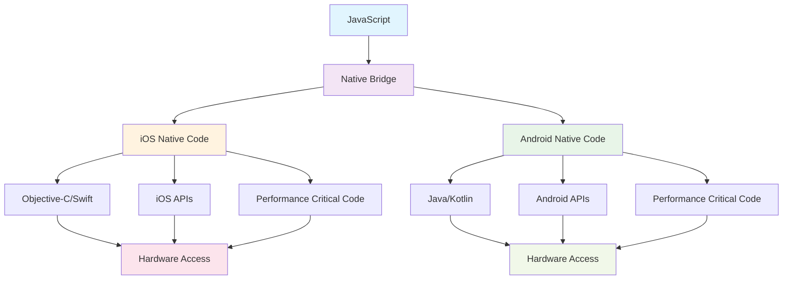
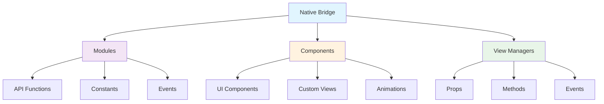
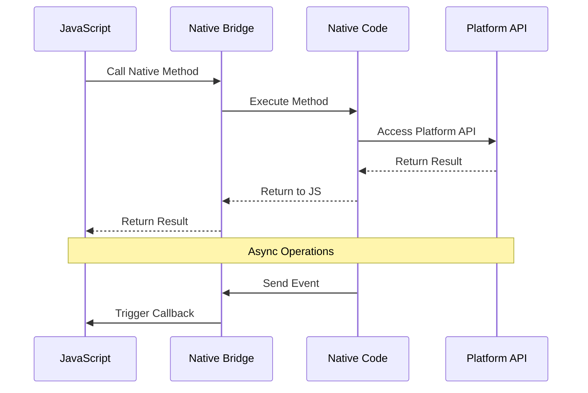

# Módulo 7: Native Bridging

## 🎯 Objetivos de Aprendizagem

Ao final deste módulo, você será capaz de:

- Entender o conceito de Native Bridge
- Criar módulos nativos para iOS
- Criar módulos nativos para Android
- Fazer bridge entre JavaScript e código nativo
- Otimizar performance com código nativo
- Acessar APIs específicas da plataforma

## 📚 Conteúdo Teórico

### 7.1 O que é Native Bridge?

O Native Bridge é a ponte de comunicação entre o JavaScript e o código nativo (Objective-C/Swift no iOS e Java/Kotlin no Android).



### 7.2 Tipos de Native Bridge



### 7.3 Fluxo de Comunicação



## 💻 Exemplos Práticos

### Exemplo 1: Módulo Nativo Simples (iOS)

```swift
// exemplos/ios/ContadorModule.swift
import Foundation
import React

@objc(ContadorModule)
class ContadorModule: NSObject {

  private var contador: Int = 0

  @objc
  static func requiresMainQueueSetup() -> Bool {
    return false
  }

  @objc
  func incrementar(_ resolve: @escaping RCTPromiseResolveBlock,
                   rejecter reject: @escaping RCTPromiseRejectBlock) -> Void {
    contador += 1
    resolve(contador)
  }

  @objc
  func decrementar(_ resolve: @escaping RCTPromiseResolveBlock,
                   rejecter reject: @escaping RCTPromiseRejectBlock) -> Void {
    contador -= 1
    resolve(contador)
  }

  @objc
  func obterValor(_ resolve: @escaping RCTPromiseResolveBlock,
                  rejecter reject: @escaping RCTPromiseRejectBlock) -> Void {
    resolve(contador)
  }

  @objc
  func resetar(_ resolve: @escaping RCTPromiseResolveBlock,
               rejecter reject: @escaping RCTPromiseRejectBlock) -> Void {
    contador = 0
    resolve(contador)
  }
}
```

```objc
// exemplos/ios/ContadorModule.m
#import <React/RCTBridgeModule.h>

@interface RCT_EXTERN_MODULE(ContadorModule, NSObject)

RCT_EXTERN_METHOD(incrementar:(RCTPromiseResolveBlock)resolve
                  rejecter:(RCTPromiseRejectBlock)reject)

RCT_EXTERN_METHOD(decrementar:(RCTPromiseResolveBlock)resolve
                  rejecter:(RCTPromiseRejectBlock)reject)

RCT_EXTERN_METHOD(obterValor:(RCTPromiseResolveBlock)resolve
                  rejecter:(RCTPromiseRejectBlock)reject)

RCT_EXTERN_METHOD(resetar:(RCTPromiseResolveBlock)resolve
                  rejecter:(RCTPromiseRejectBlock)reject)

@end
```

### Exemplo 2: Módulo Nativo Simples (Android)

```java
// exemplos/android/ContadorModule.java
package com.meuapp;

import com.facebook.react.bridge.ReactApplicationContext;
import com.facebook.react.bridge.ReactContextBaseJavaModule;
import com.facebook.react.bridge.ReactMethod;
import com.facebook.react.bridge.Promise;

public class ContadorModule extends ReactContextBaseJavaModule {

    private int contador = 0;

    public ContadorModule(ReactApplicationContext reactContext) {
        super(reactContext);
    }

    @Override
    public String getName() {
        return "ContadorModule";
    }

    @ReactMethod
    public void incrementar(Promise promise) {
        try {
            contador++;
            promise.resolve(contador);
        } catch (Exception e) {
            promise.reject("ERRO_INCREMENTAR", e.getMessage());
        }
    }

    @ReactMethod
    public void decrementar(Promise promise) {
        try {
            contador--;
            promise.resolve(contador);
        } catch (Exception e) {
            promise.reject("ERRO_DECREMENTAR", e.getMessage());
        }
    }

    @ReactMethod
    public void obterValor(Promise promise) {
        try {
            promise.resolve(contador);
        } catch (Exception e) {
            promise.reject("ERRO_OBTER_VALOR", e.getMessage());
        }
    }

    @ReactMethod
    public void resetar(Promise promise) {
        try {
            contador = 0;
            promise.resolve(contador);
        } catch (Exception e) {
            promise.reject("ERRO_RESETAR", e.getMessage());
        }
    }
}
```

```java
// exemplos/android/ContadorPackage.java
package com.meuapp;

import com.facebook.react.ReactPackage;
import com.facebook.react.bridge.NativeModule;
import com.facebook.react.bridge.ReactApplicationContext;
import com.facebook.react.uimanager.ViewManager;

import java.util.ArrayList;
import java.util.Collections;
import java.util.List;

public class ContadorPackage implements ReactPackage {

    @Override
    public List<ViewManager> createViewManagers(ReactApplicationContext reactContext) {
        return Collections.emptyList();
    }

    @Override
    public List<NativeModule> createNativeModules(ReactApplicationContext reactContext) {
        List<NativeModule> modules = new ArrayList<>();
        modules.add(new ContadorModule(reactContext));
        return modules;
    }
}
```

### Exemplo 3: Uso do Módulo Nativo no JavaScript

```jsx
// exemplos/ContadorNativo.jsx
import React, { useState, useEffect } from 'react';
import {
  View,
  Text,
  StyleSheet,
  TouchableOpacity,
  NativeModules,
  Alert
} from 'react-native';

const { ContadorModule } = NativeModules;

const ContadorNativo = () => {
  const [valor, setValor] = useState(0);
  const [carregando, setCarregando] = useState(false);

  useEffect(() => {
    carregarValor();
  }, []);

  const carregarValor = async () => {
    try {
      setCarregando(true);
      const valorAtual = await ContadorModule.obterValor();
      setValor(valorAtual);
    } catch (error) {
      console.error('Erro ao carregar valor:', error);
      Alert.alert('Erro', 'Não foi possível carregar o valor');
    } finally {
      setCarregando(false);
    }
  };

  const incrementar = async () => {
    try {
      setCarregando(true);
      const novoValor = await ContadorModule.incrementar();
      setValor(novoValor);
    } catch (error) {
      console.error('Erro ao incrementar:', error);
      Alert.alert('Erro', 'Não foi possível incrementar');
    } finally {
      setCarregando(false);
    }
  };

  const decrementar = async () => {
    try {
      setCarregando(true);
      const novoValor = await ContadorModule.decrementar();
      setValor(novoValor);
    } catch (error) {
      console.error('Erro ao decrementar:', error);
      Alert.alert('Erro', 'Não foi possível decrementar');
    } finally {
      setCarregando(false);
    }
  };

  const resetar = async () => {
    try {
      setCarregando(true);
      const novoValor = await ContadorModule.resetar();
      setValor(novoValor);
    } catch (error) {
      console.error('Erro ao resetar:', error);
      Alert.alert('Erro', 'Não foi possível resetar');
    } finally {
      setCarregando(false);
    }
  };

  return (
    <View style={styles.container}>
      <Text style={styles.titulo}>Contador Nativo</Text>

      <View style={styles.valorContainer}>
        <Text style={styles.valor}>{valor}</Text>
        {carregando && <Text style={styles.carregando}>Carregando...</Text>}
      </View>

      <View style={styles.botoesContainer}>
        <TouchableOpacity
          style={[styles.botao, styles.botaoIncrementar]}
          onPress={incrementar}
          disabled={carregando}
        >
          <Text style={styles.textoBotao}>+</Text>
        </TouchableOpacity>

        <TouchableOpacity
          style={[styles.botao, styles.botaoDecrementar]}
          onPress={decrementar}
          disabled={carregando}
        >
          <Text style={styles.textoBotao}>-</Text>
        </TouchableOpacity>

        <TouchableOpacity
          style={[styles.botao, styles.botaoResetar]}
          onPress={resetar}
          disabled={carregando}
        >
          <Text style={styles.textoBotao}>Reset</Text>
        </TouchableOpacity>
      </View>

      <View style={styles.info}>
        <Text style={styles.textoInfo}>
          Este contador usa código nativo para manter o estado
        </Text>
        <Text style={styles.textoInfo}>
          Módulo: {ContadorModule ? 'Disponível' : 'Não disponível'}
        </Text>
      </View>
    </View>
  );
};

const styles = StyleSheet.create({
  container: {
    flex: 1,
    justifyContent: 'center',
    alignItems: 'center',
    backgroundColor: '#f0f0f0',
    padding: 20
  },
  titulo: {
    fontSize: 24,
    fontWeight: 'bold',
    marginBottom: 30,
    color: '#333'
  },
  valorContainer: {
    alignItems: 'center',
    marginBottom: 30
  },
  valor: {
    fontSize: 48,
    fontWeight: 'bold',
    color: '#007bff',
    marginBottom: 10
  },
  carregando: {
    fontSize: 14,
    color: '#666'
  },
  botoesContainer: {
    flexDirection: 'row',
    gap: 15,
    marginBottom: 30
  },
  botao: {
    paddingHorizontal: 20,
    paddingVertical: 15,
    borderRadius: 8,
    minWidth: 80,
    alignItems: 'center'
  },
  botaoIncrementar: {
    backgroundColor: '#28a745'
  },
  botaoDecrementar: {
    backgroundColor: '#dc3545'
  },
  botaoResetar: {
    backgroundColor: '#6c757d'
  },
  textoBotao: {
    color: 'white',
    fontSize: 18,
    fontWeight: 'bold'
  },
  info: {
    backgroundColor: '#e9ecef',
    padding: 15,
    borderRadius: 8,
    width: '100%'
  },
  textoInfo: {
    fontSize: 14,
    color: '#666',
    textAlign: 'center',
    marginBottom: 5
  }
});

export default ContadorNativo;
```

### Exemplo 4: Módulo com Eventos

```swift
// exemplos/ios/EventosModule.swift
import Foundation
import React

@objc(EventosModule)
class EventosModule: NSObject {

  @objc
  static func requiresMainQueueSetup() -> Bool {
    return false
  }

  @objc
  func iniciarTimer(_ interval: NSNumber) -> Void {
    Timer.scheduledTimer(withTimeInterval: interval.doubleValue, repeats: true) { _ in
      self.enviarEvento("onTimerTick", body: ["timestamp": Date().timeIntervalSince1970])
    }
  }

  @objc
  func pararTimer() -> Void {
    // Implementar lógica para parar timer
  }

  private func enviarEvento(_ eventName: String, body: [String: Any]) {
    // Enviar evento para JavaScript
    if let bridge = RCTBridge.current() {
      bridge.eventDispatcher().sendAppEvent(withName: eventName, body: body)
    }
  }
}
```

```jsx
// exemplos/EventosNativo.jsx
import React, { useState, useEffect } from 'react';
import {
  View,
  Text,
  StyleSheet,
  TouchableOpacity,
  NativeModules,
  NativeEventEmitter
} from 'react-native';

const { EventosModule } = NativeModules;

const EventosNativo = () => {
  const [contador, setContador] = useState(0);
  const [timerAtivo, setTimerAtivo] = useState(false);

  useEffect(() => {
    const eventEmitter = new NativeEventEmitter(EventosModule);

    const subscription = eventEmitter.addListener('onTimerTick', event => {
      setContador(prev => prev + 1);
    });

    return () => {
      subscription.remove();
    };
  }, []);

  const iniciarTimer = () => {
    EventosModule.iniciarTimer(1000); // 1 segundo
    setTimerAtivo(true);
  };

  const pararTimer = () => {
    EventosModule.pararTimer();
    setTimerAtivo(false);
  };

  const resetarContador = () => {
    setContador(0);
  };

  return (
    <View style={styles.container}>
      <Text style={styles.titulo}>Eventos Nativos</Text>

      <View style={styles.contadorContainer}>
        <Text style={styles.contador}>{contador}</Text>
        <Text style={styles.status}>
          {timerAtivo ? 'Timer Ativo' : 'Timer Parado'}
        </Text>
      </View>

      <View style={styles.botoesContainer}>
        <TouchableOpacity
          style={[styles.botao, styles.botaoIniciar]}
          onPress={iniciarTimer}
          disabled={timerAtivo}
        >
          <Text style={styles.textoBotao}>Iniciar Timer</Text>
        </TouchableOpacity>

        <TouchableOpacity
          style={[styles.botao, styles.botaoParar]}
          onPress={pararTimer}
          disabled={!timerAtivo}
        >
          <Text style={styles.textoBotao}>Parar Timer</Text>
        </TouchableOpacity>

        <TouchableOpacity
          style={[styles.botao, styles.botaoResetar]}
          onPress={resetarContador}
        >
          <Text style={styles.textoBotao}>Resetar</Text>
        </TouchableOpacity>
      </View>

      <View style={styles.info}>
        <Text style={styles.textoInfo}>
          Este exemplo mostra como receber eventos do código nativo
        </Text>
      </View>
    </View>
  );
};

const styles = StyleSheet.create({
  container: {
    flex: 1,
    justifyContent: 'center',
    alignItems: 'center',
    backgroundColor: '#f0f0f0',
    padding: 20
  },
  titulo: {
    fontSize: 24,
    fontWeight: 'bold',
    marginBottom: 30,
    color: '#333'
  },
  contadorContainer: {
    alignItems: 'center',
    marginBottom: 30
  },
  contador: {
    fontSize: 48,
    fontWeight: 'bold',
    color: '#007bff',
    marginBottom: 10
  },
  status: {
    fontSize: 16,
    color: '#666'
  },
  botoesContainer: {
    gap: 15,
    marginBottom: 30
  },
  botao: {
    paddingHorizontal: 20,
    paddingVertical: 15,
    borderRadius: 8,
    minWidth: 150,
    alignItems: 'center',
    marginBottom: 10
  },
  botaoIniciar: {
    backgroundColor: '#28a745'
  },
  botaoParar: {
    backgroundColor: '#dc3545'
  },
  botaoResetar: {
    backgroundColor: '#6c757d'
  },
  textoBotao: {
    color: 'white',
    fontSize: 16,
    fontWeight: 'bold'
  },
  info: {
    backgroundColor: '#e9ecef',
    padding: 15,
    borderRadius: 8,
    width: '100%'
  },
  textoInfo: {
    fontSize: 14,
    color: '#666',
    textAlign: 'center'
  }
});

export default EventosNativo;
```

### Exemplo 5: Módulo com Constantes

```swift
// exemplos/ios/ConstantesModule.swift
import Foundation
import React

@objc(ConstantesModule)
class ConstantesModule: NSObject {

  @objc
  static func requiresMainQueueSetup() -> Bool {
    return false
  }

  @objc
  func constantsToExport() -> [String: Any] {
    return [
      "VERSION": "1.0.0",
      "BUILD_NUMBER": 1,
      "PLATFORM": "iOS",
      "API_URL": "https://api.meuapp.com",
      "FEATURES": [
        "notifications": true,
        "camera": true,
        "location": true
      ]
    ]
  }
}
```

```jsx
// exemplos/ConstantesNativo.jsx
import React from 'react';
import { View, Text, StyleSheet, NativeModules } from 'react-native';

const { ConstantesModule } = NativeModules;

const ConstantesNativo = () => {
  const constantes = ConstantesModule || {};

  return (
    <View style={styles.container}>
      <Text style={styles.titulo}>Constantes Nativas</Text>

      <View style={styles.infoContainer}>
        <Text style={styles.label}>Versão:</Text>
        <Text style={styles.valor}>{constantes.VERSION || 'N/A'}</Text>

        <Text style={styles.label}>Build Number:</Text>
        <Text style={styles.valor}>{constantes.BUILD_NUMBER || 'N/A'}</Text>

        <Text style={styles.label}>Plataforma:</Text>
        <Text style={styles.valor}>{constantes.PLATFORM || 'N/A'}</Text>

        <Text style={styles.label}>API URL:</Text>
        <Text style={styles.valor}>{constantes.API_URL || 'N/A'}</Text>

        <Text style={styles.label}>Recursos:</Text>
        <Text style={styles.valor}>
          Notificações: {constantes.FEATURES?.notifications ? 'Sim' : 'Não'}
        </Text>
        <Text style={styles.valor}>
          Câmera: {constantes.FEATURES?.camera ? 'Sim' : 'Não'}
        </Text>
        <Text style={styles.valor}>
          Localização: {constantes.FEATURES?.location ? 'Sim' : 'Não'}
        </Text>
      </View>
    </View>
  );
};

const styles = StyleSheet.create({
  container: {
    flex: 1,
    backgroundColor: '#f0f0f0',
    padding: 20
  },
  titulo: {
    fontSize: 24,
    fontWeight: 'bold',
    textAlign: 'center',
    marginBottom: 30,
    color: '#333'
  },
  infoContainer: {
    backgroundColor: 'white',
    padding: 20,
    borderRadius: 8,
    shadowColor: '#000',
    shadowOffset: { width: 0, height: 2 },
    shadowOpacity: 0.1,
    shadowRadius: 4,
    elevation: 3
  },
  label: {
    fontSize: 16,
    fontWeight: 'bold',
    color: '#333',
    marginTop: 10,
    marginBottom: 5
  },
  valor: {
    fontSize: 14,
    color: '#666',
    marginBottom: 5
  }
});

export default ConstantesNativo;
```

## 🎯 Atividades Práticas

### Atividade 1: Módulo de Cálculo

Crie um módulo nativo que:

- Faça cálculos matemáticos complexos
- Calcule números primos
- Gere sequências de Fibonacci
- Compare performance com JavaScript

### Atividade 2: Módulo de Hardware

Desenvolva um módulo que:

- Acesse sensores do dispositivo
- Leia informações do sistema
- Monitore uso de memória
- Controle vibração

### Atividade 3: Módulo de Criptografia

Implemente um módulo que:

- Criptografe dados sensíveis
- Gere chaves seguras
- Valide assinaturas digitais
- Use APIs nativas de segurança

## 📱 Configuração do Projeto

### iOS (Podfile)

```ruby
target 'MeuApp' do
  # ... outras configurações
end
```

### Android (build.gradle)

```gradle
dependencies {
    // ... outras dependências
}
```

## 📝 Exercícios de Fixação

1. **Pergunta:** Qual a vantagem de usar código nativo?
   - Resposta: Performance superior, acesso a APIs específicas da plataforma, funcionalidades não disponíveis em JavaScript

2. **Pergunta:** Como funciona a comunicação entre JavaScript e código nativo?
   - Resposta: Através do Native Bridge que serializa/deserializa dados entre as duas camadas

3. **Pergunta:** Quando usar módulos nativos?
   - Resposta: Para operações que requerem performance, acesso a hardware, ou funcionalidades específicas da plataforma

## 🔗 Próximos Passos

No próximo módulo, você aprenderá a:

- Implementar testes automatizados
- Usar Jest para testes unitários
- Fazer testes de integração
- Medir cobertura de código

## 📚 Recursos Adicionais

- [Native Modules](https://reactnative.dev/docs/native-modules-intro)
- [iOS Native Modules](https://reactnative.dev/docs/native-modules-ios)
- [Android Native Modules](https://reactnative.dev/docs/native-modules-android)
- [Turbo Modules](https://reactnative.dev/docs/the-new-architecture/landing-page)

---

**Professor:** Jackson Sá  
**ETEC Bento Quirino - Campinas/SP**
