# Módulo 8: Testes

## 🎯 Objetivos de Aprendizagem

Ao final deste módulo, você será capaz de:

- Implementar testes unitários com Jest
- Criar testes de componentes com React Native Testing Library
- Fazer testes de integração
- Medir cobertura de código
- Configurar testes E2E com Detox
- Implementar testes de performance

## 📚 Conteúdo Teórico

### 8.1 Tipos de Testes

```mermaid
graph TD
    A[Testes] --> B[Unitários]
    A --> C[Integração]
    A --> D[E2E]
    A --> E[Performance]

    B --> F[Funções]
    B --> G[Componentes]
    B --> H[Utils]

    C --> I[APIs]
    C --> J[Fluxos]
    C --> K[Redux]

    D --> L[App Completo]
    D --> M[User Journey]
    D --> N[Cross-Platform]

    E --> O[Render Time]
    E --> P[Memory Usage]
    E --> Q[Bundle Size]

    style A fill:#e1f5fe
    style B fill:#f3e5f5
    style C fill:#fff3e0
    style D fill:#e8f5e8
    style E fill:#fce4ec
```



### 8.2 Pirâmide de Testes

```mermaid
graph TD
    A[E2E Tests] --> B[Poucos]
    C[Integration Tests] --> D[Médios]
    E[Unit Tests] --> F[Muitos]

    G[Benefícios] --> H[Confiança]
    G --> I[Manutenibilidade]
    G --> J[Documentação]
    G --> K[Refatoração]

    style A fill:#ffcdd2
    style C fill:#fff3e0
    style E fill:#c8e6c9
    style G fill:#e1f5fe
```



### 8.3 Estrutura de Testes


## 💻 Exemplos Práticos

### Exemplo 1: Testes Unitários Básicos

```jsx
// exemplos/Calculadora.test.js
import { calcular, formatarNumero, validarEntrada } from '../utils/calculadora';

describe('Calculadora', () => {
  describe('calcular', () => {
    it('deve somar dois números corretamente', () => {
      expect(calcular(2, 3, '+')).toBe(5);
    });

    it('deve subtrair dois números corretamente', () => {
      expect(calcular(5, 3, '-')).toBe(2);
    });

    it('deve multiplicar dois números corretamente', () => {
      expect(calcular(4, 3, '*')).toBe(12);
    });

    it('deve dividir dois números corretamente', () => {
      expect(calcular(10, 2, '/')).toBe(5);
    });

    it('deve retornar erro para divisão por zero', () => {
      expect(() => calcular(10, 0, '/')).toThrow('Divisão por zero');
    });

    it('deve retornar erro para operação inválida', () => {
      expect(() => calcular(10, 5, '%')).toThrow('Operação inválida');
    });
  });

  describe('formatarNumero', () => {
    it('deve formatar número com duas casas decimais', () => {
      expect(formatarNumero(3.14159)).toBe('3.14');
    });

    it('deve formatar número inteiro sem decimais', () => {
      expect(formatarNumero(5)).toBe('5.00');
    });

    it('deve formatar zero corretamente', () => {
      expect(formatarNumero(0)).toBe('0.00');
    });
  });

  describe('validarEntrada', () => {
    it('deve aceitar números válidos', () => {
      expect(validarEntrada('123')).toBe(true);
      expect(validarEntrada('123.45')).toBe(true);
      expect(validarEntrada('-123')).toBe(true);
    });

    it('deve rejeitar entradas inválidas', () => {
      expect(validarEntrada('abc')).toBe(false);
      expect(validarEntrada('')).toBe(false);
      expect(validarEntrada('12.34.56')).toBe(false);
    });
  });
});
```

### Exemplo 2: Testes de Componentes

```jsx
// exemplos/Contador.test.jsx
import React from 'react';
import { render, fireEvent, screen } from '@testing-library/react-native';
import Contador from '../components/Contador';

describe('Contador', () => {
  it('deve renderizar com valor inicial 0', () => {
    render(<Contador />);
    expect(screen.getByText('0')).toBeTruthy();
  });

  it('deve incrementar quando botão + é pressionado', () => {
    render(<Contador />);
    const botaoIncrementar = screen.getByText('+');

    fireEvent.press(botaoIncrementar);
    expect(screen.getByText('1')).toBeTruthy();

    fireEvent.press(botaoIncrementar);
    expect(screen.getByText('2')).toBeTruthy();
  });

  it('deve decrementar quando botão - é pressionado', () => {
    render(<Contador />);
    const botaoDecrementar = screen.getByText('-');

    fireEvent.press(botaoDecrementar);
    expect(screen.getByText('-1')).toBeTruthy();
  });

  it('deve resetar quando botão Reset é pressionado', () => {
    render(<Contador />);
    const botaoIncrementar = screen.getByText('+');
    const botaoReset = screen.getByText('Reset');

    fireEvent.press(botaoIncrementar);
    fireEvent.press(botaoIncrementar);
    expect(screen.getByText('2')).toBeTruthy();

    fireEvent.press(botaoReset);
    expect(screen.getByText('0')).toBeTruthy();
  });

  it('deve mostrar histórico de operações', () => {
    render(<Contador />);
    const botaoIncrementar = screen.getByText('+');

    fireEvent.press(botaoIncrementar);
    fireEvent.press(botaoIncrementar);

    expect(screen.getByText('Incrementou para 1')).toBeTruthy();
    expect(screen.getByText('Incrementou para 2')).toBeTruthy();
  });
});
```

### Exemplo 3: Testes de Redux

```jsx
// exemplos/tarefasReducer.test.js
import tarefasReducer, {
  adicionarTarefa,
  toggleTarefa,
  removerTarefa
} from '../store/tarefasSlice';

describe('tarefasReducer', () => {
  const estadoInicial = {
    tarefas: [],
    filtro: 'todas'
  };

  it('deve retornar estado inicial', () => {
    expect(tarefasReducer(undefined, {})).toEqual(estadoInicial);
  });

  it('deve adicionar nova tarefa', () => {
    const novaTarefa = { id: 1, texto: 'Nova tarefa', concluida: false };
    const action = adicionarTarefa(novaTarefa);

    const novoEstado = tarefasReducer(estadoInicial, action);

    expect(novoEstado.tarefas).toHaveLength(1);
    expect(novoEstado.tarefas[0]).toEqual(novaTarefa);
  });

  it('deve toggle tarefa existente', () => {
    const estadoComTarefa = {
      ...estadoInicial,
      tarefas: [{ id: 1, texto: 'Tarefa', concluida: false }]
    };

    const action = toggleTarefa(1);
    const novoEstado = tarefasReducer(estadoComTarefa, action);

    expect(novoEstado.tarefas[0].concluida).toBe(true);
  });

  it('deve remover tarefa existente', () => {
    const estadoComTarefas = {
      ...estadoInicial,
      tarefas: [
        { id: 1, texto: 'Tarefa 1', concluida: false },
        { id: 2, texto: 'Tarefa 2', concluida: false }
      ]
    };

    const action = removerTarefa(1);
    const novoEstado = tarefasReducer(estadoComTarefas, action);

    expect(novoEstado.tarefas).toHaveLength(1);
    expect(novoEstado.tarefas[0].id).toBe(2);
  });
});
```

### Exemplo 4: Testes de Integração

```jsx
// exemplos/App.test.jsx
import React from 'react';
import { render, fireEvent, waitFor } from '@testing-library/react-native';
import { Provider } from 'react-redux';
import { store } from '../store';
import App from '../App';

const renderComRedux = component => {
  return render(<Provider store={store}>{component}</Provider>);
};

describe('App Integration Tests', () => {
  it('deve navegar entre telas corretamente', async () => {
    const { getByText, getByTestId } = renderComRedux(<App />);

    // Verifica se a tela inicial está visível
    expect(getByText('Bem-vindo')).toBeTruthy();

    // Navega para a tela de perfil
    const botaoPerfil = getByText('Ver Perfil');
    fireEvent.press(botaoPerfil);

    await waitFor(() => {
      expect(getByText('Meu Perfil')).toBeTruthy();
    });

    // Volta para a tela inicial
    const botaoVoltar = getByTestId('botao-voltar');
    fireEvent.press(botaoVoltar);

    await waitFor(() => {
      expect(getByText('Bem-vindo')).toBeTruthy();
    });
  });

  it('deve adicionar e remover tarefas', async () => {
    const { getByText, getByPlaceholderText } = renderComRedux(<App />);

    // Adiciona nova tarefa
    const inputTarefa = getByPlaceholderText('Nova tarefa...');
    const botaoAdicionar = getByText('Adicionar');

    fireEvent.changeText(inputTarefa, 'Nova tarefa de teste');
    fireEvent.press(botaoAdicionar);

    await waitFor(() => {
      expect(getByText('Nova tarefa de teste')).toBeTruthy();
    });

    // Remove a tarefa
    const botaoRemover = getByText('×');
    fireEvent.press(botaoRemover);

    await waitFor(() => {
      expect(getByText('Nova tarefa de teste')).not.toBeTruthy();
    });
  });
});
```

### Exemplo 5: Testes de API

```jsx
// exemplos/api.test.js
import {
  buscarUsuarios,
  criarUsuario,
  atualizarUsuario
} from '../services/api';

// Mock do fetch
global.fetch = jest.fn();

describe('API Tests', () => {
  beforeEach(() => {
    fetch.mockClear();
  });

  it('deve buscar usuários com sucesso', async () => {
    const usuariosMock = [
      { id: 1, nome: 'João', email: 'joao@email.com' },
      { id: 2, nome: 'Maria', email: 'maria@email.com' }
    ];

    fetch.mockResolvedValueOnce({
      ok: true,
      json: async () => usuariosMock
    });

    const resultado = await buscarUsuarios();

    expect(fetch).toHaveBeenCalledWith('/api/usuarios');
    expect(resultado).toEqual(usuariosMock);
  });

  it('deve criar usuário com sucesso', async () => {
    const novoUsuario = { nome: 'Pedro', email: 'pedro@email.com' };
    const usuarioCriado = { id: 3, ...novoUsuario };

    fetch.mockResolvedValueOnce({
      ok: true,
      json: async () => usuarioCriado
    });

    const resultado = await criarUsuario(novoUsuario);

    expect(fetch).toHaveBeenCalledWith('/api/usuarios', {
      method: 'POST',
      headers: { 'Content-Type': 'application/json' },
      body: JSON.stringify(novoUsuario)
    });
    expect(resultado).toEqual(usuarioCriado);
  });

  it('deve tratar erro de API', async () => {
    fetch.mockRejectedValueOnce(new Error('Erro de rede'));

    await expect(buscarUsuarios()).rejects.toThrow('Erro de rede');
  });
});
```

## 🎯 Tutorial Prático: App de Quiz com Testes

### Passo 1: Configuração do Projeto

1. **Crie um novo projeto:**

   ```bash
   npx create-expo-app app-quiz-testes
   cd app-quiz-testes
   ```

2. **Instale dependências de teste:**

   ```bash
   npm install --save-dev @testing-library/react-native @testing-library/jest-native jest-expo
   ```

3. **Configure o Jest:**
   ```bash
   npm install --save-dev jest-environment-jsdom
   ```

### Passo 2: Estrutura do Projeto

```
app-quiz-testes/
├── src/
│   ├── components/
│   │   ├── QuizCard.js
│   │   ├── QuizResult.js
│   │   └── QuizTimer.js
│   ├── services/
│   │   └── quizService.js
│   ├── utils/
│   │   └── quizUtils.js
│   └── __tests__/
│       ├── components/
│       ├── services/
│       └── utils/
├── App.js
└── package.json
```

### Passo 3: Implementando o Quiz

```jsx
// src/components/QuizCard.js
import React from 'react';
import { View, Text, TouchableOpacity, StyleSheet } from 'react-native';

const QuizCard = ({
  pergunta,
  opcoes,
  onResposta,
  respostaSelecionada,
  tempoRestante
}) => {
  return (
    <View style={styles.container}>
      <View style={styles.header}>
        <Text style={styles.tempo}>{tempoRestante}s</Text>
      </View>

      <Text style={styles.pergunta}>{pergunta}</Text>

      <View style={styles.opcoes}>
        {opcoes.map((opcao, index) => (
          <TouchableOpacity
            key={index}
            style={[
              styles.opcao,
              respostaSelecionada === index && styles.opcaoSelecionada
            ]}
            onPress={() => onResposta(index)}
          >
            <Text style={styles.textoOpcao}>{opcao}</Text>
          </TouchableOpacity>
        ))}
      </View>
    </View>
  );
};

const styles = StyleSheet.create({
  container: {
    flex: 1,
    padding: 20,
    backgroundColor: '#f8f9fa'
  },
  header: {
    alignItems: 'flex-end',
    marginBottom: 20
  },
  tempo: {
    fontSize: 18,
    fontWeight: 'bold',
    color: '#dc3545'
  },
  pergunta: {
    fontSize: 20,
    fontWeight: 'bold',
    color: '#333',
    marginBottom: 30,
    textAlign: 'center'
  },
  opcoes: {
    gap: 15
  },
  opcao: {
    backgroundColor: 'white',
    padding: 15,
    borderRadius: 8,
    borderWidth: 2,
    borderColor: '#e9ecef'
  },
  opcaoSelecionada: {
    borderColor: '#007bff',
    backgroundColor: '#e3f2fd'
  },
  textoOpcao: {
    fontSize: 16,
    color: '#333'
  }
});

export default QuizCard;
```

### Passo 4: Testes dos Componentes

```jsx
// src/__tests__/components/QuizCard.test.js
import React from 'react';
import { render, fireEvent } from '@testing-library/react-native';
import QuizCard from '../../components/QuizCard';

describe('QuizCard', () => {
  const mockProps = {
    pergunta: 'Qual é a capital do Brasil?',
    opcoes: ['São Paulo', 'Rio de Janeiro', 'Brasília', 'Belo Horizonte'],
    onResposta: jest.fn(),
    respostaSelecionada: null,
    tempoRestante: 30
  };

  beforeEach(() => {
    jest.clearAllMocks();
  });

  it('deve renderizar pergunta e opções corretamente', () => {
    const { getByText } = render(<QuizCard {...mockProps} />);

    expect(getByText('Qual é a capital do Brasil?')).toBeTruthy();
    expect(getByText('São Paulo')).toBeTruthy();
    expect(getByText('Rio de Janeiro')).toBeTruthy();
    expect(getByText('Brasília')).toBeTruthy();
    expect(getByText('Belo Horizonte')).toBeTruthy();
  });

  it('deve mostrar tempo restante', () => {
    const { getByText } = render(<QuizCard {...mockProps} />);

    expect(getByText('30s')).toBeTruthy();
  });

  it('deve chamar onResposta quando opção é selecionada', () => {
    const { getByText } = render(<QuizCard {...mockProps} />);

    const opcaoBrasilia = getByText('Brasília');
    fireEvent.press(opcaoBrasilia);

    expect(mockProps.onResposta).toHaveBeenCalledWith(2);
  });

  it('deve destacar opção selecionada', () => {
    const propsComSelecao = {
      ...mockProps,
      respostaSelecionada: 2
    };

    const { getByText } = render(<QuizCard {...propsComSelecao} />);

    const opcaoBrasilia = getByText('Brasília');
    expect(opcaoBrasilia.parent).toHaveStyle({
      borderColor: '#007bff',
      backgroundColor: '#e3f2fd'
    });
  });
});
```

### Passo 5: Testes de Serviços

```jsx
// src/__tests__/services/quizService.test.js
import {
  buscarPerguntas,
  validarResposta,
  calcularPontuacao
} from '../../services/quizService';

// Mock do fetch
global.fetch = jest.fn();

describe('quizService', () => {
  beforeEach(() => {
    fetch.mockClear();
  });

  describe('buscarPerguntas', () => {
    it('deve buscar perguntas com sucesso', async () => {
      const perguntasMock = [
        {
          id: 1,
          pergunta: 'Qual é a capital do Brasil?',
          opcoes: ['São Paulo', 'Rio de Janeiro', 'Brasília', 'Belo Horizonte'],
          respostaCorreta: 2
        }
      ];

      fetch.mockResolvedValueOnce({
        ok: true,
        json: async () => perguntasMock
      });

      const resultado = await buscarPerguntas();

      expect(fetch).toHaveBeenCalledWith('/api/quiz/perguntas');
      expect(resultado).toEqual(perguntasMock);
    });

    it('deve tratar erro de API', async () => {
      fetch.mockRejectedValueOnce(new Error('Erro de rede'));

      await expect(buscarPerguntas()).rejects.toThrow('Erro de rede');
    });
  });

  describe('validarResposta', () => {
    it('deve validar resposta correta', () => {
      const pergunta = {
        respostaCorreta: 2
      };

      expect(validarResposta(pergunta, 2)).toBe(true);
    });

    it('deve validar resposta incorreta', () => {
      const pergunta = {
        respostaCorreta: 2
      };

      expect(validarResposta(pergunta, 1)).toBe(false);
    });
  });

  describe('calcularPontuacao', () => {
    it('deve calcular pontuação corretamente', () => {
      const respostas = [
        { pergunta: { respostaCorreta: 2 }, resposta: 2 },
        { pergunta: { respostaCorreta: 1 }, resposta: 1 },
        { pergunta: { respostaCorreta: 3 }, resposta: 1 }
      ];

      const pontuacao = calcularPontuacao(respostas);

      expect(pontuacao).toBe(2);
    });

    it('deve retornar 0 para array vazio', () => {
      const pontuacao = calcularPontuacao([]);

      expect(pontuacao).toBe(0);
    });
  });
});
```

### Passo 6: Testes de Integração

```jsx
// src/__tests__/App.test.js
import React from 'react';
import { render, fireEvent, waitFor } from '@testing-library/react-native';
import App from '../App';

// Mock do quizService
jest.mock('../services/quizService', () => ({
  buscarPerguntas: jest.fn(() =>
    Promise.resolve([
      {
        id: 1,
        pergunta: 'Qual é a capital do Brasil?',
        opcoes: ['São Paulo', 'Rio de Janeiro', 'Brasília', 'Belo Horizonte'],
        respostaCorreta: 2
      }
    ])
  )
}));

describe('App Integration Tests', () => {
  it('deve iniciar quiz e responder pergunta', async () => {
    const { getByText, getByTestId } = render(<App />);

    // Inicia o quiz
    const botaoIniciar = getByText('Iniciar Quiz');
    fireEvent.press(botaoIniciar);

    // Aguarda carregar pergunta
    await waitFor(() => {
      expect(getByText('Qual é a capital do Brasil?')).toBeTruthy();
    });

    // Responde a pergunta
    const opcaoBrasilia = getByText('Brasília');
    fireEvent.press(opcaoBrasilia);

    // Verifica resultado
    await waitFor(() => {
      expect(getByText('Correto!')).toBeTruthy();
    });
  });

  it('deve mostrar pontuação final', async () => {
    const { getByText } = render(<App />);

    // Inicia e completa quiz
    fireEvent.press(getByText('Iniciar Quiz'));

    await waitFor(() => {
      expect(getByText('Qual é a capital do Brasil?')).toBeTruthy();
    });

    fireEvent.press(getByText('Brasília'));

    await waitFor(() => {
      expect(getByText('Pontuação: 1/1')).toBeTruthy();
    });
  });
});
```

### Passo 7: Executando os Testes

```bash
# Executar todos os testes
npm test

# Executar testes em modo watch
npm run test:watch

# Executar testes com cobertura
npm run test:coverage
```

### Passo 8: Exercícios de Extensão

1. **Adicione testes de performance**
2. **Implemente testes de acessibilidade**
3. **Crie testes de snapshot**
4. **Configure testes E2E com Detox**

## 🎯 Atividades Práticas

### Atividade 1: App de Calculadora com Testes

Crie uma calculadora com testes completos:

- Testes unitários para funções matemáticas
- Testes de componentes para interface
- Testes de integração para fluxo completo

### Atividade 2: App de Lista de Tarefas com Testes

Implemente uma lista de tarefas com:

- Testes de Redux
- Testes de componentes
- Testes de persistência local

### Atividade 3: App de API com Testes

Desenvolva um app que consome API com:

- Testes de serviços
- Testes de tratamento de erro
- Testes de cache

## 📝 Exercícios de Fixação

1. **Pergunta:** Qual é a diferença entre testes unitários e de integração?
   - Resposta: Unitários testam funções isoladas, integração testam interação entre componentes

2. **Pergunta:** Por que usar mocks em testes?
   - Resposta: Para isolar o código sendo testado e controlar dependências externas

3. **Pergunta:** O que é cobertura de código?
   - Resposta: Percentual de código executado durante os testes

## 🔗 Próximos Passos

No próximo módulo, você aprenderá a:

- Preparar aplicações para produção
- Configurar builds otimizados
- Publicar nas lojas de aplicativos
- Monitorar performance

## 📚 Recursos Adicionais

- [Jest Documentation](https://jestjs.io/)
- [React Native Testing Library](https://callstack.github.io/react-native-testing-library/)
- [Detox](https://github.com/wix/Detox)
- [Testing Best Practices](https://reactnative.dev/docs/testing-overview)

---

**Professor:** Jackson Sá  
**ETEC Bento Quirino - Campinas/SP**
