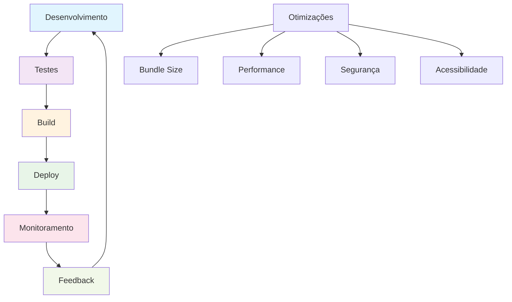
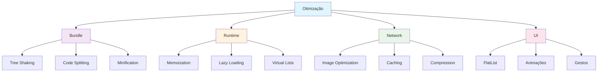
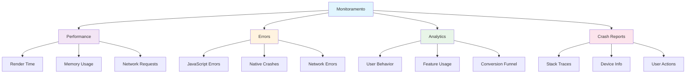

# Módulo 9: Preparação para Produção

## 🎯 Objetivos de Aprendizagem

Ao final deste módulo, você será capaz de:

- Configurar builds otimizados para produção
- Implementar code splitting e lazy loading
- Configurar monitoramento e analytics
- Otimizar performance e bundle size
- Publicar nas lojas de aplicativos
- Configurar CI/CD para deploy automático

## 📚 Conteúdo Teórico

### 9.1 Pipeline de Produção



### 9.2 Estratégias de Otimização



### 9.3 Monitoramento e Analytics



## 💻 Exemplos Práticos

### Exemplo 1: Configuração de Build Otimizado

```javascript
// metro.config.js
const { getDefaultConfig } = require('expo/metro-config');

const config = getDefaultConfig(__dirname);

// Configurações de otimização
config.transformer.minifierConfig = {
  keep_fnames: true,
  mangle: {
    keep_fnames: true
  }
};

// Configurações de bundle
config.resolver.platforms = ['ios', 'android', 'native', 'web'];

// Configurações de transformação
config.transformer.babelTransformerPath = require.resolve(
  'metro-react-native-babel-transformer'
);

module.exports = config;
```

```javascript
// babel.config.js
module.exports = function (api) {
  api.cache(true);
  return {
    presets: ['babel-preset-expo'],
    plugins: [
      // Plugin para otimização de bundle
      'babel-plugin-transform-remove-console',

      // Plugin para tree shaking
      'babel-plugin-transform-imports',

      // Plugin para lazy loading
      'babel-plugin-dynamic-import-node',

      // Plugin para otimização de performance
      'babel-plugin-transform-react-remove-prop-types'
    ]
  };
};
```

### Exemplo 2: Code Splitting e Lazy Loading

```jsx
// src/components/LazyComponent.js
import React, { Suspense, lazy } from 'react';
import { View, Text, ActivityIndicator } from 'react-native';

// Lazy loading de componentes
const HeavyComponent = lazy(() => import('./HeavyComponent'));
const ChartComponent = lazy(() => import('./ChartComponent'));
const MapComponent = lazy(() => import('./MapComponent'));

const LazyComponent = ({ type, ...props }) => {
  const renderComponent = () => {
    switch (type) {
      case 'heavy':
        return <HeavyComponent {...props} />;
      case 'chart':
        return <ChartComponent {...props} />;
      case 'map':
        return <MapComponent {...props} />;
      default:
        return <Text>Componente não encontrado</Text>;
    }
  };

  return (
    <Suspense fallback={<LoadingFallback />}>{renderComponent()}</Suspense>
  );
};

const LoadingFallback = () => (
  <View style={styles.loadingContainer}>
    <ActivityIndicator size='large' color='#007bff' />
    <Text style={styles.loadingText}>Carregando...</Text>
  </View>
);

const styles = {
  loadingContainer: {
    flex: 1,
    justifyContent: 'center',
    alignItems: 'center',
    padding: 20
  },
  loadingText: {
    marginTop: 10,
    fontSize: 16,
    color: '#666'
  }
};

export default LazyComponent;
```

### Exemplo 3: Otimização de Performance

```jsx
// src/components/OptimizedList.js
import React, { memo, useMemo, useCallback } from 'react';
import { FlatList, View, Text, StyleSheet } from 'react-native';

const OptimizedList = ({ data, onItemPress, onEndReached }) => {
  // Memoização do renderItem
  const renderItem = useCallback(
    ({ item }) => <ListItem item={item} onPress={onItemPress} />,
    [onItemPress]
  );

  // Memoização do keyExtractor
  const keyExtractor = useCallback(item => item.id.toString(), []);

  // Memoização do getItemLayout para performance
  const getItemLayout = useCallback(
    (data, index) => ({
      length: 80,
      offset: 80 * index,
      index
    }),
    []
  );

  // Memoização de dados processados
  const processedData = useMemo(() => {
    return data.map(item => ({
      ...item,
      displayName: item.name.toUpperCase()
    }));
  }, [data]);

  return (
    <FlatList
      data={processedData}
      renderItem={renderItem}
      keyExtractor={keyExtractor}
      getItemLayout={getItemLayout}
      onEndReached={onEndReached}
      onEndReachedThreshold={0.5}
      removeClippedSubviews={true}
      maxToRenderPerBatch={10}
      windowSize={10}
      initialNumToRender={10}
      updateCellsBatchingPeriod={50}
    />
  );
};

// Componente memoizado
const ListItem = memo(({ item, onPress }) => {
  const handlePress = useCallback(() => {
    onPress(item);
  }, [item, onPress]);

  return (
    <View style={styles.item} onTouchEnd={handlePress}>
      <Text style={styles.title}>{item.displayName}</Text>
      <Text style={styles.subtitle}>{item.description}</Text>
    </View>
  );
});

const styles = StyleSheet.create({
  item: {
    padding: 15,
    borderBottomWidth: 1,
    borderBottomColor: '#eee'
  },
  title: {
    fontSize: 16,
    fontWeight: 'bold',
    color: '#333'
  },
  subtitle: {
    fontSize: 14,
    color: '#666',
    marginTop: 5
  }
});

export default OptimizedList;
```

### Exemplo 4: Configuração de Analytics

```jsx
// src/services/analytics.js
import { Analytics } from 'expo-analytics';

class AnalyticsService {
  constructor() {
    this.analytics = new Analytics('YOUR_ANALYTICS_ID');
  }

  // Rastrear tela
  trackScreen(screenName, properties = {}) {
    this.analytics.screen(screenName, properties);
  }

  // Rastrear evento
  trackEvent(eventName, properties = {}) {
    this.analytics.event(eventName, properties);
  }

  // Rastrear erro
  trackError(error, context = {}) {
    this.analytics.event('error', {
      error: error.message,
      stack: error.stack,
      ...context
    });
  }

  // Rastrear performance
  trackPerformance(metricName, value, properties = {}) {
    this.analytics.event('performance', {
      metric: metricName,
      value,
      ...properties
    });
  }

  // Rastrear conversão
  trackConversion(conversionType, value, properties = {}) {
    this.analytics.event('conversion', {
      type: conversionType,
      value,
      ...properties
    });
  }
}

export default new AnalyticsService();
```

```jsx
// src/hooks/useAnalytics.js
import { useEffect } from 'react';
import { useRoute } from '@react-navigation/native';
import analytics from '../services/analytics';

export const useAnalytics = () => {
  const route = useRoute();

  useEffect(() => {
    // Rastrear mudança de tela
    analytics.trackScreen(route.name, {
      timestamp: new Date().toISOString()
    });
  }, [route.name]);

  return {
    trackEvent: analytics.trackEvent,
    trackError: analytics.trackError,
    trackPerformance: analytics.trackPerformance,
    trackConversion: analytics.trackConversion
  };
};
```

### Exemplo 5: Configuração de Monitoramento de Erros

```jsx
// src/services/errorReporting.js
import * as Sentry from '@sentry/react-native';

class ErrorReportingService {
  constructor() {
    this.initialize();
  }

  initialize() {
    Sentry.init({
      dsn: 'YOUR_SENTRY_DSN',
      environment: __DEV__ ? 'development' : 'production',
      debug: __DEV__,
      integrations: [
        new Sentry.ReactNativeTracing({
          routingInstrumentation: new Sentry.ReactNavigationInstrumentation()
        })
      ]
    });
  }

  // Capturar erro
  captureError(error, context = {}) {
    Sentry.captureException(error, {
      tags: {
        component: context.component || 'unknown'
      },
      extra: context
    });
  }

  // Capturar mensagem
  captureMessage(message, level = 'info', context = {}) {
    Sentry.captureMessage(message, level, {
      extra: context
    });
  }

  // Adicionar breadcrumb
  addBreadcrumb(message, category = 'user', level = 'info') {
    Sentry.addBreadcrumb({
      message,
      category,
      level,
      timestamp: Date.now() / 1000
    });
  }

  // Definir usuário
  setUser(user) {
    Sentry.setUser(user);
  }

  // Definir contexto
  setContext(key, context) {
    Sentry.setContext(key, context);
  }
}

export default new ErrorReportingService();
```

### Exemplo 6: Configuração de CI/CD

```yaml
# .github/workflows/build.yml
name: Build and Deploy

on:
  push:
    branches: [main, develop]
  pull_request:
    branches: [main]

jobs:
  test:
    runs-on: ubuntu-latest
    steps:
      - uses: actions/checkout@v3

      - name: Setup Node.js
        uses: actions/setup-node@v3
        with:
          node-version: '18'
          cache: 'npm'

      - name: Install dependencies
        run: npm ci

      - name: Run tests
        run: npm test -- --coverage --watchAll=false

      - name: Run linting
        run: npm run lint

      - name: Run type checking
        run: npx tsc --noEmit

  build:
    needs: test
    runs-on: ubuntu-latest
    if: github.ref == 'refs/heads/main'

    steps:
      - uses: actions/checkout@v3

      - name: Setup Node.js
        uses: actions/setup-node@v3
        with:
          node-version: '18'
          cache: 'npm'

      - name: Install dependencies
        run: npm ci

      - name: Setup Expo
        uses: expo/expo-github-action@v8
        with:
          expo-version: latest
          token: ${{ secrets.EXPO_TOKEN }}

      - name: Build Android
        run: eas build --platform android --non-interactive

      - name: Build iOS
        run: eas build --platform ios --non-interactive

      - name: Submit to Play Store
        run: eas submit --platform android --non-interactive

      - name: Submit to App Store
        run: eas submit --platform ios --non-interactive
```

## 🎯 Tutorial Prático: App Completo para Deploy

### Passo 1: Configuração do Projeto

1. **Crie um novo projeto:**

   ```bash
   npx create-expo-app app-producao
   cd app-producao
   ```

2. **Instale dependências de produção:**

   ```bash
   npm install @sentry/react-native expo-analytics
   npm install --save-dev @types/jest
   ```

3. **Configure o EAS:**
   ```bash
   npx eas login
   npx eas init
   ```

### Passo 2: Estrutura do Projeto

```
app-producao/
├── src/
│   ├── components/
│   ├── screens/
│   ├── services/
│   │   ├── analytics.js
│   │   ├── errorReporting.js
│   │   └── performance.js
│   ├── utils/
│   └── __tests__/
├── .github/
│   └── workflows/
├── App.js
├── app.json
├── eas.json
└── package.json
```

### Passo 3: Implementando o App

```jsx
// App.js
import React from 'react';
import { NavigationContainer } from '@react-navigation/native';
import { createStackNavigator } from '@react-navigation/stack';
import { Provider } from 'react-redux';
import { store } from './src/store';
import { useAnalytics } from './src/hooks/useAnalytics';
import HomeScreen from './src/screens/HomeScreen';
import ProductScreen from './src/screens/ProductScreen';
import CartScreen from './src/screens/CartScreen';

const Stack = createStackNavigator();

const App = () => {
  return (
    <Provider store={store}>
      <NavigationContainer>
        <Stack.Navigator>
          <Stack.Screen name='Home' component={HomeScreen} />
          <Stack.Screen name='Product' component={ProductScreen} />
          <Stack.Screen name='Cart' component={CartScreen} />
        </Stack.Navigator>
      </NavigationContainer>
    </Provider>
  );
};

export default App;
```

### Passo 4: Configuração de Build

```json
// eas.json
{
  "cli": {
    "version": ">= 3.0.0"
  },
  "build": {
    "development": {
      "developmentClient": true,
      "distribution": "internal"
    },
    "preview": {
      "distribution": "internal",
      "android": {
        "buildType": "apk"
      }
    },
    "production": {
      "android": {
        "buildType": "aab"
      },
      "ios": {
        "buildConfiguration": "Release"
      }
    }
  },
  "submit": {
    "production": {
      "android": {
        "serviceAccountKeyPath": "./android-service-account.json",
        "track": "internal"
      },
      "ios": {
        "appleId": "your-apple-id@example.com",
        "ascAppId": "1234567890",
        "appleTeamId": "ABCD123456"
      }
    }
  }
}
```

### Passo 5: Configuração de Monitoramento

```jsx
// src/services/performance.js
import { Performance } from 'expo-performance';

class PerformanceService {
  // Medir tempo de renderização
  measureRenderTime(componentName, renderFunction) {
    const startTime = Performance.now();
    const result = renderFunction();
    const endTime = Performance.now();

    const renderTime = endTime - startTime;

    // Enviar métrica para analytics
    analytics.trackPerformance('render_time', renderTime, {
      component: componentName
    });

    return result;
  }

  // Medir tempo de carregamento
  measureLoadTime(resourceName, loadFunction) {
    const startTime = Performance.now();

    return loadFunction().then(result => {
      const endTime = Performance.now();
      const loadTime = endTime - startTime;

      analytics.trackPerformance('load_time', loadTime, {
        resource: resourceName
      });

      return result;
    });
  }

  // Medir uso de memória
  measureMemoryUsage() {
    if (performance.memory) {
      const memoryInfo = {
        used: performance.memory.usedJSHeapSize,
        total: performance.memory.totalJSHeapSize,
        limit: performance.memory.jsHeapSizeLimit
      };

      analytics.trackPerformance('memory_usage', memoryInfo.used, {
        total: memoryInfo.total,
        limit: memoryInfo.limit
      });

      return memoryInfo;
    }

    return null;
  }
}

export default new PerformanceService();
```

### Passo 6: Configuração de Deploy

```bash
# Build para produção
eas build --platform all --profile production

# Submit para as lojas
eas submit --platform android --profile production
eas submit --platform ios --profile production
```

### Passo 7: Monitoramento Pós-Deploy

```jsx
// src/screens/HomeScreen.js
import React, { useEffect } from 'react';
import { View, Text, StyleSheet } from 'react-native';
import { useAnalytics } from '../hooks/useAnalytics';
import performance from '../services/performance';

const HomeScreen = () => {
  const { trackEvent, trackPerformance } = useAnalytics();

  useEffect(() => {
    // Rastrear carregamento da tela
    trackEvent('screen_loaded', {
      screen: 'Home',
      timestamp: new Date().toISOString()
    });

    // Medir performance
    performance.measureRenderTime('HomeScreen', () => {
      // Renderizar componente
    });
  }, []);

  return (
    <View style={styles.container}>
      <Text style={styles.title}>App de Produção</Text>
      <Text style={styles.subtitle}>Monitorado e otimizado para produção</Text>
    </View>
  );
};

const styles = StyleSheet.create({
  container: {
    flex: 1,
    justifyContent: 'center',
    alignItems: 'center',
    padding: 20
  },
  title: {
    fontSize: 24,
    fontWeight: 'bold',
    marginBottom: 10
  },
  subtitle: {
    fontSize: 16,
    color: '#666',
    textAlign: 'center'
  }
});

export default HomeScreen;
```

### Passo 8: Exercícios de Extensão

1. **Configure monitoramento de performance**
2. **Implemente A/B testing**
3. **Configure rollback automático**
4. **Implemente feature flags**

## 🎯 Atividades Práticas

### Atividade 1: App de E-commerce para Produção

Crie um app de e-commerce completo com:

- Build otimizado
- Monitoramento de performance
- Analytics de conversão
- Deploy automático

### Atividade 2: App de Produtividade para Produção

Implemente um app de produtividade com:

- Code splitting
- Lazy loading
- Monitoramento de erros
- CI/CD completo

### Atividade 3: App de Social para Produção

Desenvolva um app social com:

- Otimizações de performance
- Monitoramento de uso
- Deploy para múltiplas plataformas
- Rollback automático

## 📝 Exercícios de Fixação

1. **Pergunta:** O que é code splitting?
   - Resposta: Técnica para dividir o código em chunks menores e carregar apenas o necessário

2. **Pergunta:** Por que usar analytics em produção?
   - Resposta: Para entender comportamento do usuário e otimizar a experiência

3. **Pergunta:** O que é CI/CD?
   - Resposta: Integração Contínua e Deploy Contínuo para automatizar o processo de desenvolvimento

## 🔗 Próximos Passos

No próximo módulo, você aprenderá a:

- Explorar o ecossistema React Native
- Usar bibliotecas populares
- Contribuir com a comunidade
- Manter-se atualizado

## 📚 Recursos Adicionais

- [Expo EAS Build](https://docs.expo.dev/build/introduction/)
- [Sentry React Native](https://docs.sentry.io/platforms/react-native/)
- [React Native Performance](https://reactnative.dev/docs/performance)
- [CI/CD Best Practices](https://docs.github.com/en/actions)

---

**Professor:** Jackson Sá  
**ETEC Bento Quirino - Campinas/SP**
