# Módulo 10: Ecossistema e Bibliotecas

## 🎯 Objetivos de Aprendizagem

Ao final deste módulo, você será capaz de:

- Explorar o ecossistema React Native
- Usar bibliotecas populares e confiáveis
- Contribuir com a comunidade
- Manter-se atualizado com as tendências
- Escolher as melhores ferramentas para cada projeto
- Implementar soluções robustas e escaláveis

## 📚 Conteúdo Teórico

### 10.1 Ecossistema React Native


### 10.2 Categorias de Bibliotecas

```mermaid
graph TD
    A[Bibliotecas] --> B[UI/UX]
    A --> C[Funcionalidade]
    A --> D[Performance]
    A --> E[Desenvolvimento]
    A --> F[Produção]

    B --> G[Componentes]
    B --> H[Animações]
    B --> I[Ícones]
    B --> J[Temas]

    C --> K[APIs]
    C --> L[Integrações]
    C --> M[Utilitários]
    C --> N[Plugins]

    D --> O[Otimização]
    D --> P[Cache]
    D --> Q[Lazy Loading]
    D --> R[Virtual Lists]

    E --> S[Debugging]
    E --> T[Hot Reload]
    E --> U[TypeScript]
    E --> V[Linting]

    F --> W[Analytics]
    F --> X[Crash Reporting]
    F --> Y[Performance]
    F --> Z[Deploy]

    style A fill:#e1f5fe
    style B fill:#f3e5f5
    style C fill:#fff3e0
    style D fill:#e8f5e8
    style E fill:#fce4ec
    style F fill:#f1f8e9
```



### 10.3 Critérios de Escolha

```mermaid
graph TD
    A[Escolha de Biblioteca] --> B[Popularidade]
    A --> C[Manutenção]
    A --> D[Documentação]
    A --> E[Performance]
    A --> F[Compatibilidade]
    A --> G[Licença]
    A --> H[Suporte]

    B --> I[GitHub Stars]
    B --> J[Downloads]
    B --> K[Comunidade]

    C --> L[Última Atualização]
    C --> M[Frequência de Commits]
    C --> N[Issues Resolvidas]

    D --> O[README Completo]
    D --> P[Exemplos]
    D --> Q[API Reference]
    D --> R[Tutoriais]

    E --> S[Bundle Size]
    E --> T[Render Time]
    E --> U[Memory Usage]
    E --> V[Network Requests]

    F --> W[React Native Version]
    F --> X[Platform Support]
    F --> Y[Dependencies]
    F --> Z[Breaking Changes]

    G --> AA[MIT]
    G --> BB[Apache]
    G --> CC[GPL]
    G --> DD[Proprietary]

    H --> EE[Stack Overflow]
    H --> FF[Discord]
    H --> GG[GitHub Issues]
    H --> HH[Documentation]

    style A fill:#e1f5fe
    style B fill:#f3e5f5
    style C fill:#fff3e0
    style D fill:#e8f5e8
    style E fill:#fce4ec
    style F fill:#f1f8e9
    style G fill:#e8f5e8
    style H fill:#fff3e0
```



## 💻 Exemplos Práticos

### Exemplo 1: Bibliotecas de UI Populares

```jsx
// Usando React Native Elements
import React from 'react';
import { View } from 'react-native';
import { Button, Card, Input, Text } from 'react-native-elements';
import { Icon } from 'react-native-vector-icons/MaterialIcons';

const UILibraryExample = () => {
  return (
    <View style={{ flex: 1, padding: 20 }}>
      <Card>
        <Card.Title>React Native Elements</Card.Title>
        <Card.Divider />

        <Input
          placeholder='Digite seu nome'
          leftIcon={<Icon name='person' size={24} color='black' />}
        />

        <Button
          title='Botão com Ícone'
          icon={<Icon name='save' size={24} color='white' />}
          onPress={() => console.log('Botão pressionado')}
        />
      </Card>
    </View>
  );
};

export default UILibraryExample;
```

```jsx
// Usando NativeBase
import React from 'react';
import { Box, VStack, HStack, Text, Button, Input, Icon } from 'native-base';
import { MaterialIcons } from '@expo/vector-icons';

const NativeBaseExample = () => {
  return (
    <Box flex={1} p={5}>
      <VStack space={4}>
        <Text fontSize='xl' fontWeight='bold'>
          NativeBase Components
        </Text>

        <Input
          placeholder='Digite seu email'
          InputLeftElement={
            <Icon as={MaterialIcons} name='email' size={5} ml={2} />
          }
        />

        <HStack space={2}>
          <Button flex={1} colorScheme='primary'>
            Salvar
          </Button>
          <Button flex={1} variant='outline'>
            Cancelar
          </Button>
        </HStack>
      </VStack>
    </Box>
  );
};

export default NativeBaseExample;
```

### Exemplo 2: Bibliotecas de Estado

```jsx
// Usando Zustand
import { create } from 'zustand';
import { persist } from 'zustand/middleware';

const useStore = create(
  persist(
    (set, get) => ({
      // Estado
      user: null,
      todos: [],
      theme: 'light',

      // Ações
      setUser: user => set({ user }),
      addTodo: todo =>
        set(state => ({
          todos: [...state.todos, { ...todo, id: Date.now() }]
        })),
      toggleTodo: id =>
        set(state => ({
          todos: state.todos.map(todo =>
            todo.id === id ? { ...todo, completed: !todo.completed } : todo
          )
        })),
      setTheme: theme => set({ theme }),

      // Computed values
      completedTodos: () => get().todos.filter(todo => todo.completed),
      pendingTodos: () => get().todos.filter(todo => !todo.completed)
    }),
    {
      name: 'app-storage',
      partialize: state => ({
        user: state.user,
        theme: state.theme,
        todos: state.todos
      })
    }
  )
);

export default useStore;
```

```jsx
// Usando Jotai
import { atom, useAtom, useAtomValue } from 'jotai';
import { atomWithStorage } from 'jotai/utils';

// Átomos
const userAtom = atom(null);
const todosAtom = atomWithStorage('todos', []);
const themeAtom = atomWithStorage('theme', 'light');

// Átomos derivados
const completedTodosAtom = atom(get =>
  get(todosAtom).filter(todo => todo.completed)
);

const pendingTodosAtom = atom(get =>
  get(todosAtom).filter(todo => !todo.completed)
);

// Componente usando Jotai
const JotaiExample = () => {
  const [user, setUser] = useAtom(userAtom);
  const [todos, setTodos] = useAtom(todosAtom);
  const [theme, setTheme] = useAtom(themeAtom);
  const completedTodos = useAtomValue(completedTodosAtom);
  const pendingTodos = useAtomValue(pendingTodosAtom);

  const addTodo = todo => {
    setTodos(prev => [...prev, { ...todo, id: Date.now() }]);
  };

  return <View>{/* Componente usando os átomos */}</View>;
};

export default JotaiExample;
```

### Exemplo 3: Bibliotecas de Animações

```jsx
// Usando React Native Reanimated
import React from 'react';
import { View, Text, TouchableOpacity } from 'react-native';
import Animated, {
  useSharedValue,
  useAnimatedStyle,
  withSpring,
  withTiming,
  withSequence,
  withRepeat
} from 'react-native-reanimated';

const AnimationExample = () => {
  const scale = useSharedValue(1);
  const opacity = useSharedValue(1);
  const translateX = useSharedValue(0);

  const animatedStyle = useAnimatedStyle(() => ({
    transform: [{ scale: scale.value }, { translateX: translateX.value }],
    opacity: opacity.value
  }));

  const handlePress = () => {
    // Animação de escala
    scale.value = withSpring(1.2, {}, () => {
      scale.value = withSpring(1);
    });

    // Animação de opacidade
    opacity.value = withSequence(
      withTiming(0.5, { duration: 200 }),
      withTiming(1, { duration: 200 })
    );

    // Animação de translação
    translateX.value = withRepeat(withTiming(10, { duration: 100 }), 2, true);
  };

  return (
    <View style={{ flex: 1, justifyContent: 'center', alignItems: 'center' }}>
      <Animated.View style={animatedStyle}>
        <TouchableOpacity onPress={handlePress}>
          <Text>Toque para animar</Text>
        </TouchableOpacity>
      </Animated.View>
    </View>
  );
};

export default AnimationExample;
```

```jsx
// Usando Lottie
import React from 'react';
import { View } from 'react-native';
import LottieView from 'lottie-react-native';

const LottieExample = () => {
  return (
    <View style={{ flex: 1, justifyContent: 'center', alignItems: 'center' }}>
      <LottieView
        source={require('../assets/animations/loading.json')}
        autoPlay
        loop
        style={{ width: 200, height: 200 }}
      />
    </View>
  );
};

export default LottieExample;
```

### Exemplo 4: Bibliotecas de Networking

```jsx
// Usando Axios
import axios from 'axios';

const api = axios.create({
  baseURL: 'https://api.exemplo.com',
  timeout: 10000,
  headers: {
    'Content-Type': 'application/json'
  }
});

// Interceptors
api.interceptors.request.use(
  config => {
    const token = getToken();
    if (token) {
      config.headers.Authorization = `Bearer ${token}`;
    }
    return config;
  },
  error => Promise.reject(error)
);

api.interceptors.response.use(
  response => response,
  error => {
    if (error.response?.status === 401) {
      // Redirecionar para login
      redirectToLogin();
    }
    return Promise.reject(error);
  }
);

export default api;
```

```jsx
// Usando Apollo Client
import { ApolloClient, InMemoryCache, createHttpLink } from '@apollo/client';
import { setContext } from '@apollo/client/link/context';

const httpLink = createHttpLink({
  uri: 'https://api.exemplo.com/graphql'
});

const authLink = setContext((_, { headers }) => {
  const token = getToken();
  return {
    headers: {
      ...headers,
      authorization: token ? `Bearer ${token}` : ''
    }
  };
});

const client = new ApolloClient({
  link: authLink.concat(httpLink),
  cache: new InMemoryCache()
});

export default client;
```

### Exemplo 5: Bibliotecas de Storage

```jsx
// Usando WatermelonDB
import { Database } from '@nozbe/watermelondb';
import SQLiteAdapter from '@nozbe/watermelondb/adapters/sqlite';
import { schema, migrations } from './schema';
import { User, Post, Comment } from './models';

const adapter = new SQLiteAdapter({
  schema,
  migrations,
  dbName: 'AppDatabase'
});

const database = new Database({
  adapter,
  modelClasses: [User, Post, Comment]
});

export default database;
```

```jsx
// Usando MMKV
import { MMKV } from 'react-native-mmkv';

const storage = new MMKV();

// Salvar dados
storage.set('user.name', 'João Silva');
storage.set('user.age', 25);
storage.set('user.preferences', JSON.stringify({ theme: 'dark' }));

// Recuperar dados
const name = storage.getString('user.name');
const age = storage.getNumber('user.age');
const preferences = JSON.parse(storage.getString('user.preferences') || '{}');

// Deletar dados
storage.delete('user.name');

export default storage;
```

## 🎯 Tutorial Prático: App Final Integrado

### Passo 1: Configuração do Projeto

1. **Crie um novo projeto:**

   ```bash
   npx create-expo-app app-final
   cd app-final
   ```

2. **Instale bibliotecas essenciais:**
   ```bash
   npm install @react-navigation/native @react-navigation/stack
   npm install react-native-elements react-native-vector-icons
   npm install zustand react-native-mmkv
   npm install react-native-reanimated lottie-react-native
   npm install axios react-query
   npm install react-native-maps expo-location
   npm install @sentry/react-native expo-analytics
   ```

### Passo 2: Estrutura do Projeto

```
app-final/
├── src/
│   ├── components/
│   │   ├── ui/
│   │   ├── forms/
│   │   └── charts/
│   ├── screens/
│   │   ├── HomeScreen.js
│   │   ├── ProfileScreen.js
│   │   ├── MapScreen.js
│   │   └── SettingsScreen.js
│   ├── services/
│   │   ├── api.js
│   │   ├── storage.js
│   │   └── analytics.js
│   ├── store/
│   │   ├── userStore.js
│   │   ├── appStore.js
│   │   └── mapStore.js
│   ├── utils/
│   │   ├── constants.js
│   │   ├── helpers.js
│   │   └── validators.js
│   └── __tests__/
├── assets/
│   ├── images/
│   ├── animations/
│   └── fonts/
├── App.js
└── package.json
```

### Passo 3: Implementando o App

```jsx
// App.js
import React from 'react';
import { NavigationContainer } from '@react-navigation/native';
import { createStackNavigator } from '@react-navigation/stack';
import { QueryClient, QueryClientProvider } from 'react-query';
import { Provider } from 'react-redux';
import { store } from './src/store';
import { useAnalytics } from './src/hooks/useAnalytics';
import HomeScreen from './src/screens/HomeScreen';
import ProfileScreen from './src/screens/ProfileScreen';
import MapScreen from './src/screens/MapScreen';
import SettingsScreen from './src/screens/SettingsScreen';

const Stack = createStackNavigator();
const queryClient = new QueryClient();

const App = () => {
  return (
    <QueryClientProvider client={queryClient}>
      <Provider store={store}>
        <NavigationContainer>
          <Stack.Navigator>
            <Stack.Screen name='Home' component={HomeScreen} />
            <Stack.Screen name='Profile' component={ProfileScreen} />
            <Stack.Screen name='Map' component={MapScreen} />
            <Stack.Screen name='Settings' component={SettingsScreen} />
          </Stack.Navigator>
        </NavigationContainer>
      </Provider>
    </QueryClientProvider>
  );
};

export default App;
```

### Passo 4: Implementando Stores

```jsx
// src/store/userStore.js
import { create } from 'zustand';
import { persist } from 'zustand/middleware';
import storage from '../services/storage';

const useUserStore = create(
  persist(
    (set, get) => ({
      // Estado
      user: null,
      isAuthenticated: false,
      preferences: {
        theme: 'light',
        language: 'pt',
        notifications: true
      },

      // Ações
      setUser: user => set({ user, isAuthenticated: true }),
      logout: () => set({ user: null, isAuthenticated: false }),
      updatePreferences: preferences =>
        set(state => ({
          preferences: { ...state.preferences, ...preferences }
        })),

      // Computed values
      isLoggedIn: () => get().isAuthenticated,
      getUserName: () => get().user?.name || 'Usuário',
      getUserEmail: () => get().user?.email || ''
    }),
    {
      name: 'user-storage',
      storage: storage
    }
  )
);

export default useUserStore;
```

### Passo 5: Implementando Serviços

```jsx
// src/services/api.js
import axios from 'axios';
import { QueryClient } from 'react-query';

const api = axios.create({
  baseURL: 'https://api.exemplo.com',
  timeout: 10000,
  headers: {
    'Content-Type': 'application/json'
  }
});

// Interceptors
api.interceptors.request.use(
  config => {
    const token = storage.getString('auth.token');
    if (token) {
      config.headers.Authorization = `Bearer ${token}`;
    }
    return config;
  },
  error => Promise.reject(error)
);

api.interceptors.response.use(
  response => response,
  error => {
    if (error.response?.status === 401) {
      // Redirecionar para login
      useUserStore.getState().logout();
    }
    return Promise.reject(error);
  }
);

export default api;
```

### Passo 6: Implementando Telas

```jsx
// src/screens/HomeScreen.js
import React from 'react';
import { View, Text, StyleSheet, ScrollView } from 'react-native';
import { Card, Button, Input } from 'react-native-elements';
import { useQuery } from 'react-query';
import { useUserStore } from '../store/userStore';
import { useAnalytics } from '../hooks/useAnalytics';

const HomeScreen = ({ navigation }) => {
  const { user, getUserName } = useUserStore();
  const { trackEvent } = useAnalytics();

  const { data: posts, isLoading } = useQuery('posts', () =>
    api.get('/posts').then(res => res.data)
  );

  const handleNavigate = screen => {
    trackEvent('navigation', { screen });
    navigation.navigate(screen);
  };

  return (
    <ScrollView style={styles.container}>
      <Card>
        <Card.Title>Bem-vindo, {getUserName()}!</Card.Title>
        <Card.Divider />

        <Text style={styles.subtitle}>
          Este é um app completo integrando várias bibliotecas
        </Text>

        <View style={styles.buttons}>
          <Button
            title='Ver Perfil'
            onPress={() => handleNavigate('Profile')}
            style={styles.button}
          />
          <Button
            title='Ver Mapa'
            onPress={() => handleNavigate('Map')}
            style={styles.button}
          />
          <Button
            title='Configurações'
            onPress={() => handleNavigate('Settings')}
            style={styles.button}
          />
        </View>
      </Card>

      {isLoading ? (
        <Text>Carregando posts...</Text>
      ) : (
        posts?.map(post => (
          <Card key={post.id}>
            <Card.Title>{post.title}</Card.Title>
            <Text>{post.body}</Text>
          </Card>
        ))
      )}
    </ScrollView>
  );
};

const styles = StyleSheet.create({
  container: {
    flex: 1,
    padding: 20
  },
  subtitle: {
    fontSize: 16,
    color: '#666',
    marginBottom: 20,
    textAlign: 'center'
  },
  buttons: {
    gap: 10
  },
  button: {
    marginVertical: 5
  }
});

export default HomeScreen;
```

### Passo 7: Implementando Testes

```jsx
// src/__tests__/screens/HomeScreen.test.js
import React from 'react';
import { render, fireEvent } from '@testing-library/react-native';
import { QueryClient, QueryClientProvider } from 'react-query';
import HomeScreen from '../../screens/HomeScreen';

const createTestQueryClient = () =>
  new QueryClient({
    defaultOptions: {
      queries: {
        retry: false
      }
    }
  });

const renderWithQuery = component => {
  const queryClient = createTestQueryClient();
  return render(
    <QueryClientProvider client={queryClient}>{component}</QueryClientProvider>
  );
};

describe('HomeScreen', () => {
  it('deve renderizar corretamente', () => {
    const { getByText } = renderWithQuery(<HomeScreen />);

    expect(getByText('Bem-vindo, Usuário!')).toBeTruthy();
    expect(getByText('Ver Perfil')).toBeTruthy();
    expect(getByText('Ver Mapa')).toBeTruthy();
    expect(getByText('Configurações')).toBeTruthy();
  });

  it('deve navegar para outras telas', () => {
    const mockNavigate = jest.fn();
    const { getByText } = renderWithQuery(
      <HomeScreen navigation={{ navigate: mockNavigate }} />
    );

    fireEvent.press(getByText('Ver Perfil'));
    expect(mockNavigate).toHaveBeenCalledWith('Profile');
  });
});
```

### Passo 8: Configuração de Deploy

```json
// eas.json
{
  "cli": {
    "version": ">= 3.0.0"
  },
  "build": {
    "production": {
      "android": {
        "buildType": "aab"
      },
      "ios": {
        "buildConfiguration": "Release"
      }
    }
  },
  "submit": {
    "production": {
      "android": {
        "serviceAccountKeyPath": "./android-service-account.json",
        "track": "internal"
      },
      "ios": {
        "appleId": "your-apple-id@example.com",
        "ascAppId": "1234567890",
        "appleTeamId": "ABCD123456"
      }
    }
  }
}
```

### Passo 9: Exercícios de Extensão

1. **Adicione mais bibliotecas**
2. **Implemente testes E2E**
3. **Configure monitoramento**
4. **Otimize performance**

## 🎯 Atividades Práticas

### Atividade 1: App de Rede Social

Crie um app de rede social completo com:

- UI moderna com bibliotecas populares
- Gerenciamento de estado robusto
- Integração com APIs
- Testes completos

### Atividade 2: App de E-commerce

Implemente um app de e-commerce com:

- Catálogo de produtos
- Carrinho de compras
- Pagamentos
- Deploy para produção

### Atividade 3: App de Produtividade

Desenvolva um app de produtividade com:

- Gerenciamento de tarefas
- Calendário
- Notas
- Sincronização

## 📝 Exercícios de Fixação

1. **Pergunta:** Como escolher uma biblioteca confiável?
   - Resposta: Verificar popularidade, manutenção, documentação, performance e compatibilidade

2. **Pergunta:** O que é o ecossistema React Native?
   - Resposta: Conjunto de bibliotecas, ferramentas e recursos que complementam o React Native

3. **Pergunta:** Por que contribuir com a comunidade?
   - Resposta: Para ajudar outros desenvolvedores, melhorar as ferramentas e crescer profissionalmente

## 🔗 Próximos Passos

Agora que você completou todos os módulos, você está preparado para:

- Desenvolver aplicações React Native profissionais
- Escolher as melhores ferramentas para cada projeto
- Contribuir com a comunidade
- Manter-se atualizado com as tendências

## 📚 Recursos Adicionais

- [React Native Directory](https://reactnative.directory/)
- [Awesome React Native](https://github.com/jondot/awesome-react-native)
- [React Native Community](https://github.com/react-native-community)
- [Expo Snack](https://snack.expo.dev/)

---

**Professor:** Jackson Sá  
**ETEC Bento Quirino - Campinas/SP**
